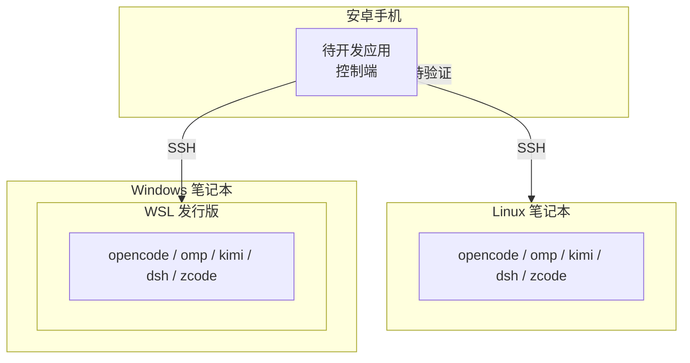

# 01 需求说明

在安卓手机上统一管理多台电脑上的 5 个 AI 编码 agent 会话。本文档定义该应用的功能范围、非功能约束与验收口径。

## 1. 场景

用户日常在 3 类设备上使用 AI 编码 agent：

| 设备 | 系统 | agent 安装方式 |
| --- | --- | --- |
| Linux 笔记本 | Linux 直装 | 直接安装 |
| Windows 笔记本 | Windows + WSL | 安装在 WSL 发行版内 |
| 安卓手机 | droidspace + Arch | 容器内安装 |

每台设备上都安装了 5 个 agent CLI：opencode、oh-my-pi、kimi-code、deepseek-harness、zcode。

当前工作方式的问题：每个 agent 各自记录会话，会话数据分散在各台设备的本地存储中。用户想继续某个会话时，必须先找到是在哪台设备的哪个 agent 上发起的，再打开那台设备、用对应 agent 的 resume 命令恢复。设备在局域网内的 IP 会变化，远程连接配置随之中断，需要重新配置 IP。

## 2. 功能需求

### FR-1 设备管理

应用必须能够保存多台设备，每台设备保存以下信息：

| 字段 | 类型 | 必填 | 说明 |
| --- | --- | --- | --- |
| 设备标识 | 字符串 | 是 | 稳定标识，不随 IP 变化 |
| 显示名 | 字符串 | 是 | 用户自定义，用于列表展示 |
| 连接地址 | 字符串 | 是 | 当前可达的主机名或地址 |
| 端口 | 整数 | 是 | SSH 端口，默认 22 |
| 用户名 | 字符串 | 是 | SSH 登录用户 |
| 认证方式 | 枚举 | 是 | 密钥 / 密码 |
| 发行版名 | 字符串 | 否 | 仅在 WSL 设备上使用 |

设备标识与连接地址必须分离：**地址变化时只更新连接地址字段，设备标识与其关联的历史数据不变**。

验收口径：修改某台设备的连接地址后，该设备下的会话列表、密钥、known_hosts 记录均保持可用，无需重新添加设备。

### FR-2 连接与保活

应用必须通过 SSH 连接被管设备。连接能力要求：

- 支持公钥认证与密码认证
- 支持跳板机（ProxyJump）
- 校验主机密钥指纹，首次连接需用户确认，指纹变更时拒绝连接并提示
- 连接断开后自动重连，退避重试
- 应用切到后台时保持连接与任务

### FR-3 会话列表

应用必须列出每台设备上每个 agent 的历史会话，统一为一张列表。每个会话至少包含：

| 字段 | 说明 |
| --- | --- |
| 所属设备 | 会话所在的设备 |
| 所属 agent | 5 个 agent 之一 |
| 会话 ID | agent 原生会话标识 |
| 标题 | 会话标题，由 agent 生成 |
| 工作目录 | 会话发起时的工作目录 |
| 更新时间 | 最后一次活动时间 |

列表必须支持按设备过滤、按 agent 过滤、按标题与最后一条消息全文搜索、按更新时间排序。

工作目录是必填字段，不是可选项：kimi-code 与 deepseek-harness 的会话按工作目录索引，继续会话时必须回到原目录，缺少该字段会导致继续会话失败。

### FR-4 新建与继续会话

- **新建会话**：指定设备、agent、工作目录，创建新会话，并可在应用内对话
- **继续会话**：从历史列表选择一个会话，在应用内继续对话，必须保持原会话的上下文与工作目录

### FR-5 实时对话

应用必须支持在当前会话中收发消息，并实时呈现 agent 的输出。需要呈现的内容类型：

| 内容类型 | 说明 |
| --- | --- |
| 回复文本 | 流式增量渲染 |
| 思考过程 | 折叠展示 |
| 工具调用 | 工具名、参数、状态、结果 |
| 文件改动 | 差异视图 |
| 权限请求 | 可点击批准或拒绝 |
| 提问请求 | 结构化选项或自由文本回答 |
| 执行计划 | 计划内容与批准入口 |
| 用量信息 | token 用量与上下文占用 |

### FR-6 降级能力

当某个 agent 无法通过结构化协议接入时，应用必须提供终端界面作为兜底，允许用户在其中手动执行命令。

## 3. 非功能需求

| 编号 | 需求 | 口径 |
| --- | --- | --- |
| NFR-1 | 会话数据只读 | 应用读取 agent 的原生存储，不得修改。写操作只通过 agent 自身的 CLI 或协议进行 |
| NFR-2 | 不在手机上传输大文件 | 会话数据库可能达到 GB 级，过滤与解析在远端执行，手机只接收 JSON 结果 |
| NFR-3 | 不依赖设备 IP 稳定 | 连接地址可随时修改；跨网络场景依赖覆盖网络提供稳定地址 |
| NFR-4 | 凭据安全 | SSH 私钥与口令存储在使用 Android Keystore 加密的存储中 |
| NFR-5 | 后台可用 | 长任务与连接在应用切到后台后继续运行，通过前台服务与通知呈现状态 |
| NFR-6 | 局域网访问合规 | 应用需在 Android 16 起适配本地网络权限，见 05 文档第 7 节 |

## 4. 范围外

以下内容不在本期范围内：

- iOS 客户端
- 对 agent 自身代码或存储格式的修改
- 多用户、多租户、团队协作
- 云端中继服务的搭建与运营
- 对 5 个 agent 之外的 agent 的支持

## 5. 约束

| 约束 | 影响 |
| --- | --- |
| 不修改任何 agent 的安装 | 只能读取 Agent 已有的本地存储或调用其已有命令 |
| Windows 设备的 agent 装在 WSL 内 | 连接目标是 WSL 发行版，不是 Windows 宿主 |
| 手机自身的 agent 在 droidspace 容器内 | 容器默认使用 NAT 网络，容器内服务默认无法被局域网直接访问 |
| 5 个 agent 的存储格式互相不同 | 每个 agent 需要独立的解析逻辑 |

## 6. 验收口径

| 编号 | 验收项 | 通过条件 |
| --- | --- | --- |
| AC-1 | 多设备管理 | 添加 3 台设备，修改其中 1 台的地址后仍能连接，会话列表不变 |
| AC-2 | 全量会话列表 | 5 个 agent 的历史会话均出现在列表中，字段完整 |
| AC-3 | 继续会话 | 从列表任选一个会话继续对话，agent 能读取到原上下文 |
| AC-4 | 新建会话 | 在指定设备与目录上创建新会话并完成一轮对话 |
| AC-5 | 权限审批 | 在手机端批准一次文件改动，改动实际执行 |
| AC-6 | 断线恢复 | 断开网络后恢复，连接自动重建，会话列表可刷新 |
| AC-7 | 降级终端 | 在任意设备上打开终端界面并执行命令 |
