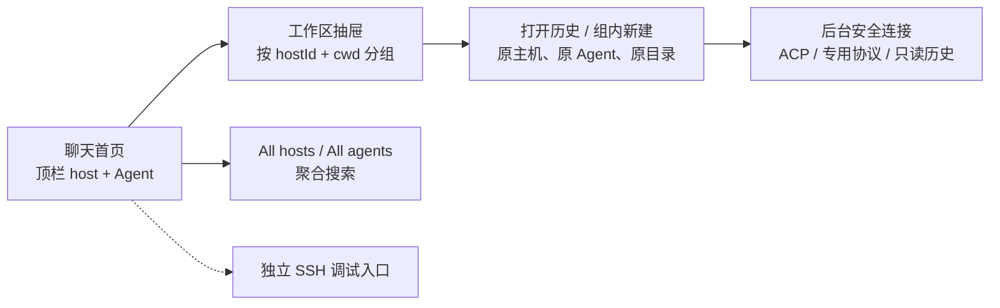
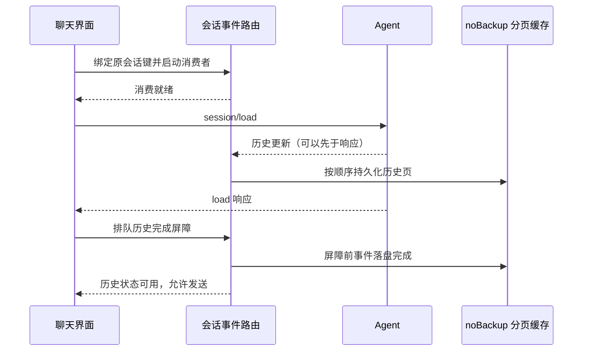

# 01 需求说明

应用在安卓手机上聚合多台主机的 opencode、oh-my-pi、kimi-code、deepseek-harness、zcode 会话，以聊天作为首页。主机连接是后台基础设施，SSH 终端只用于独立的调试入口。

本文面向产品评审、开发与测试。标识约定：**新增设计**＝必须实现的目标，不能视为已交付；**上游源码核实**＝外部项目的公开实现；**既有采样记录**＝已有环境的采样结论，不代表所有版本；**待验证**＝未完成端到端验收。本文功能条款均为新增设计。

## 1. 场景与术语

| 被管设备 | 系统 | Agent 所在环境 |
| --- | --- | --- |
| Linux 笔记本 | Linux 直装 | 用户已安装并登录的 CLI |
| Windows 笔记本 | Windows + WSL | WSL 发行版内的 CLI，连接目标不是 Windows 宿主 |
| 安卓手机 | droidspace + Arch | 容器内的 CLI，自管节点可达性待验证 |

每台设备的目标覆盖均包含上述 5 个 Agent。各 Agent 的历史分散在主机本地；用户应当能从一个入口找到原会话，在原工作目录继续对话，而无需先进入终端寻找记录。

| 概念 | 首选术语 | 定义与边界 |
| --- | --- | --- |
| 被管环境 | 主机（host） | 用稳定 `hostId` 标识；连接地址可以变化；WSL 发行版视为独立目标 |
| 会话工作目录 | `cwd` | 远端绝对路径，按该主机的路径规则处理 |
| 自动目录分组 | 工作区（workspace） | UI 分组键为 `(hostId, cwd)`，不是手工登记的 SSH 项目；zcode 原生 workspaceIdentity 另行保留，不能用 cwd 替代协议身份 |
| 会话身份 | 会话键 | `(hostId, agent, sessionId)`；`sessionId` 为 Agent 原生标识 |
| 正在执行的会话 | busy 会话 | 包含进行中的轮次或待处理交互；不等同于当前显示的会话 |

## 2. 功能需求（新增设计）

### FR-1 主机管理与自动探测

保存的主机信息必须包含稳定 `hostId`、显示名、可编辑连接地址、SSH 端口（默认 22）、用户名、认证方式（密钥或密码）；WSL 目标可以保存发行版名。应用必须分离主机身份与地址，更新地址不得重建会话身份、工作区、密钥关联或信任记录。

用户在顶栏选择具体 host 后，应用必须自动连接、探测已安装 Agent 与可用能力、刷新该主机的历史列表。探测必须区分未安装、启动失败、无协议能力、连接失败与刷新中。失败时保留已有列表并显示错误及重试入口，不得把失败解释为“无历史”。快速切换主机后，迟到结果只能更新其所属主机的数据，不能覆盖当前主机的显示状态。

`All hosts` 是聚合浏览范围，不是可执行的远端目标。新建或发送必须确定具体主机；断线主机的缓存可以参与搜索，但必须显示离线与缓存范围。

### FR-2 安全连接与保活

Agent 的结构化通道可以通过 SSH exec 或 loopback 端口隧道承载，用户无需打开 SSH 终端。连接必须支持公钥认证、密码认证与跳板机（ProxyJump）。首次连接必须在发送认证凭据前确认主机密钥指纹；指纹变更时拒绝连接，并要求用户显式重新确认，地址变化不能绕过校验。

网络断开后采用退避重连。恢复连接时必须核实原会话是否仍在执行，不能重复发送上一轮 prompt。后台任务通过前台服务与通知显示；系统终止连接后必须提示状态未知或已断线，不得伪装为持续运行。

### FR-3 顶栏筛选与工作区抽屉

1. 首页必须显示聊天区域及 host、Agent 选择器；未选择会话时显示可操作的空态，不能以 SSH 主机列表作为默认首页。
2. 选择 Agent 后，抽屉只显示该 Agent 的会话；`All agents` 保留所有 Agent 的聚合浏览。筛选不能改变已有会话的 Agent。
3. 抽屉必须根据历史会话的 `(hostId, cwd)` 自动生成工作区组。不同主机的相同路径不得合并；同一主机同一目录的不同 Agent 会话属于同组，并在行内标明 Agent。
4. 组标题应当显示目录简称，并提供完整路径及主机信息。组内显示会话标题、Agent、更新时间、busy／待审批状态与“新建会话”入口。
5. 组内新建自动使用该组的具体 host 与 `cwd`；具体 Agent 未确定时先选择 Agent。`All hosts`、`All agents` 不能充当执行目标；在聚合视图打开已有会话后，发送仍绑定该会话的具体 host 与 Agent。
6. 缺少或无效 `cwd` 的记录必须保留在“目录未知”组，并提示原因；补齐目录前禁止继续与组内新建，不得猜测 HOME 或删除记录。

路径标准化必须遵守远端语义。不得仅按目录末级名称合并；是否将符号链接别名视为同一目录待远端确认，未确认时保持分离。Agent 原生工作区身份必须作为驱动元数据保留；zcode 的列表／继续需真实 workspaceIdentity，UI 的 `(hostId, cwd)` 分组不能替代该身份。

### FR-4 会话列表与聚合搜索

会话列表必须覆盖每台主机的 5 个 Agent，并保留 `hostId`、`agent`、原生 `sessionId`、标题、`cwd`、更新时间；来源缺少标题或时间时，必须显示未命名或未知，不能编造。创建时间与预览可缺省。支持 host 和 Agent 的交叉过滤、按已知更新时间排序，以及标题和消息内容搜索（至少覆盖末条消息）。

`All hosts` 与 `All agents` 可以组合使用。搜索结果必须显示主机、Agent、目录及内容片段；命中后打开原会话并定位其工作区。搜索范围必须区分远端结果、已缓存内容和未加载内容；分页未结束、主机离线或某个解析器失败时，不能宣称已搜索全部历史。列表分页失败保留已得结果，给出继续加载／重试入口。

### FR-5 新建、继续与 busy 切换

新建会话必须明确具体主机、Agent 和绝对 `cwd`；通过 Agent 原生协议或 CLI 创建，保存返回的原生会话 ID。继续会话必须使用原会话键、原目录与原上下文。

浏览范围与执行会话必须分离：切换 host、Agent 或抽屉中的会话，仅切换显示与筛选。busy 会话的连接、输出消费与权限请求必须继续绑定原会话；切回后能够看到后续输出。若实现暂不能同时保留连接，必须阻止切换并说明原因，或经用户显式确认停止后切换。

**禁止事项**：筛选或导航不得静默调用 `cancel`／`close`，不得将原会话 ID 搬到新主机或新 Agent，不得创建新 ID 冒充继续，不得重复提交进行中的 prompt。停止操作必须是独立、可确认的用户动作，并且只作用于指定会话。

### FR-6 历史打开、重放屏障与完整缓存

打开历史前必须先就绪事件路由与持续消费者，再发送 `session/load`。历史可能在 load 响应前通过 `session/update` 到达；不得以“尚未收到 sessionId 响应”丢弃事件。

支持 load 的通道必须按以下顺序组织；无 load 的只读历史＋resume 路线见下方第 2 条：

1. 有 `loadSession` 时使用 load 重放；其响应只代表远端请求完成，应用还必须等待消费者处理并持久化屏障前的更新，才能把 UI 标记为历史就绪。
2. 只有 resume 而没有 load 时，必须从原生只读存储或已验证的官方历史接口分页读取，再恢复同一会话。resume 恢复 Agent 上下文不等于重建手机历史；deepseek-harness 属于这一路线。
3. 历史缓存必须置于 Android `noBackupFilesDir`，按会话键保存完整已取得的消息与事件页、排序信息、来源版本、续页游标和完整性状态。分页用于控制读取与内存，不能成为静默删除旧消息的理由。
4. 有界内存缓冲只能控制瞬时内存；积压必须通过背压或落盘处理。达到限制、写入失败、损坏、超时或断线时保留已有页与重试位置，并显式显示“历史不完整”。
5. 缓存只在所有历史页完成后标记完整。未取得的旧页仍可继续读取；离线浏览不得把未缓存内容显示为不存在。刷新失败不得覆盖完整缓存为空。
6. 重放、只读历史与实时输出的重复记录必须按来源稳定标识或已定义的顺序映射合并，不能按文本相同删除。缓存清理由用户显式触发，不能自动静默丢弃旧页。

缓存是应用自己的副本；上述持久化不授权修改 Agent 原生数据。跨来源事件映射与实时接续的边界需逐 Agent 验证，验证前不得承诺无缝重放。

### FR-7 实时对话与结构化交互

| 内容 | 展示与操作要求 |
| --- | --- |
| 回复文本 | 按通道提供的增量或已提交消息更新，不伪造流式能力 |
| 思考过程 | 折叠展示 |
| 工具调用 | 工具名、参数、状态、结果 |
| 文件改动 | 差异视图 |
| 权限请求 | 显式批准或拒绝，响应回到原 host、Agent、会话及请求 |
| 提问请求 | 结构化选项或自由文本回答 |
| 执行计划 | 计划内容与批准入口 |
| 用量信息 | token 用量与上下文占用 |

能力不存在时，必须显示不支持或不可用，不得凭 Agent 名称显示无效按钮。历史中的权限卡不得当作当前可操作请求。未知事件必须保留类型与诊断信息，不得中断或静默删除整段历史。

### FR-8 SSH 调试入口

SSH 终端必须通过“调试／SSH”独立入口打开，可以查看环境、执行诊断命令或手动运行 Agent。结构化接入失败时可以提示用户使用该入口，但终端交互不能替代新建／继续会话的聊天验收，也不得自动跳入终端。

## 3. 非功能需求与约束

| 编号 | 需求 | 强制口径 |
| --- | --- | --- |
| NFR-1 | 原生数据只读 | 应用读取 Agent 存储，不得修改；写入、归档或会话操作只通过 Agent 自身明确支持的协议／CLI |
| NFR-2 | 大数据在远端处理 | 不传输 GB 级数据库到手机；过滤、解压与解析在远端执行，手机仅接收分页 JSON／协议事件 |
| NFR-3 | 地址可变 | 主机身份不随 IP 变化；跨网络可达性依赖覆盖网络，不承诺自动发现换 IP 的设备 |
| NFR-4 | 凭据安全 | SSH 私钥与口令用 Android Keystore 加密；日志、搜索、缓存不得包含认证秘密；不保存 Agent API 凭据，复用远端登录状态 |
| NFR-5 | 后台可用 | 前台服务、通知与会话级状态同步；切后台不得自动取消任务 |
| NFR-6 | 网络安全 | Web 服务采用远端 loopback + SSH 隧道；不因上游允许具体 IP 就扩大本项目监听范围 |
| NFR-7 | 本地网络权限 | 按目标 Android 版本与 targetSdk 核实局域网权限要求及拒绝行为；版本阈值和真机行为待验证，不仅凭旧文档放行 |
| NFR-8 | 缓存安全与完整性 | 缓存不参加系统备份，保持分页完整性；noBackup 不等同于加密，敏感内容的本地保护与清理必须可控 |

不修改任何 Agent 的安装、代码或存储格式。缺少远端工具或协议时提示用户准备环境，不静默升级／替换 Agent。WSL 连接目标是发行版；droidspace 默认 NAT 下的服务可达性需实机核实。各 Agent 存储不同且可能随版本变化，必须独立适配与诊断。

## 4. 范围外

- iOS 客户端；多用户、多租户、团队协作。
- 云端中继服务的搭建与运营；自动设备发现；支持上述 5 个 Agent 之外的 Agent。
- 修改 Agent 自身安装或原生存储；用终端路径冒充结构化聊天完成。

## 5. 验收口径（新增设计，均待执行）

| 编号 | 验收项 | 通过条件 |
| --- | --- | --- |
| AC-1 | 主机身份与信任 | 保存不同设备环境；修改地址后会话键、工作区和凭据关联不变；主机密钥变化仍阻断 |
| AC-2 | 聊天首页与自动探测 | 冷启动进入聊天；选择 host 自动 probe／刷新；失败保留旧结果并可重试；迟到结果不覆盖其他主机 |
| AC-3 | 抽屉与过滤 | 按 `(hostId, cwd)` 自动分组；同路径跨主机不合并；Agent 筛选与 `All agents` 有效；组内可在原目录新建 |
| AC-4 | 聚合搜索与完整列表 | 5 个 Agent 列表逐页到结束；`All hosts`／`All agents` 可组合；离线、未加载或失败源显示范围，不冒称全量 |
| AC-5 | 聊天新建与继续 | 每个 Agent 在指定主机目录完成一轮聊天；历史继续沿用原 ID、目录和上下文；不支持者明确阻塞，终端不计通过 |
| AC-6 | 历史与缓存 | load 响应前产生大量更新不丢失；屏障完成后允许发送；分页、进程重启与离线可读已取得的首尾旧消息；失败显示不完整并可续读 |
| AC-7 | busy 切换隔离 | 运行中切 host／Agent／会话不静默 cancel／close；输出与审批留在原会话；不迁移 ID、不重复 prompt |
| AC-8 | 权限与结构化内容 | 批准和拒绝均回到原请求；一次批准的文件改动实际执行；过期历史卡无操作；缺失能力不伪造支持 |
| AC-9 | 断线与后台 | 断线后恢复原会话并核实执行状态；不重复提交；后台仍有状态通知，未知状态明确展示 |
| AC-10 | 只读与网络边界 | 原生数据不被扫描器改写；不传整库；Web 仅 loopback 隧道；认证秘密不进入缓存或日志；SSH 调试为独立入口 |

zcode 真正入口 `/home/colle/.zcode/server/agents/glm/zcode-agent` 已有版本 `0.16.9`、no-PTY app-server、`runtime/capabilities` 与真实工作区 `session/list` 的采样证据；原 CPA 插件产物不是官方 CLI，不能用它的空输出判定整个 zcode 不可接入。原会话 resume、prompt、审批与安卓专用驱动端到端仍待验证；omp 历史格式需取得真实样本。不得把有限探测成功标为完整聊天通过，也不得在验收时静默剔除这些 Agent，详见 03 与 06。
