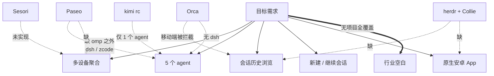

# 02 竞品调研

调研目标：确认市面上是否存在能直接满足需求的软件；若不存在，找出可复用的项目与最接近的方案。

## 1. 结论

**不存在同时满足全部需求的现成软件。** 具体结论分三条：

1. **跨多设备 + 多 agent + 会话历史浏览 + 继续会话 + 原生安卓 App 的完整组合，没有任何项目实现。**
2. **「按设备指纹自动发现 IP 变化的设备」这一能力，全行业无人实现。** 业界通用做法是用覆盖网络（Tailscale 等）消除该问题，而不是在应用层做发现。
3. 最接近的组合是 **herdr + Collie**（多机聚合最强，缺结构化会话历史与原生 App）与 **Paseo**（原生安卓 App + 多 daemon 聚合，缺 2 个 agent 且无 WSL 支持）。

## 2. 候选项目对照

评分维度：①多机聚合 ②覆盖的 agent ③会话历史浏览 ④新建/继续会话 ⑤安卓客户端。

| 项目 | ★ | 许可 | ① | ② | ③ | ④ | ⑤ | 判定 |
| --- | --- | --- | --- | --- | --- | --- | --- | --- |
| [herdr](https://github.com/herdrdev/herdr) | 42464 | Apache-2.0 | 强 | 24 种 | 弱 | 支持 | 无原生 | 运行时最强，缺会话历史 |
| [herdr + Collie](https://github.com/AltanS/collie) | 42464 + 1220 | Apache-2.0 + MIT | 强 | 24 种 | 弱 | 支持 | PWA | 最接近的组合 |
| [Paseo](https://github.com/getpaseo/paseo) | 19599 | Apache-2.0 | 强 | 3/5 | 中 | 支持 | 原生 | 安卓端最佳 |
| [Orca](https://github.com/stablyai/orca) | 85702 | MIT | 中 | 5/5 读取 | 强 | 受限 | 原生 | 会话读取最强，WSL 支持 |
| [codeg](https://github.com/spacering-net/codeg) | 3842 | Apache-2.0 | 中 | 3/5 | 强 | 支持 | 有 | 单机聚合最强 |
| [Sesori](https://github.com/sesori-ai/sesori_apps_monorepo) | 125 | FSL-1.1-ALv2 | 无 | 2/5 | 支持 | 支持 | 原生 | 多机未实现 |
| [AgentsMesh](https://github.com/AgentsMesh/AgentsMesh) | 2361 | BSL-1.1 | 强 | 2/5 | 无 | 受限 | 无 | 只列自建 Pod |
| [Happy](https://github.com/slopus/happy) | 24020 | MIT | 无 | 0/5 | 支持 | 支持 | 原生 | 一对一单机 |
| [kimi rc](https://moonshotai.github.io/kimi-code/) | 官方 | 官方 | 弱 | 1/5 | 支持 | 支持 | 网页 | 官方最完整，覆盖窄 |

★ 为 GitHub API 实时取值，取数日期 2026-10-07。

## 3. 关键项目逐一分析

### 3.1 herdr — 多机聚合的现成答案（本需求的参考项目）

herdr 是 tmux 血统的 agent 运行时，把多台 SSH 机器的 agent 聚合到一个窗口，每个 pane 标注 working / blocked / idle 状态。

| 项 | 内容 | 标识 |
| --- | --- | --- |
| 多机方式 | `herdr machine add <ssh-target>`，client 同时连多个 server | **已有** |
| agent 识别 | 读取 pane 底部文本做模式匹配（`src/detect/mod.rs`），24 种 agent | **已有** |
| resume 命令 | **agent 自己上报**，herdr 只做校验，源码里没有命令表 | **已有** |
| 会话历史 | 只列当前 pane 中的 agent，**不读各 agent 的历史存储** | **已有** |
| 对外接口 | 本地 Unix socket + NDJSON，有官方 JSON Schema（`herdr api schema --json`） | **已有** |
| 跨机合并列表 | 官方文档明确：`--machine` 一次只针对一台机器，"combined listings are not included" | **已有** |
| 安卓被管 | 官方声明 Android/Termux 不支持 | **已有** |

**关键限制**：herdr 的 RPC 是一次性的（服务端回一个响应就关连接），唯一例外是 `events.subscribe` 保持连接。请求 ID 必须是字符串。这些细节在 Collie 的 `HERDR_API.md` 中有实测记录。

**对本项目的价值**：herdr 证明「多机聚合 + agent 状态感知」可行且已被大量用户接受，但它刻意不做会话历史浏览——这正是本应用要补的空档。其 socket API 与 JSON Schema 可作为自研协议的设计参考。

### 3.2 Paseo — 唯一可直接试用的安卓方案

Paseo 是 Node daemon + React Native App，App 支持同时连接多个 daemon。

| 项 | 内容 | 标识 |
| --- | --- | --- |
| 多机 | App 层 `HostRuntimeController` 管理多 host，有 "All hosts" 聚合视图 | **已有** |
| 覆盖 agent | opencode ✅、omp ✅（默认关闭，需配置开启）、kimi ✅（ACP）、dsh ❌、zcode ❌ | **已有** |
| 会话历史 | 自己的会话全量可见；终端里发起的历史会话需**手动逐条 Import** | **已有** |
| WSL | 全仓 `wsl.exe` / `wsl.localhost` 零命中，**不支持** | **已有** |
| 插件 | 可注册 provider，插件拥有完整 Node 权限（可读任意文件、可 spawn 子进程），`session.list` 是可用能力 | **已有** |
| 协议 | WebSocket + 7605 行 zod schema，**无 JSON-Schema 导出**，无 Kotlin 代码生成路径 | **已有** |

**对本项目的价值**：

- 若要快速验证，可在每台机器上跑 daemon、手机装官方 App，直接试用
- dsh 与 zcode 可通过写 provider 插件补齐，插件的 `session.list` 会被 daemon 原样消费
- 但 WSL 场景需要退化为「在 WSL 内再跑一个 daemon」

### 3.3 Orca — 会话读取与 WSL 支持的标杆

Orca 的 `ai-vault` 子系统已能读取 24 个 agent 的本地存储，并支持 WSL 发行版。

| 项 | 内容 | 标识 |
| --- | --- | --- |
| 支持扫描的 agent | 24 个，含 opencode / opencode2 / omp / kimi / zcode | **已有** |
| 不支持扫描 | **dsh**——文档明确："currently does not discover DSH logs in Agent Session History" | **已有** |
| WSL | 显式枚举每个发行版的 home 目录，扫描其 `.claude/projects`、`.omp/agent/sessions`、`.local/share/opencode/storage`、`.zcode/cli/db` | **已有** |
| resume 命令表 | `src/shared/agent-resume-argv.ts` 含 24 个 agent 的完整命令 | **已有** |
| 移动端限制 | 跨 SSH 主机的历史浏览与 resume 被硬编码拦截，只有 `local` 放行 | **已有** |
| 架构 | 1 个 Orca 宿主 ↔ N 个瘦客户端，与「N 台对等设备 ↔ 1 个入口」方向相反 | **已有** |

**关键发现**：Orca 的宿主侧**已经实现了跨 SSH 主机列会话**（`scanAiVaultSessionsByHostScope()` 并发扫描 local 与所有活跃 SSH 主机），只是移动端 UI 没有接入——拦截点只有两处：`isSupportedMobileAiVaultResumeTargetStatus()` 的 `status === 'local'` 判断，以及移动端扫描请求不传 `executionHostScope` 参数。

**对本项目的价值**：Orca 的 resume 命令表与各 agent 的存储路径是**可直接抄用的知识资产**（MIT 许可），且其 WSL 处理方式（`wsl.exe -d <distro> --exec` + `\\wsl.localhost` UNC 路径）是本项目在 Windows 设备上的实现范本。

### 3.4 kimi rc — 今天就能用，但覆盖窄

Kimi Code 官方提供 Remote Control：终端执行 `kimi rc` 打印二维码，手机扫码后用同一账号登录，即可查看会话、继续会话、发起新任务、审批。

| 限制 | 内容 |
| --- | --- |
| 设备数 | 每账号约 3 台上限 |
| 覆盖 | 只能管 Kimi Code 自己的会话 |
| 形态 | 浏览器网页，非原生 App |
| 前置 | 需要付费会员 |
| 中继 | 经官方中继，只绑 loopback，不能与 `--host` 局域网共享同时使用 |

设备 ID 由机器数据目录派生，因此设备与其链接保持稳定——这是现成的「稳定设备标识」范例。

### 3.5 已停更或不可用的项目

以下项目已归档、关停或不适配，**不应作为依赖**：

| 项目 | 状态 |
| --- | --- |
| coder/agentapi | 已归档，README 明确 deprecated；且它包的是 PTY 屏幕而非结构化会话 |
| Terragon | 公司已关闭，仓库为关停快照 |
| Crystal (stravu/crystal) | 已废弃，2026-02 停止 |
| Vibe Kanban | README 首行声明正在关停 |
| claude-squad / ccmanager / agent-deck | 纯本机 TUI，无远程与多机能力 |

## 4. 设备发现与 IP 变化

调研覆盖面：全部候选项目的源码检索。结论：**没有任何项目实现「按设备指纹认出换了 IP 的同一台设备并自动重连」**。

| 方案 | 机制 | 能否被安卓应用集成 | 说明 |
| --- | --- | --- | --- |
| Tailscale | WireGuard 覆盖网，每设备固定 100.x 地址 + MagicDNS 主机名，节点身份是设备密钥 | 可以 | 生态共识，ccmux / Collie / opencode-mobile / hermes-android 均采用 |
| NetBird | 同类覆盖网，有官方安卓客户端 | 可以 | 可自托管 |
| ZeroTier | L2 虚拟交换机，设备有 10 位 node ID | 可以 | — |
| headscale | Tailscale 控制平面的自托管实现 | 可以 | 客户端仍用官方 tailscale |
| mDNS / Avahi | 局域网多播 DNS | 受限 | 启用 VPN 后多播通常不通；部分 Wi-Fi 有 AP 隔离；安卓需 MulticastLock |
| 自研 UDP 心跳 | 每台设备上报带指纹的心跳 | 可以 | 但需在每台设备常驻进程 |

**本项目的处理方式**：不实现设备发现。设备的「稳定标识」用用户自定义的标识字段（见 01 文档 FR-1），跨网络的可达性由覆盖网络提供。自研发现机制的成本与收益不成比例。

## 5. 结论对方案的影响

| 发现 | 对方案的影响 |
| --- | --- |
| 无现成完整方案 | 必须自研，但要最大化复用 |
| herdr 证明了多机聚合可行 | 自研的「跨机合并列表」是核心价值点，也是全行业空白 |
| Orca 已验证 WSL 会话读取 | WSL 支持直接照其思路实现，不必重新摸索 |
| Orca 的 resume 命令表与存储路径 | 直接复用，省去大量逆向工作 |
| Paseo 的插件机制 | dsh / zcode 可用插件补齐，是一条可选的省力路径 |
| 设备发现无人实现 | 明确不做，交给覆盖网络 |
