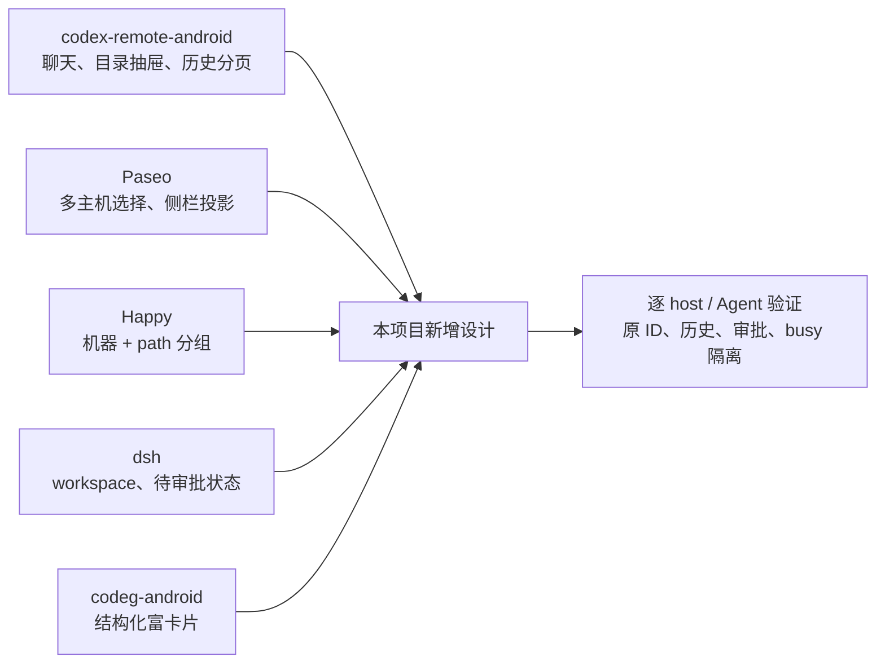

# 02 竞品调研

已核实的项目提供了聊天首页、工作目录分组、多主机选择、历史分页和结构化审批的可借鉴实现；它们不能直接证明本项目的 5 个 Agent 在当前安装环境中均可接入。产品目标是 Agent 聚合与聊天，不以 SSH 终端作为默认界面。

本文面向选型与实现人员。标识：**上游源码核实**＝公开源码或一方文档直接支持；**既有采样记录**＝当前项目提供的安装环境记录；**新增设计**＝本项目目标；**待验证**＝尚无端到端证据。公开源码核实范围为下列固定提交或明确分支；不将第三方实现、仓库检索零命中或 README 的支持声明视为本机接入已通过。

## 1. 结论与适用范围

1. 在本次核实的项目中，尚未确认一个现成安卓应用同时完成本项目的多主机、5 个指定 Agent、全历史浏览、原会话继续与完整缓存要求。这是候选范围内的结论，不是“全行业无人实现”。
2. 本项目优先参考 codex-remote-android 的聊天／抽屉／历史交互；这是设计选择。它面向 Codex，不能把协议原样用于这些 Agent。
3. Paseo 的 host-picker 与 sidebar-projection 已提供多主机入口及侧栏投影；Happy 按机器和路径生成项目组。因此，多主机聚合和机器＋目录分组不是本项目独有的设计。
4. deepseek-harness 有 MIT 开源的 Web 工作区界面与 ACP 自动化服务器。其 ACP 可继续原会话但不重放历史，历史浏览必须另走只读读取路径。
5. ZCode 一方源码有专用 app-server 与统一 `zcode --web` 发行入口；本机真正 CLI 0.16.9 的 no-PTY 能力与真实列表探测已成功。CPA 插件产物不是 CLI；原 ID resume、prompt、审批与安卓驱动端到端仍待验证，不能宣称全部聊天能力已通过。

## 2. 已核实的交互参考

| 项目与许可 | 核实的实现 | 对本项目的用途 | 不可据此宣称的能力 |
| --- | --- | --- | --- |
| [codex-remote-android](https://github.com/liuhao-labs/codex-remote-android)，Apache-2.0 | README：连接后自动导入可继续的远端历史、按 thread 的 `cwd` 生成项目；打开时先取最近完整轮次，向上滚动加载旧历史。`WorkspaceScreen.kt`：聊天、`ModalNavigationDrawer`、项目内 New task、`onLoadOlderHistory` | 聊天首页、自动目录分组、组内新建、历史分页 | 对本项目 5 个 Agent 的覆盖与可用性；其 Codex app-server 不是 ACP |
| [Paseo](https://github.com/getpaseo/paseo)，Apache-2.0（第三方组件另按各自许可） | `host-picker.tsx`：具体主机、`All hosts`、连接状态与设置；`sidebar-projection.ts`：项目／状态分组、固定项与快捷键共享侧栏投影 | 顶栏 host 选择、聚合范围与显示投影分离 | 对 dsh／zcode 插件可直接上线的承诺；WSL 端到端支持或不支持 |
| [Happy](https://github.com/slopus/happy)，MIT | `projectGroups.ts` 的 `buildPathProjectGroups` 用 `JSON.stringify([machineId, projectPath])` 分组，worktree 层级独立 | 同路径跨主机隔离、稳定工作区键 | 本项目应当自动合并 worktree；或它是一对一单机产品 |
| [codeg-android](https://github.com/xintaofei/codeg-android)，Apache-2.0 | `ToolCallCard.kt`、`PermissionRequestCard.kt`、`AskQuestionCard.kt`、`PlanApprovalCard.kt` 分别承载工具与交互请求 | 工具、审批、提问、计划的富卡片渲染 | 这些卡片已适配本项目事件协议或已通过真机验收 |
| [deepseek-harness](https://github.com/deepseek-ai/deepseek-harness)，MIT | `packages/client/ui-workspace` 提供 workspace 分组、组内新建、搜索、会话行操作与待审批／待回答状态 | 聊天＋工作区的交互参照 | Web 的 DSH 专用卡片都能通过 ACP 获得 |

源码依据均为**上游源码核实**：

- codex-remote-android，提交 `372581ad5cc66677d5322a9a447a03277d36ce15`：[README](https://github.com/liuhao-labs/codex-remote-android/blob/372581ad5cc66677d5322a9a447a03277d36ce15/README.md)、[WorkspaceScreen.kt](https://github.com/liuhao-labs/codex-remote-android/blob/372581ad5cc66677d5322a9a447a03277d36ce15/app/src/main/java/com/codex/remote/ui/screens/WorkspaceScreen.kt)、[AppViewModel.kt](https://github.com/liuhao-labs/codex-remote-android/blob/372581ad5cc66677d5322a9a447a03277d36ce15/app/src/main/java/com/codex/remote/AppViewModel.kt)。自动导入和项目生成由连接／状态层完成，不是仅靠界面文件。
- Paseo，提交 `a1da1b8f234afe7a75785022292cdf8a50ee11a5`：[host-picker.tsx](https://github.com/getpaseo/paseo/blob/a1da1b8f234afe7a75785022292cdf8a50ee11a5/packages/app/src/components/hosts/host-picker.tsx)、[sidebar-projection.ts](https://github.com/getpaseo/paseo/blob/a1da1b8f234afe7a75785022292cdf8a50ee11a5/packages/app/src/components/sidebar/sidebar-projection.ts)、[LICENSE](https://github.com/getpaseo/paseo/blob/a1da1b8f234afe7a75785022292cdf8a50ee11a5/LICENSE)。
- Happy，提交 `63579c5234641768318b9c240103b068dc1a3aaf`：[projectGroups.ts](https://github.com/slopus/happy/blob/63579c5234641768318b9c240103b068dc1a3aaf/packages/happy-app/sources/sync/projectGroups.ts)。该实现还支持具有原生项目身份的另一条分组路径，不能仅从 path 分组函数推断整个产品范围。
- codeg-android，提交 `33dba91b1522330fe519c27c4833066e35c9495e`：[工具卡](https://github.com/xintaofei/codeg-android/blob/33dba91b1522330fe519c27c4833066e35c9495e/app/src/main/java/app/codeg/android/feature/sessiondetail/rendering/ToolCallCard.kt)、[权限卡](https://github.com/xintaofei/codeg-android/blob/33dba91b1522330fe519c27c4833066e35c9495e/app/src/main/java/app/codeg/android/feature/sessiondetail/interactive/PermissionRequestCard.kt)、[提问卡](https://github.com/xintaofei/codeg-android/blob/33dba91b1522330fe519c27c4833066e35c9495e/app/src/main/java/app/codeg/android/feature/sessiondetail/interactive/AskQuestionCard.kt)、[计划卡](https://github.com/xintaofei/codeg-android/blob/33dba91b1522330fe519c27c4833066e35c9495e/app/src/main/java/app/codeg/android/feature/sessiondetail/interactive/PlanApprovalCard.kt)。

## 3. Agent 一方实现与安装边界

### 3.1 deepseek-harness：Web 工作区与 ACP 是不同能力面

**上游源码核实**：[deepseek-ai/deepseek-harness](https://github.com/deepseek-ai/deepseek-harness) 默认分支为 `master`，核实提交为 `d743267388641bc76f17c45ce8b4c231aed1d32c`，根 [LICENSE](https://github.com/deepseek-ai/deepseek-harness/blob/d743267388641bc76f17c45ce8b4c231aed1d32c/LICENSE) 为 MIT。

| 能力面 | 源码依据 | 核实结论 |
| --- | --- | --- |
| Web 工作区 | [ui-workspace README](https://github.com/deepseek-ai/deepseek-harness/blob/d743267388641bc76f17c45ce8b4c231aed1d32c/packages/client/ui-workspace/README.md)、[Rows.tsx](https://github.com/deepseek-ai/deepseek-harness/blob/d743267388641bc76f17c45ce8b4c231aed1d32c/packages/client/ui-workspace/src/client/rows/Rows.tsx)、[WorkspaceBrowser.tsx](https://github.com/deepseek-ai/deepseek-harness/blob/d743267388641bc76f17c45ce8b4c231aed1d32c/packages/client/ui-workspace/src/client/rows/WorkspaceBrowser.tsx) | 有目录工作区、组内新建与会话搜索；会话行按 pendingInteraction 显示审批、计划确认或回答状态。上游以登记的 workspace 组织目录，不等同于本项目从所有历史 `cwd` 自动建组 |
| ACP 自动化 | [ACP README](https://github.com/deepseek-ai/deepseek-harness/blob/d743267388641bc76f17c45ce8b4c231aed1d32c/packages/acp/acp/README.md)、[src/index.ts](https://github.com/deepseek-ai/deepseek-harness/blob/d743267388641bc76f17c45ce8b4c231aed1d32c/packages/acp/acp/src/index.ts) | 启动入口 `dsh --profile acp`；支持 list／resume／close／new／prompt／cancel，initialize 宣告 `sessionCapabilities: { close: {}, list: {}, resume: {} }`；不支持 `session/load` 与历史重放 |
| Web 监听 | [webserver/src/index.ts](https://github.com/deepseek-ai/deepseek-harness/blob/d743267388641bc76f17c45ce8b4c231aed1d32c/packages/host/webserver/src/index.ts) | `host` 接受本地接口的具体 IPv4／IPv6 字面地址，拒绝 wildcard，包括 `0.0.0.0` 与 `::`；并非只接受 loopback |

**既有采样记录**：经本机 SSH 端口 2222 对 dsh `0.2.1-alpha.1` 执行 `dsh --profile acp`，initialize 确认 resume／list／close，未宣告 `loadSession`。这支持采用“只读历史＋resume”的接入设计，但不代表 new／prompt／审批全链路已在安卓通过。

**新增设计**：本项目仍采用 loopback＋SSH 隧道，不因上游可绑定具体 IP 就将执行服务暴露到局域网。DSH 的 Web 展示协议与标准 ACP 分开评估；ACP 不提供 DSH 专用计划、标题等展示扩展，不能用 Web 卡片推断 ACP 能力。

### 3.2 ZCode：专用 app-server 已可探测，聊天全链路待验证

**上游源码核实**：[zai-org/ZCode](https://github.com/zai-org/ZCode) 提交 `29628c9acdb81b703bbd4080c207a0e7ce5e276e` 的 [LICENSE](https://github.com/zai-org/ZCode/blob/29628c9acdb81b703bbd4080c207a0e7ce5e276e/LICENSE) 为 Apache-2.0。

- [README](https://github.com/zai-org/ZCode/blob/29628c9acdb81b703bbd4080c207a0e7ce5e276e/README.md) 包含 `apps/zcode-cli` 一方 CLI／运行时源码，以及统一发行的 `zcode`（TUI）、`zcode --web`（Web）入口；构建发行包不会自动替换 PATH 中的旧安装。
- [arguments.ts](https://github.com/zai-org/ZCode/blob/29628c9acdb81b703bbd4080c207a0e7ce5e276e/apps/zcode-cli/packages/cli/src/arguments.ts) 识别 app-server／agent-server 和 stdio；[run.ts](https://github.com/zai-org/ZCode/blob/29628c9acdb81b703bbd4080c207a0e7ce5e276e/apps/zcode-cli/packages/cli/src/run.ts) 将命令交给 `runZCodeProtocolAgent`；[main.ts](https://github.com/zai-org/ZCode/blob/29628c9acdb81b703bbd4080c207a0e7ce5e276e/apps/zcode-cli/packages/cli/src/main.ts) 明确保护 ZCode Protocol 的 stdout 帧通道。该链路是 ZCode 专用协议，不是 ACP，不能套用 ACP 方法与能力位。

**既有采样记录**：真正 CLI 是 `/home/colle/.zcode/server/agents/glm/zcode-agent`，`--version` 返回 `0.16.9`。仅注入已有 provider 配置文件路径、不读取或输出配置内容，通过 SSH no-PTY 启动 `app-server --cwd /home/colle` 后，`runtime/capabilities` 返回 `{ "independentPlanState": true }`；带真实 `workspaceIdentity` 的 `session/list` 返回真实会话。具体启动条件、请求与报告出处见 03 第 3.3 节。

协议为严格 JSONL 的 ZCode Protocol v1，请求字段为 `id/method/params/trace`，不是 JSON-RPC，不得加入 `jsonrpc:"2.0"`。`initialize` 不存在，实测返回 `-32601`；就绪／能力探测使用 `startup/storageState` 与 `runtime/capabilities`，不能以 ACP initialize 失败认定进程不可用。

`/home/colle/dsh/cpa-jethub-plugins/zcode` 是 CPA provider 插件产物，`main` 为空，不是官方 CLI。它对 `--version`、`--help`、`app-server --stdio` 无输出并退出，不构成整个 zcode 的接入阻塞。显示分组可以用 `(hostId, cwd)`，但协议 list／恢复必须保留原生工作区身份，不能仅把 cwd 填入 workspaceKey。

**待验证**：原会话 resume、正文／事件接续、prompt、审批和安卓专用驱动端到端未取得实际运行证据；版本、能力与列表探测成功不等于聊天全链路通过。查看冷历史仍走只读 SQLite，不为浏览自动恢复用户会话。

### 3.3 Kimi：旧 Web 源码与当前公开 API 分开

**上游源码核实**：[MoonshotAI/kimi-cli](https://github.com/MoonshotAI/kimi-cli) 已归档，README 明确迁移至 [MoonshotAI/kimi-code](https://github.com/MoonshotAI/kimi-code)。旧 Python 仓库的许可为 Apache-2.0，包含旧 Web 构建入口；不能把它当作当前 Kimi Code Web 的维护仓库。

当前 kimi-code 提交 `419aced0e97fa04b75f8f71b089e1667f6de6d0a` 为 MIT。其 [web/run.ts](https://github.com/MoonshotAI/kimi-code/blob/419aced0e97fa04b75f8f71b089e1667f6de6d0a/apps/kimi-code/src/cli/sub/web/run.ts) 调用 `@moonshot-ai/kap-server`，并说明 Web UI 源码位于 code-app 仓库；公开主仓有打包的 `dist-web` 静态资源，但不等于公开了当前 Web UI 开发源码。公开的 [kap-server 路由目录](https://github.com/MoonshotAI/kimi-code/tree/419aced0e97fa04b75f8f71b089e1667f6de6d0a/packages/kap-server/src/routes) 包含会话、工作区、transcript、审批等 server API，可用于接口核实。

**待验证**：采用 ACP 还是 server API、不同版本的历史重放与分页边界，须按目标机器实际安装探测。公开 API 不能替代当前安装环境测试；也不能从旧 Web 源码推断当前 UI 可直接复制。

## 4. 其他候选的证据边界

以下项目保留为参考入口，不以未经复核的支持数量、排名或停更结论决定接入。

| 项目 | 可考察方向 | 核实边界 |
| --- | --- | --- |
| [herdr](https://github.com/herdrdev/herdr) + [Collie](https://github.com/AltanS/collie) | 多机运行时、状态感知与联邦协议 | 当前会话历史覆盖与安卓适配待验证，不写“行业最强”或“缺历史”的全量断言 |
| [Orca](https://github.com/stablyai/orca) | Agent 存储扫描、WSL 路径处理、resume 命令知识 | MIT 已核实；`src/shared/agent-resume-argv.ts` 含 zcode／dsh resume 分支。命令表不证明本机可运行，也不证明移动端跨主机链路已打通 |
| [codeg](https://github.com/spacering-net/codeg) | 只读历史解析与 ACP 客户端 | Apache-2.0 已核实；dsh 解析器有多帧、世代选择及 v4 测试，kimi 解析器从 session_index 补全 `cwd`；适配本机仍须样本验证 |
| [agentctxsync](https://github.com/westsource/agentctxsync) | 存储格式与写入约束调研 | 作为第三方资料，不能代替一方协议或真实样本 |
| [Sesori](https://github.com/sesori-ai/sesori_apps_monorepo)、[AgentsMesh](https://github.com/AgentsMesh/AgentsMesh) | 其他远程 Agent 产品路线 | 当前范围、许可附加条件与部署成本待验证，不作为已选依赖 |

源码检索没有找到 `wsl.exe` 或 `wsl.localhost`，只能说明没有在该检索范围发现专门实现；不能推出 Paseo 不支持在 WSL 内部署 daemon，更不能推出 WSL 场景不可用。WSL 发行版内 daemon、SSH 直连与 Windows 宿主转接分别是不同部署方式，需要各自实测。

本文不提供未取得当前 API 证据的 star 数；热度数字不作为功能、维护状态或技术可行性的证据。

## 5. 地址变化与网络选择

**新增设计**：主机身份使用稳定 `hostId`，连接地址是可编辑属性。应用不负责自动识别换 IP 的同一设备，跨网络稳定可达性由用户部署的覆盖网络提供；首次确认和主机密钥变更检查仍保留。

可考察 [Tailscale](https://tailscale.com/kb/1081/magicdns)、[NetBird](https://docs.netbird.io/)、[ZeroTier](https://docs.zerotier.com/) 等网络方案。它们的安卓、WSL、droidspace 组合以及 VPN 下局域网行为属于部署验证，不作为本项目自动设备发现能力。mDNS 与自研心跳也不能仅凭概念说明就计为完成。

## 6. 对产品与实施的要求

| 依据 | 本项目新增设计／验证要求 |
| --- | --- |
| 多个项目已存在目录与会话抽屉 | 首页 chat；按 `(hostId, cwd)` 自动建组；组内新建；保留聚合搜索 |
| Paseo 与 Happy 已存在多主机／机器路径标识 | 浏览范围与执行会话分离；跨主机同路径不合并 |
| dsh ACP 没有 load | 只读完整历史分页＋resume；不得把 resume 成功当作历史浏览完成 |
| ZCode 真 CLI 的能力／真实列表已可探测，协议不是 JSON-RPC | 保留原生 workspaceIdentity；独立驱动继续验证 resume／prompt／审批，不以探测成功认定聊天全链路已通过 |
| Kimi Web 源码边界 | 当前 UI 不按旧 Python Web 直接移植；优先核实公开协议与 server API |
| 上游 UI 可借鉴但本项目尚未验收 | load 前消费者就绪、历史完成屏障、noBackup 完整分页缓存与 busy 切换隔离均单独验收 |

许可证决定复制代码时的条件，不能直接决定功能是否可用。AGPL 项目要求按适用条款履行源代码开放等义务；本项目选择不直接复制此类代码，不能表述为“法律上不可复制”，详见 04。
