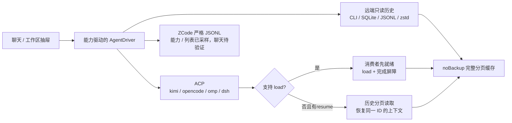

# 03 Agent 对接矩阵

5 个 Agent 共用聊天与工作区模型，但各自的历史读取、上下文恢复和实时交互必须独立判定。SSH 是后台传输与调试设施，不能用终端继续命令替代应用内聊天验收。

本文面向开发与测试。标识：**上游源码核实**＝公开一方或第三方实现已核对，注明来源；**既有采样记录**＝项目已有环境记录，须保留版本边界；**新增设计**＝待实现契约；**待验证**＝未完成当前安装环境的端到端验证。安装版本与路径不是跨设备常量。

## 1. 接入总览

| Agent | 既有采样版本 | 历史读取基础 | 结构化交互路线 | 当前证据边界 |
| --- | --- | --- | --- | --- |
| kimi-code | 2.1.1 | `kimi session list --all --json`；索引＋state＋wire 历史 | `kimi acp`；公开 server API 可另评估 | ACP 能力位为既有采样记录；当前安装的重放与审批端到端待验证 |
| opencode | 1.18.34 | 原生 SQLite 的 session／message／part | `opencode acp` | SQLite 与 ACP 采样已记录；当前安装的分页与事件接续待验证 |
| oh-my-pi | 18.4.9 | `~/.omp/agent/sessions/`，JSONL 布局需真实样本 | `omp acp` | 既有 ACP 采样记录；已有目录为空，不能认定历史解析已通过 |
| deepseek-harness | 0.2.1-alpha.1 | 原生 zstd 多帧 JSONL；ACP list 只给列表，不重放正文 | `dsh --profile acp`，只读历史＋resume | 本机 SSH 2222 initialize 确认 list／resume／close、无 loadSession；new／prompt／审批聊天全链路待验证 |
| zcode | 真入口 `zcode-agent` 实测 0.16.9 | 只读 SQLite；专用 session/list 保留原生 workspaceIdentity | ZCode Protocol v1 app-server，**非 ACP／非 JSON-RPC** | 真入口、no-PTY 启动、runtime/capabilities 与真实列表已确认；resume／prompt／审批及安卓驱动端到端待验证 |

**新增设计**：5 个 Agent 都必须列入探测、历史列表与验收矩阵。不能因格式或启动受阻而隐藏 Agent、把空结果当成功、或把目标缩小为 kimi＋opencode。



## 2. 协议与历史路线（新增设计）

| 路线 | 用途 | 必须满足的契约 |
| --- | --- | --- |
| ACP over SSH exec | 新建、继续、prompt、取消与权限交互 | 禁用 PTY；stdout 为 NDJSON JSON-RPC，stderr 单独消费；先 initialize，再按能力调用 |
| 一方专用协议 | zcode app-server 等非 ACP 通道 | 按其启动状态与能力方法就绪；ZCode 严格 JSONL 不含 jsonrpc，initialize 不存在；方法、身份与事件独立映射 |
| 官方只读 CLI／API | 会话列表、正文或分页历史 | 核实版本、字段、排序与续页机制；一次性 CLI 读取不等于流式聊天 |
| 远端存储解析 | 协议未提供历史重放时的只读读取 | 在远端筛选、解压、分页并返回 JSON；不下载整库、不改原生数据 |
| Web 经 loopback 隧道 | 补充界面与协议研究 | 不替代原生聊天验收；认证、来源限制与生命周期单独验证 |
| SSH 终端 | 人工调试 | 独立入口；用户显式打开，不能作为默认聊天或自动降级目标 |

### 2.1 ACP 能力协商

ACP 以 JSON-RPC over stdio 提供会话方法。是否支持历史 load、list、resume、close、图像或扩展方法，必须以目标进程的 initialize 与实际响应为准，不按 Agent 名称或版本号硬编码。

| 能力 | kimi 2.1.1 | opencode 1.18.34 | omp 18.4.9 | dsh 0.2.1-alpha.1 |
| --- | --- | --- | --- | --- |
| `loadSession` | 既有采样：支持 | 既有采样：支持 | 既有采样：支持 | 本机 initialize 未宣告；上游明确不支持 load |
| `sessionCapabilities.list` | 既有采样：支持 | 既有采样：支持 | 既有采样：支持 | 本机 initialize 已确认 |
| `sessionCapabilities.resume` | 既有采样：支持 | 既有采样：支持 | 既有采样：支持 | 本机 initialize 已确认 |
| `sessionCapabilities.close` | 既有采样：支持 | 既有采样：支持 | 既有采样：支持 | 本机 initialize 已确认 |
| fork | 既有采样：支持 | 既有采样：支持 | 既有采样：支持 | 上游不支持 |
| delete | 既有采样：支持 | 既有采样：不支持 | 既有采样：不支持 | 上游不支持 |
| 图像 prompt | 既有采样：支持 | 既有采样：支持 | 既有采样：支持 | 上游按持久附件与当前模型路线动态判定，本机待验证 |

前三列不是本次重新执行的握手结果，更不代表安卓真机已通过。能力缺失视为不支持；未知、初始化失败与不支持必须分别呈现。

| 方法／事件 | 用途与边界 |
| --- | --- |
| `initialize` | 首个调用，协商版本及能力 |
| `session/new` | 明确绝对 `cwd` 与 MCP 配置，创建后保存原生 sessionId |
| `session/list` | 遵循 nextCursor 分页；无正文，不等于历史已取得 |
| `session/load` | 载入原会话并用 `session/update` 重放历史；历史不在返回值内 |
| `session/resume` | 恢复同一会话上下文，不重放手机所需历史 |
| `session/prompt` | 提交当前会话轮次，响应前继续消费更新与审批 |
| `session/cancel` | 用户显式停止操作；导航、筛选和刷新不得暗中发送 |
| `session/close` | 仅在支持时显式释放会话；dsh close 会取消／排空相关工作，不能用于 busy 视图切换 |
| `session/set_config_option` | 仅对已宣告选项调用 |
| `session/update` | 历史与实时输出的事件入口，必须持续消费 |
| `session/request_permission` | 保留来源会话和请求身份；必须向原请求响应，不默认批准 |

clientCapabilities 的文件系统与终端支持应当只宣告实际实现的能力。未实现时按目标 ACP schema 省略或明确禁用对应能力，不能虚报支持，也不能承诺因此就只会收到两类回调；扩展提问、计划等需逐通道适配。

### 2.2 打开历史与缓存契约

**新增设计**：身份键固定为 `(hostId, agent, sessionId)`；工作区键固定为 `(hostId, cwd)`。打开与后续 prompt 不得把 ID 移到其他 host 或 Agent。

1. 发送 load 前，路由必须绑定原会话键，消费者确认就绪并开始收取更新。load 响应前的历史更新也必须进入同一顺序队列。
2. load 响应收到后，在该事件序列中放入历史完成屏障。等待屏障前更新全部归一化、落盘并投影到 UI 后才能允许发送；RPC 返回不能替代这一条件。
3. 无 load 但有 resume 时，先建立实时消费者，按只读来源取得历史与明确的读取边界，再 resume 同一 ID。历史与实时区间的去重依据必须来自稳定事件／消息 ID 或已定义的顺序映射，不按相同文本去重。
4. 若 Agent 仍在外部持续写入，读取器必须记录快照或续读边界并验证接续；无法确认完整性时显示“历史不完整”，不能标记完整或自动重复发送 prompt。
5. `noBackupFilesDir` 中保存完整已取得的历史页、序号、来源版本、游标与完整性状态。内存只保留显示窗口；旧页可以从磁盘再次读取，不能因内存条数上限静默丢弃。
6. 分页到结束才标完整。部分成功、缓存写入失败、解析失败、断线或取消加载保留已取得页与重试位置；刷新失败不得用空结果覆盖旧缓存。
7. 缓存完整且接续边界已确认时，可以用 resume 避免重复重放；缓存缺页时必须补读或重放，不能仅依据“存在缓存文件”跳过历史。

busy 会话在筛选、切 host／Agent／会话后必须继续被其原消费者管理。实现不能保留连接时须明确阻止切换或请求用户确认停止；不得静默 cancel／close。缓存清理由用户显式操作，且只清应用副本。

### 2.3 传输与资源限制

| 风险 | 必须处理的行为 |
| --- | --- |
| PTY 回显／CRLF | SSH exec 禁用 PTY，不走交互终端流 |
| stdout 污染 | stderr 与 stdout 分开；协议启动日志不得混入 stdout |
| PATH 不完整 | 记录探测到的可执行路径；通过受控 login shell 或绝对路径启动；参数安全引用 |
| 超大帧 | 本项目采用 32 MiB 单帧保护作为设计限制，兼容性待验证；超限明确报错并保留已取得历史，不静默截断为合法 JSON |
| 消费积压 | 背压或分页落盘；内存有界不得用 drop-oldest 隐藏旧消息 |
| 断线与重连 | 恢复原 ID 并核实轮次状态，不自动重复 prompt |

## 3. 逐 Agent 存储与命令

本节路径和字段是**既有采样记录**；第三方来源另标。读取器必须先发现实际数据根与 schema，返回版本与错误状态，不据此修改任何原生文件。

### 3.1 kimi-code

| 项 | 采样内容 |
| --- | --- |
| 数据根 | `$KIMI_CODE_HOME` 或 `~/.kimi-code` |
| 会话目录 | `<根>/sessions/<工作目录键>/session_<uuid>/` |
| 元数据 | `<会话目录>/state.json` |
| 消息记录 | `<会话目录>/agents/<agentId>/wire.jsonl` |
| 全局索引 | `<根>/session_index.jsonl`，字段 `sessionId`、`sessionDir`、`workDir` |
| 列表命令 | `kimi session list --all --json`；已有选项记录为 `--cwd`、`--all`、`--archived`、`--limit`、`--json`，目标版本需检查 |
| 人工继续命令 | `kimi --session <id>`，需回到原 `workDir` |

`cwd` 必须从索引或协议核实，不能假定 `state.json` 提供完整目录字段。**第三方源码核实**：[codeg 的 kimi_code.rs](https://github.com/spacering-net/codeg/blob/main/src-tauri/src/parsers/kimi_code.rs) 明确从 session_index 补充 `cwd`。单独扫描 state.json 会遗漏该关联；工作目录缺失的记录保留并标记不可继续。

**一方源码核实**：旧 [kimi-cli](https://github.com/MoonshotAI/kimi-cli) 已归档、Apache-2.0；当前 [kimi-code](https://github.com/MoonshotAI/kimi-code) 为 MIT。当前公开主仓有 server API，Web UI 开发源码不在公开主仓，见 02 第 3.3 节。不能混用两代存储与界面实现。

### 3.2 opencode

| 项 | 采样内容 |
| --- | --- |
| 数据库 | `~/.local/share/opencode/opencode.db` |
| 表 | `session`、`message`、`part` |
| 日志模式 | WAL，存在 `-wal`／`-shm` 旁文件 |
| 会话字段 | `id`、`project_id`、`workspace_id`、`parent_id`、`slug`、`directory`、`path`、`title`、`version`、`agent`、`model`、`time_created`、`time_updated`、`time_archived` |
| 人工继续命令 | `opencode --session <id>` |

采样的 1.x 为 SQLite，不是旧 `storage/session/info/*.json` 布局。发现器可以保留旧布局兼容，但不能用旧解析器对新版的空结果认定“没有会话”。

**新增设计**：数据库以只读连接查询并遵守 WAL 读一致性；不得对在线库启用忽略 WAL 的读法，也不得执行 migration、VACUUM、checkpoint 或写入。排序用稳定主键作为时间的次级键，列表与正文必须分开分页。

下面是只读列表字段查询，分页游标与参数绑定需由读取器实现，不是完整分页脚本：

```bash
sqlite3 -readonly -json "$HOME/.local/share/opencode/opencode.db" \
  'select id,title,directory,time_created,time_updated from session order by time_updated desc,id;'
```

message 按 `time_created`、`id` 获取；part 按其所属消息及稳定序号关联，不能仅按 message_id 字符串宣称已恢复对话顺序。所有 sessionId 查询必须安全绑定参数。

### 3.3 zcode

| 项 | 采样内容 |
| --- | --- |
| 数据库 | `~/.zcode/cli/db/db.sqlite` |
| 表 | `session`、`message`、`part`，另有 `session_entry`、`permission`、`workflow_*` |
| 会话字段 | `id`、`project_id`、`workspace_id`、`directory`、`path`、`title`、`time_created`、`time_updated`、`task_type`、`trace_id`；目录与原生 workspace_id 必须同时保留 |
| 消息排序 | message／part 有 `sequence`；空 sequence 排后，次级键 `time_created`、`rowid` |
| 真正 CLI 入口 | `/home/colle/.zcode/server/agents/glm/zcode-agent`；wrapper 调用同 runtime 的 node 与 `zcode.cjs` |
| 运行版本 | `--version` 实测返回 `0.16.9`；同目录 `.version` 为 `0.13.3`，不能用它替代实际 CLI 版本 |
| 专用通道 | SSH no-PTY exec，`app-server --cwd /home/colle`，stdin 保持打开，stdout／stderr 分离 |
| 非 CLI 文件 | `/home/colle/dsh/cpa-jethub-plugins/zcode` 是 CPA 插件构建产物，空 main 不处理参数 |
| 人工继续命令记录 | `zcode --resume <id>` 是第三方 argv 记录，不能替代该 runtime 的 `session/resume` 端到端验证 |

zcode 与 opencode 库按实际路径分别发现，不能只按同源表结构识别。只读查询规则与 opencode 相同；`sequence` 需连同消息关联一起验证。

**一方源码核实**：[ZCode](https://github.com/zai-org/ZCode) 为 Apache-2.0，公开 `apps/zcode-cli`。`app-server`／`agent-server` 经 [run.ts](https://github.com/zai-org/ZCode/blob/29628c9acdb81b703bbd4080c207a0e7ce5e276e/apps/zcode-cli/packages/cli/src/run.ts) 调用 `runZCodeProtocolAgent`；[README](https://github.com/zai-org/ZCode/blob/29628c9acdb81b703bbd4080c207a0e7ce5e276e/README.md) 给出统一 `zcode --web` 发行入口。当前桌面远端 runtime wrapper 不等于完整的独立发行包。

**既有采样记录的出处**：只读探测报告 `/home/colle/.kimi-code/sessions/wd_rmagentma_e0efdf802231/session_dda25434-e40f-4a4d-83cd-5c27eb7d8c78/agents/main/tasks/agent-k08yc4gg/output.log` 第 7–61 行记录入口、版本与启动条件，第 63–144 行记录 wire 与真实列表，第 146–173 行限定实时边界并确认 CPA 插件身份。报告只发 initialize、runtime/capabilities、session/list，没有 create／resume／subscribe／prompt；本节不能视为聊天已通过。

#### 启动条件

裸执行该 runtime 的 app-server 缺少预期邻接 provider 配置。以下采样命令只向环境注入配置文件路径，没有读取、复制或输出配置内容，也没有修改安装：

```bash
ZCODE_BUILTIN_PROVIDER_CONFIG_FILE=/home/colle/.zcode/v2/runtime/provider/bundled/zcode-builtin.json \
ZCODE_PERSONAL_PROVIDER_CONFIG_FILE=/home/colle/.zcode/v2/provider_config.json \
/home/colle/.zcode/server/agents/glm/zcode-agent app-server --cwd /home/colle
```

`app-server` 本身走 stdio，无需 `--stdio`。stdin 必须保持打开至所需响应到达；过早 EOF 的 `Protocol input closed` 不是 CLI 不可运行的证据。上述 bundled 路径仅证明该采样可以启动，不保证等于当前 endpoint 的活动配置。生产接入应当使用显式配置的启动命令或官方 host 的活动路径解析；不得猜 endpoint、硬编码版本目录或把配置内容导入手机。

#### 专用消息与只读探测

**既有采样记录**：ZCode Protocol v1 使用严格 JSONL 消息，请求字段为 `id/method/params/trace`，不是 ACP，也不是 JSON-RPC；不能添加 `jsonrpc:"2.0"`。`initialize` 返回 `{"error":{"code":-32601,"message":"Method not found: initialize"},"id":1}`，不属于握手入口。

```json
{"id":2,"method":"runtime/capabilities","params":{}}
{"id":2,"result":{"independentPlanState":true}}
```

启动先发 `startup/storageState`，采样达到 ready；runtime/capabilities 只证明该能力响应可用，不宣告 prompt／resume／审批均已验收。采样迁移状态为 kind=none、executedCount=0、committedCount=0，不代表 app-server 绝对零写入；Agent 自己仍可能写运行日志或辅助数据。查看原生历史的扫描器继续只读，不为查看冷会话自动启动／恢复其 runtime。

#### 原生工作区身份

**既有采样记录**：目录 `/mnt/e/ProgramingCode/onLineDoc` 对应持久化 `workspace_id` 为 `remote:wsl:default:/mnt/e/ProgramingCode/onLineDoc`。仅以 cwd 同时填 workspaceKey／workspacePath 会返回空列表；使用真实 identity 的以下请求返回该目录真实会话：

```json
{"id":20,"method":"session/list","params":{"workspace":{"workspacePath":"/mnt/e/ProgramingCode/onLineDoc","workspaceKey":"remote:wsl:default:/mnt/e/ProgramingCode/onLineDoc","workspaceIdentity":"remote:wsl:default:/mnt/e/ProgramingCode/onLineDoc"},"includeArchived":false,"limit":2}}
```

**新增设计**：SQLite 读取必须保留 `directory/path/workspace_id`。全局 protocol list 可以按路径生成 UI 工作区，但输出的 path 未必带齐持久化 identity；打开与恢复仍需从权威元数据取得原生 identity。UI 分组键 `(hostId, cwd)` 与协议 `workspaceIdentity` 是不同对象，不得互相替代，也不得将此台机器的 remote:wsl 前缀硬编码到其他 host。

#### 实时接入边界

报告中的 runtime 源码记录：`session/messages`、`session/read`、`session/events`、`session/subscribe` 要求当前 app-server 已有 active runtime；messages 不会自动读取冷会话。`session/resume` 会重建 runtime，不是只读数据库查询。

**新增设计**：用户显式选择继续时才 resume，随后订阅／获取消息；历史浏览先走只读 SQLite。`interaction/requestPermission`、requestUserInput 与 provider／MCP 授权等反向请求必须分别处理，不默认放行；凭据留在远端。

**待验证**：专用驱动的原 ID resume、正文／事件接续、prompt、审批以及安卓端到端仍未取得实际运行证据；驱动代码实现不等于这些方法已通过。应用不得自动替换安装、创建新会话冒充继续，或从 CPA 插件空输出推断整个 ZCode 不可接入。

### 3.4 deepseek-harness

| 项 | 采样内容 |
| --- | --- |
| 数据根 | `$DSH_HOME/sessions/`，默认 `~/.dsh/sessions/` |
| 会话目录 | `<根>/--<工作目录 slug>--/<会话 uuid>/` |
| 日志 | `session.vN.jsonl.zstd`，既有样本为 v4 |
| 压缩 | zstd 多帧拼接，无加密；`zstd -dc` 可解多帧 |
| 不参与读取的文件 | `session.lock`、`session.migration.<token>.jsonl.zstd.tmp` |
| 排序 | 会话头后为含 `seq` 的事件包 |
| 人工继续命令 | `dsh tui --resume <id>`，必须保持原目录 |
| ACP 入口 | `dsh --profile acp` |

事件包括 `session` 头与 `user/message`、`assistant/message`、`tool/call`、`step/start` 等。工具与非文本事件必须保留，不能只筛 user／assistant 就声称历史完整。

**新增设计**：按数值最高的有效日志世代选择文件，不能拼接 `session.v*.jsonl.zstd` 的所有世代，避免重读同一历史。选择、损坏与迁移中的状态必须显式返回。**第三方源码核实**：[codeg deepseek.rs](https://github.com/spacering-net/codeg/blob/main/src-tauri/src/parsers/deepseek.rs) 有世代选择、多帧读取及 v4 测试，不能表述为只记录到 v3；但仍须与目标安装实际样本对照。

**一方源码核实**：`deepseek-ai/deepseek-harness` 的 `master`、MIT，提交 `d743267388641bc76f17c45ce8b4c231aed1d32c`。其 [ACP README](https://github.com/deepseek-ai/deepseek-harness/blob/d743267388641bc76f17c45ce8b4c231aed1d32c/packages/acp/acp/README.md) 与 [index.ts](https://github.com/deepseek-ai/deepseek-harness/blob/d743267388641bc76f17c45ce8b4c231aed1d32c/packages/acp/acp/src/index.ts) 支持 list／resume／close／new／prompt／cancel，无 load 与历史重放。list 分页遵守返回游标，不保证它就是磁盘所有归档／子 Agent 记录；磁盘索引与可继续列表的覆盖须分别标明。

**既有采样记录**：SSH 2222 的 dsh `0.2.1-alpha.1` initialize 已确认 resume／list／close，无 loadSession。历史浏览走只读解压分页，实时对话走 resume＋prompt；Web 的 DSH 专用卡片不属于 ACP 自动化展示面。

### 3.5 oh-my-pi

| 项 | 采样内容与边界 |
| --- | --- |
| 默认根 | `~/.omp/agent/sessions/` |
| 可配置位置 | `--session-dir <path>` 或 `PI_CODING_AGENT_SESSION_DIR`，目标版本需核实 |
| 目录组织 | 工作目录编码的子目录；既有本机子目录为空 |
| 格式 | 第三方描述为 JSONL；未取得当前安装真实会话样本 |
| 人工继续命令 | `omp --resume <id\|path>`；ID／路径参数的选择需实际验证 |

第三方资料描述标题槽位、会话头（`id`、`timestamp`、`cwd`）与消息链（`id`、`parentId`、`timestamp`、`message`）。“首行 256 字节槽位”的描述属于待验证，不能据此断言普通 JSON 解析一定失败，也不能按定宽截断有效记录。

**待验证**：经用户明确操作在临时会话目录完成一轮，取得真实文件，核对首行填充、分支 parentId、排序与继续入口。生成样本必须通过 Agent 本身，不手工伪造原生文件。样本缺失时明确报告历史未验证，不自动把 omp 降为仅新建或从目标范围删除。

## 4. Web 补充路线的边界

| Agent | 已知入口与证据 | 本项目规则 |
| --- | --- | --- |
| kimi-code | 当前公开 web 启动与 server API；当前 UI 开发源码不在公开主仓 | 作为补充，版本与认证待目标环境验证 |
| opencode | 既有记录为 `opencode web`／`serve` | 监听、认证与来源校验待验证，不凭旧记录允许直接外网暴露 |
| deepseek-harness | 一方 webserver 支持本地接口具体 IPv4／IPv6；拒绝 wildcard | 仍用 loopback＋SSH 隧道，不表述为“不能绑定局域网” |
| zcode | 一方统一发行入口 `zcode --web`；本机桌面 runtime 的 app-server 已可探测 | Web 发行入口与桌面 runtime 分开；当前机器的 Web 启动与安卓嵌入仍待验证，CPA 插件不是 Web／CLI 入口 |
| oh-my-pi | 未核实本项目可用的 Web 入口 | 不作为接入依据 |

DSH 的监听约束依据：[webserver/src/index.ts](https://github.com/deepseek-ai/deepseek-harness/blob/d743267388641bc76f17c45ce8b4c231aed1d32c/packages/host/webserver/src/index.ts)。采用远端 loopback 服务时，本地转发也只绑定手机 loopback；端口以实际服务为准。

```bash
ssh -N -L 127.0.0.1:3080:127.0.0.1:3080 <host>
```

## 5. 统一历史输出契约（新增设计）

| 字段 | 类型 | 必填 | 含义 |
| --- | --- | --- | --- |
| `hostId` | 字符串 | 是 | 稳定主机标识，不用当前地址替代 |
| `sessionId` | 字符串 | 是 | 原生会话 ID |
| `agent` | 字符串 | 是 | 本项目 Agent 标识 |
| `title` | 字符串 | 否 | 原标题，缺失时由 UI 显示未命名 |
| `cwd` | 字符串 | 正常记录必须有 | 远端绝对目录；缺失的异常记录保留、禁止继续 |
| 原生工作区身份 | 驱动元数据 | zcode 继续时必须有 | 保留 workspace_id 与必要的 path；不与 UI cwd 分组键混用；统一字段名尚未定义 |
| `createdAt` | 时间戳 | 否 | 来源提供的创建时间 |
| `updatedAt` | 时间戳 | 否 | 来源提供的活动时间；未知时不伪造 |
| `messageCount` | 整数 | 否 | 来源提供或省略，不把当前分页条数当全量 |
| `preview` | 字符串 | 否 | 末条消息摘要及其来源范围 |
| `nextCursor` | 不透明字符串 | 否 | 页级续读标识；不是会话字段 |
| 完整性状态 | 枚举 | 是 | 页级区分完整／部分／失败；精确 wire 枚举尚未定义 |

时间戳必须在驱动内明确源单位并统一转换；不能直接混排毫秒与秒。历史事件页还必须携带稳定消息／事件标识、顺序、类型、正文与来源版本，未知类型保留。精确字段 schema、去重映射和游标失效恢复尚未定义；确认前不得据此删除记录、自动回退为新会话或宣称完整。

## 6. 远端依赖与验证顺序

| 工具 | 用途 | 不具备时 |
| --- | --- | --- |
| `sqlite3` | opencode／zcode 只读查询 | 核实 Python 标准库 sqlite3 的只读 URI 支持后使用 |
| `zstd` | dsh 多帧解压 | 核实 Python 3.14+ 的 `compression.zstd` 实际可用性；都缺失时提示用户准备工具 |
| `jq` | JSON 处理 | Python 标准库 json；不能把输出截断伪装为合法 JSON |

逐项探测，报告缺失而不静默安装。优先验证 omp 真实样本与 zcode 未完成的原 ID resume／prompt／审批；zcode 真入口、能力与列表采样作为前提，不重复标为不可运行。同时建立 kimi 的聊天＋历史屏障闭环，再验证 opencode 和 dsh 的只读分页／实时接续。具体里程碑与验收在 06，不能按解析成本低或驱动代码存在就把未完成聊天的 Agent 标为已接入。
