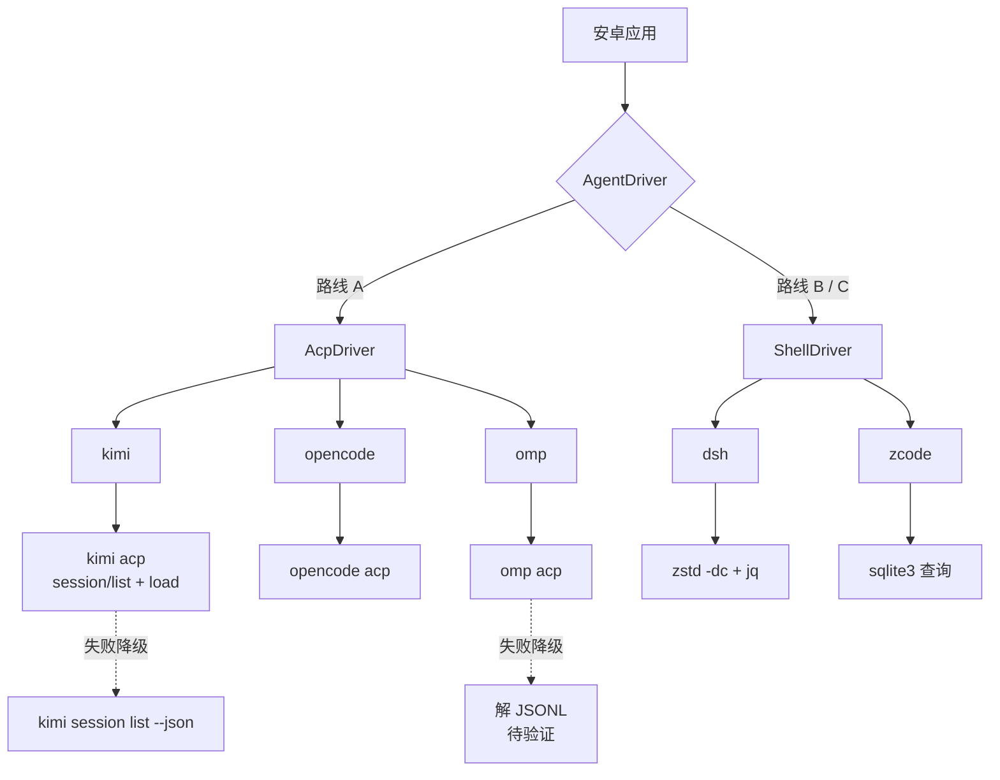

# 03 Agent 对接矩阵

5 个 agent 的会话存储位置、读取方式、继续命令与接入路线。本文档是实现的直接依据。

## 0. 总览

| agent | 版本 | 会话存储形态 | 读取方式 | 继续命令 | 实时对话通道 | 实现成本 |
| --- | --- | --- | --- | --- | --- | --- |
| kimi-code | 2.1.1 | 目录 + JSONL | 官方 CLI `--json` | `kimi --session <id>` | ACP | 低 |
| opencode | 1.18.34 | SQLite | 远端 `sqlite3` | `opencode --session <id>` | ACP | 低 |
| zcode | CLI 0.16.9 | SQLite | 远端 `sqlite3` | `zcode --resume <id>` | CLI | 低 |
| deepseek-harness | 0.2.1-alpha.1 | zstd 压缩 JSONL | `zstd -dc` + `jq` | `dsh tui --resume <id>` | CLI | 中 |
| oh-my-pi | 18.4.9 | JSONL（格式待验证） | 解 JSONL | `omp --resume <id\|path>` | ACP | 高 |

版本号为实机验证时的版本。**已有** 表示已在本机确认；**待验证** 表示格式未取得真实样本。

## 1. 三条接入路线

| 路线 | 适用 agent | 原理 | 优点 | 缺点 |
| --- | --- | --- | --- | --- |
| A. ACP over SSH | kimi、opencode、omp | SSH exec channel 远端运行 `<agent> acp`，NDJSON 收发 JSON-RPC | 一套代码驱动三家；协议含 `session/load`（继续会话）与 `session/list`（列会话） | 需要禁用 PTY；进程长驻 |
| B. CLI 一次性调用 | 全部 5 个 | SSH exec 执行命令，解析 JSON 输出 | 最简单，无长连接 | 每次调用新建连接；无流式 |
| C. 远端 SQLite / 文本解析 | opencode、zcode、dsh、omp | SSH 上跑 `sqlite3` / `zstd` / `jq`，手机收 JSON | 不依赖 agent 可执行文件；数据不过网 | 解析逻辑在远端脚本里维护 |

**推荐组合**：会话历史读取走 **B + C**，实时对话走 **A**（三家）+ **B**（dsh、zcode）。

理由：会话历史读取用一次性命令最省力，且不需要在手机上引入 zstd 解码器或 SQLite 驱动；实时对话用 ACP 可获得结构化事件（工具调用、权限请求、计划），避免解析终端输出。



## 2. ACP 能力矩阵

ACP（Agent Client Protocol）是 Zed 发起的 JSON-RPC 2.0 协议，传输为 stdio，线格式是 NDJSON（一行一条 JSON）。

实机确认的能力位：

| 能力 | kimi 2.1.1 | opencode 1.18.34 | omp 18.4.9 |
| --- | --- | --- | --- |
| `loadSession`（继续会话） | 支持 | 支持 | 支持 |
| `sessionCapabilities.list`（列会话） | 支持 | 支持 | 支持 |
| `sessionCapabilities.resume` | 支持 | 支持 | 支持 |
| `sessionCapabilities.close` | 支持 | 支持 | 支持 |
| `sessionCapabilities.fork` | 支持 | 支持 | 支持 |
| `sessionCapabilities.delete` | 支持 | 不支持 | 不支持 |
| `promptCapabilities.image` | 支持 | 支持 | 支持 |

**实现纪律**：必须按能力位判断，不得按 agent 名称或版本号硬编码。缺失的能力位一律视为不支持。

### 2.1 关键方法

client → agent：

| 方法 | 类型 | 用途 |
| --- | --- | --- |
| `initialize` | 请求 | 版本与能力协商，必须第一个调用 |
| `session/new` | 请求 | 新建会话，参数含 `cwd`、`mcpServers` |
| `session/load` | 请求 | 继续会话并重放历史 |
| `session/resume` | 请求 | 继续会话但不重放历史 |
| `session/list` | 请求 | 列出历史会话 |
| `session/prompt` | 请求 | 发送消息，阻塞至本轮结束 |
| `session/cancel` | 通知 | 取消进行中的轮次 |
| `session/set_config_option` | 请求 | 切换模型等配置项 |

agent → client（应用必须实现）：

| 方法 | 类型 | 用途 |
| --- | --- | --- |
| `session/update` | 通知 | 流式输出主通道 |
| `session/request_permission` | 请求 | 工具执行前请求授权，必须回应 |

**省力做法**：在 `initialize` 中把 `clientCapabilities.fs` 与 `clientCapabilities.terminal` 都声明为 `false`。这样 agent 不会回调应用的文件系统与终端方法——agent 本身就运行在远端机器上，有完整的本地访问权，不需要经过手机。声明 `false` 后，应用只需实现 `session/update` 与 `session/request_permission` 两个回调。

### 2.2 session/load 的语义

- 参数：`sessionId`（必填）、`cwd`（必填，绝对路径）、`mcpServers`（必填，可为空数组）
- 历史消息**不在返回值中**，而是通过 `session/update` 通知重放
- 重放通知可能在请求响应**之前**开始到达，因此收集器必须在发出请求时就绪
- `session/load` 与 `session/resume` 的分工：首次打开会话用 `load`（重建 UI），本地已有缓存时用 `resume`（避免重放）

### 2.3 线格式与传输陷阱

| 陷阱 | 后果 | 处理 |
| --- | --- | --- |
| 分配 PTY | TTY 回显请求、行尾变 CRLF，协议失效 | 必须禁 PTY：`channel.setPty(false)` 或 `ssh -T` |
| stderr 与 stdout 合并 | SSH 警告与 agent 日志污染 JSON 流 | stderr 单独定向 |
| 单条消息无上限 | 超大消息耗尽内存 | 设 32 MiB 上限，与官方 SDK 一致 |
| 远端 PATH 不含安装目录 | `command not found` | 使用绝对路径，或经 login shell 启动 |

## 3. 逐 agent 规格

### 3.1 kimi-code

| 项 | 内容 | 标识 |
| --- | --- | --- |
| 数据根 | `$KIMI_CODE_HOME` 或 `~/.kimi-code` | **已有** |
| 会话目录 | `<根>/sessions/<工作目录键>/session_<uuid>/` | **已有** |
| 会话元数据 | `<会话目录>/state.json` | **已有** |
| 消息记录 | `<会话目录>/agents/<agentId>/wire.jsonl` | **已有** |
| 全局索引 | `<根>/session_index.jsonl` | **已有** |
| 工作目录来源 | `session_index.jsonl` 的 `workDir` 字段 | **已有** |

`session_index.jsonl` 每行结构（实机取值）：

```json
{"sessionId":"session_9d4b4d3e-...","sessionDir":"/home/colle/.kimi-code/sessions/wd_colle_34779d66274d/session_9d4b4d3e-...","workDir":"/home/colle"}
```

**读取方式（首选）**：官方 CLI，输出即为成品 JSON，无需解析。

```bash
kimi session list --all --json
```

可用选项：`--cwd <path>`、`--all`、`--archived`、`--limit <n>`、`--json`。

**读取方式（兜底，不依赖可执行文件）**：

```bash
jq -c '{id,title,cwd,createdAt,updatedAt,archived}' \
  "$HOME"/.kimi-code/sessions/*/*/state.json
```

**继续会话**：`kimi --session <id>`。

**工作目录是必需的前提**：kimi 的会话按工作目录索引，继续会话前必须切换到原 `workDir`，否则 CLI 拒绝加载。

### 3.2 opencode

| 项 | 内容 | 标识 |
| --- | --- | --- |
| 数据库 | `~/.local/share/opencode/opencode.db` | **已有** |
| 表 | `session`、`message`、`part` | **已有** |
| 日志模式 | WAL（另有 `-wal` / `-shm` 旁文件） | **已有** |
| 本机会话数 | 1255 个会话 / 51716 条消息 | **已有** |
| 数据库体积 | 4.6 GB | **已有** |

`session` 表字段：`id`、`project_id`、`workspace_id`、`parent_id`、`slug`、`directory`、`path`、`title`、`version`、`agent`、`model`、`time_created`、`time_updated`、`time_archived`。

**读取方式**：

```bash
DB="$HOME/.local/share/opencode/opencode.db"
sqlite3 "$DB" "select id,title,directory,time_created,time_updated
               from session order by time_updated desc limit 200;"
sqlite3 "$DB" "select id,data from message where session_id='<id>' order by time_created, id;"
sqlite3 "$DB" "select message_id,data from part where session_id='<id>' order by message_id, id;"
```

**继续会话**：`opencode --session <id>`。

**存储格式**：1.x 版本使用 SQLite，不写旧的 JSON 布局（`storage/session/info/*.json`）。针对旧布局的解析代码在新版上读不到任何会话。

### 3.3 zcode

| 项 | 内容 | 标识 |
| --- | --- | --- |
| 数据库 | `~/.zcode/cli/db/db.sqlite` | **已有** |
| 表 | `session`、`message`、`part`，另有 `session_entry`、`permission`、`workflow_*` 等 | **已有** |
| 会话数 | 9 个会话 / 499 条消息 / 1898 个 part | **已有** |
| 可执行文件位置 | 本机位于 `/home/colle/dsh/cpa-jethub-plugins/zcode`，**不在 PATH 中** | **已有** |

`session` 表结构与 opencode 同源，字段含 `id`、`project_id`、`workspace_id`、`directory`、`title`、`time_created`、`time_updated`、`task_type`、`trace_id`。

`message` 与 `part` 表比 opencode 多一列 `sequence`。

**读取方式**：

```bash
DB="$HOME/.zcode/cli/db/db.sqlite"
sqlite3 "$DB" "select id,title,directory,time_created from session
               order by time_created desc limit 200;"
sqlite3 "$DB" "select id,data from message where session_id='<id>'
               order by sequence is null, sequence, time_created, rowid;"
```

**排序必须按 `sequence`**：`sequence` 为空的行排在最后，其后以 `time_created`、`rowid` 作为次级排序键。仅按时间排序会打乱消息顺序。

**继续会话**：`zcode --resume <id>`。

**注意**：zcode 的数据库要与 opencode 分开发现，避免两者互相吸收对方的记录——两库表结构同源，按文件名区分而不是按表结构区分。

### 3.4 deepseek-harness

| 项 | 内容 | 标识 |
| --- | --- | --- |
| 会话根 | `$DSH_HOME/sessions/`（默认 `~/.dsh/sessions/`） | **已有** |
| 会话目录 | `<根>/--<工作目录 slug>--/<会话 uuid>/` | **已有** |
| 会话文件 | `<会话目录>/session.vN.jsonl.zstd` | **已有** |
| 当前世代 | v4 | **已有** |
| 压缩 | zstd，**多帧拼接**，无加密 | **已有** |
| 本机会话数 | 86 个 | **已有** |
| 锁文件 | `<会话目录>/session.lock` | **已有** |
| 暂存文件 | `session.migration.<token>.jsonl.zstd.tmp` | **已有** |

文件内容结构：第 1 行为会话头，其后每行是一个带 `seq` 的事件包。

```json
{"type":"session","version":4,"id":"...","createdAt":...,"cwd":"...",...}
{"type":"user/message","seq":N,"time":...,"data":{...}}
{"type":"assistant/message","seq":N,"time":...,"data":{...}}
{"type":"tool/call","seq":N,"time":...,"data":{...}}
{"type":"step/start","seq":N,"time":...,"data":{...}}
```

**读取方式**：

```bash
D="$HOME/.dsh/sessions/--<slug>--/<session-uuid>"

# 会话头
zstd -dc "$D"/session.v*.jsonl.zstd | head -1 | jq -c '{id,createdAt,cwd,origin}'

# 对话正文
zstd -dc "$D"/session.v*.jsonl.zstd \
  | jq -c 'select(.type=="user/message" or .type=="assistant/message") | {type,seq,time,data}'
```

**`zstd -dc` 一条命令即可解开全部帧**，不需要 `--single-frame`，不需要循环。实机验证：单文件解出 663 行 JSONL。

**世代号必须当变量处理**：取文件名的数值最高世代，忽略 `session.lock` 与 `*.jsonl.zstd.tmp`。实机世代为 v4，而公开的第三方解析实现（agentctxsync、codeg）记录到 v3。

**继续会话**：`dsh tui --resume <id>`。dsh 按工作目录索引会话，必须保持原目录。

**Web 界面**：`dsh web` 存在，但 `--host` 只接受 `127.0.0.1` 与 `0.0.0.0`，且 `0.0.0.0` 被显式拒绝（理由是会把远程代码执行暴露到网络）。因此该界面只能通过 SSH 端口转发访问，见 3.6 节。

### 3.5 oh-my-pi

| 项 | 内容 | 标识 |
| --- | --- | --- |
| 会话根 | `~/.omp/agent/sessions/`（本机存在） | **已有** |
| 自定义位置 | `--session-dir <path>` 选项，或 `PI_CODING_AGENT_SESSION_DIR` | **已有** |
| 目录组织 | 按工作目录编码分子目录（本机见 `-`、`-.dsh`、`-tmp`） | **已有** |
| 本机文件数 | **0** | **已有** |
| 文件格式 | JSONL | **待验证** |

**这项要特别注意**：本机 `~/.omp/agent/sessions/` 下三个子目录均为空，全机 `find ~/.omp -name "*.jsonl"` 命中 0 个文件。因此 **omp 的会话文件格式在本机没有真实样本可供验证**。

第三方实现描述的格式（来自 Orca、Paseo、agentctxsync 的源码，三处一致）：

| 行 | 内容 |
| --- | --- |
| 第 1 行 | 标题槽位，**256 字节定宽**（含 `pad` 填充），字段 `type`、`v`、`title`、`source`、`updatedAt` |
| 第 2 行 | 会话头，字段 `type`、`version`、`id`、`timestamp`、`cwd` |
| 其后 | 每条消息一行，字段 `type`、`id`、`parentId`、`timestamp`、`message` |

**该格式描述为待验证**。第 1 行的 256 字节定宽槽位意味着不能用普通的逐行 JSON 解析——首行在读取后需要按定宽截断。

**实现建议**：先用 `omp --session-dir` 在一个临时目录里跑一轮会话，生成真实样本，再据此实现解析。这是本项目中唯一需要先造数据的 agent。

**继续会话**：`omp --resume <id|path>`。

### 3.6 Web 界面路线的可行性

| agent | 本地 Web 界面 | 能否绑局域网 | 结论 |
| --- | --- | --- | --- |
| kimi-code | 有（`kimi web`） | 可以（`--host`），且官方文档写明支持手机浏览器 | 可用 |
| opencode | 有（`opencode web` / `serve`） | 可以，但**不校验 Host 头** | 必须设密码后使用 |
| deepseek-harness | 有（`dsh web`） | **不可以**，`0.0.0.0` 被显式拒绝 | 只能经 SSH 端口转发 |
| oh-my-pi | 无 | — | 不适用 |
| zcode | 无 | — | 不适用 |

**结论**：Web 界面路线只能覆盖 5 个中的 2 个至 3 个，**不作为主方案**，仅作为补充（在 05 文档中作为可选功能）。

对 dsh，正确做法是 SSH 本地端口转发后访问 `127.0.0.1`，既不触碰它的 `--host` 限制，也避免把可执行权限暴露到网络：

```bash
ssh -L 3080:127.0.0.1:3080 <host>
```

## 4. 会话历史读取的统一输出格式

三条路线（官方 CLI、SQL、文本解析）都必须归一化为同一结构，供应用统一渲染。

| 字段 | 类型 | 必填 | 说明 |
| --- | --- | --- | --- |
| `sessionId` | 字符串 | 是 | agent 原生会话标识 |
| `agent` | 字符串 | 是 | 5 个 agent 之一 |
| `title` | 字符串 | 否 | 会话标题 |
| `cwd` | 字符串 | 是 | 工作目录，绝对路径 |
| `createdAt` | 时间戳 | 否 | 创建时间 |
| `updatedAt` | 时间戳 | 是 | 最后活动时间 |
| `messageCount` | 整数 | 否 | 消息条数，可由 agent 提供或省略 |
| `preview` | 字符串 | 否 | 最后一条用户消息的摘要 |

`cwd` 标记为必填的原因：kimi 与 dsh 的会话按工作目录索引，缺少该字段会导致继续会话失败。

## 5. 实现顺序

按实现成本排序，建议按此顺序推进：

| 顺序 | agent | 路线 | 理由 |
| --- | --- | --- | --- |
| 1 | kimi-code | 官方 CLI `--json` | 输出即为成品，几乎零解析 |
| 2 | opencode | 远端 `sqlite3` | 表结构干净，字段齐全 |
| 3 | zcode | 远端 `sqlite3` | 与 opencode 同源，仅需处理 `sequence` 排序 |
| 4 | deepseek-harness | `zstd -dc` + `jq` | 管道本身简单，难点在世代号漂移 |
| 5 | oh-my-pi | 解 JSONL | 无样本可验证，需先造数据 |

前 4 个 agent 的解析全部可用纯 CLI 组合完成（`sqlite3`、`zstd`、`jq`），不需要在手机上引入 SQLite 驱动或 zstd 解码库。

## 6. 远端依赖

远端脚本使用 `sqlite3`、`zstd`、`jq` 三个命令。它们并非所有发行版预装。

| 命令 | 用途 | 缺失时的降级 |
| --- | --- | --- |
| `sqlite3` | opencode、zcode 会话查询 | 改用 `python3 -c` 配合标准库 `sqlite3` |
| `zstd` | dsh 会话解压 | 改用 Python 3.14+ 的 `compression.zstd`，或提示用户安装 |
| `jq` | JSON 处理 | 改用 Python 标准库 `json` |

**降级策略**：脚本按「CLI 优先、Python 兜底」逐项降级，两者都不可用时返回明确的错误信息，由应用展示给用户。
