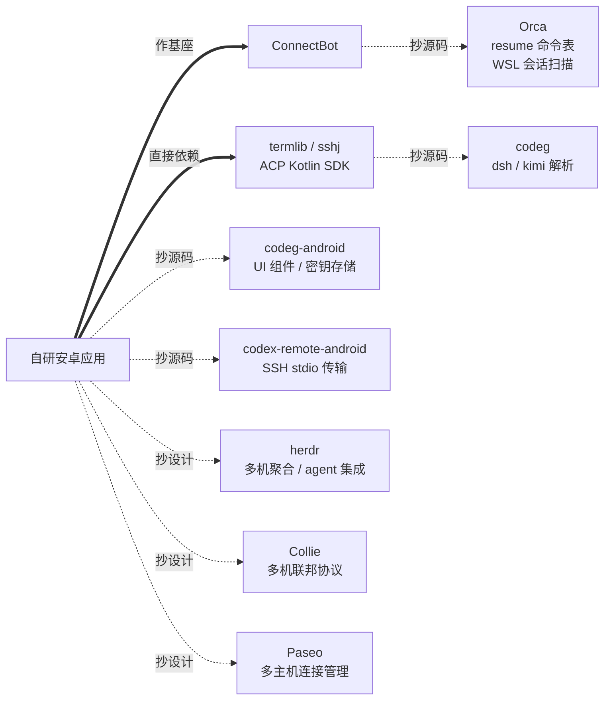

# 04 参考项目复用清单

自研应用可复用的项目资产盘点。按复用方式分四类：作基座、直接依赖、抄源码、抄设计。



## 1. 复用策略

| 复用方式 | 含义 | 涉及项目 |
| --- | --- | --- |
| 作基座 | fork 整个应用作为起点 | ConnectBot |
| 直接依赖 | 作为 Maven 依赖引入 | termlib、sshlib/cbssh、sshj、ACP Kotlin SDK |
| 抄源码 | 复制代码或知识资产，按许可证合规 | Orca、codeg、codeg-android、codex-remote-android |
| 抄设计 | 只借鉴架构与流程，不复制代码 | herdr、Collie、Paseo、agentctxsync |

## 2. 作基座：ConnectBot

[connectbot/connectbot](https://github.com/connectbot/connectbot) — ★3501、Apache-2.0、Kotlin 2.4.20 + Jetpack Compose，最近提交 2026-10-07。

### 2.1 为何选它

| 理由 | 证据 |
| --- | --- |
| 唯一 ★3000+ 且保持活跃的开源安卓 SSH 客户端 | 最近提交 2026-10-07，仍在发版 |
| **纯 Compose**，无 View 迁移负担 | 全部源码只有一个 Activity（`ui/MainActivity.kt`），入口是 `setContent {}`，无 `setContentView` |
| 已把 SSH 库与终端库外置为独立 Maven 依赖 | 本仓只含 `:app`、`:mosh`、`:translations` 三个模块 |
| 主机管理、密钥、known_hosts、端口转发、前台服务、生物识别、备份全部现成 | 见 2.2 |
| 许可证宽松 | Apache-2.0，可自由改造与分发 |

### 2.2 可直接复用的能力

| 能力 | 位置 | 对项目的价值 |
| --- | --- | --- |
| 主机数据模型 | `data/entity/Host.kt` | 字段含 `nickname`、`protocol`、`username`、`hostname`、`port`、`jumpHostId`、`pubkeyId`、`postLogin`、`stayConnected` |
| 密钥管理 | `data/entity/Pubkey.kt` | 含导出策略与 Keystore 存储类型 |
| known_hosts | `data/entity/KnownHost.kt` | 按主机外键关联，含算法与密钥数据 |
| 端口转发 | `data/entity/PortForward.kt` + 对应界面 | 可直接用于 SSH 本地转发 |
| 前台服务与多会话 | `service/TerminalManager.kt`、`TerminalBridge.kt`、`Relay.kt` | 已在 `AndroidManifest.xml` 声明 `foregroundServiceType="remoteMessaging"`；`TerminalManager` 用 `ConcurrentHashMap` 管理多个会话 |
| 通知与会话提示 | `ConnectionNotifier.kt`、`SessionAttention.kt` | 状态呈现基础 |
| 非终端类界面 | `ui/screens/` 下的 HostList、HostEditor、PubkeyList、PortForwardList、Settings | 新增会话列表界面时可照此模式扩展 |
| 交互组件 | `ui/components/InlinePrompt.kt`、`PromptDialogs.kt`、`AuthBannerDialog.kt` | 可复用于权限审批与提问交互 |
| 自动化基础设施 | `service/automation/` | 正则匹配输出并触发动作，可用于识别 agent 状态 |

### 2.3 必须处理的两个问题

| 问题 | 说明 | 处理 |
| --- | --- | --- |
| SSH 库过时 | ConnectBot 当前依赖的 `org.connectbot:sshlib:2.2.48` 是 trilead 分支，**POM 描述明确标注 DEPRECATED**，许可证为 BSD-3-Clause | 按 3.2 节替换 |
| 无 agent 层 | 应用只理解「连接」，不理解「会话」 | 新增 agent 模块，见 05 文档 |

**Host 模型已满足需求的关键点**：`Host.id` 是自增主键，`hostname` 只是可编辑字段。这天然对应 FR-1 要求的「稳定标识 + 可变地址」——地址变化时只改 `hostname`，主键及其关联数据不变。

## 3. 直接依赖

### 3.1 termlib — 终端渲染

| 项 | 值 |
| --- | --- |
| 坐标 | `org.connectbot:termlib:0.3.11` |
| 许可 | Apache-2.0（内置 libvterm 为 MIT） |
| 形态 | Compose Canvas 渲染，libvterm 已 vendored 进仓库 |

官方定位是「纯显示组件，只负责终端模拟与渲染，PTY 与连接由调用方管理」，与本项目的使用方式完全契合。

```kotlin
val emulator = TerminalEmulatorFactory.create(onKeyBoardInput = { /* 转发到 SSH */ })
emulator.writeInput(data, offset, length)   // 把远端输出喂进来
Terminal(terminalEmulator = emulator)
```

### 3.2 SSH 库

| 库 | 最新版 | 许可 | 评价 |
| --- | --- | --- | --- |
| `org.connectbot.sshlib:sshlib`（cbssh） | 0.5.0 | Apache-2.0 | 纯 Kotlin，API 现代（`ReceiveChannel` 流 + suspend 写入 + `exitInfo` Deferred），但**声明为 JVM 库**，无安卓测试 |
| `com.hierynomus:sshj` | 0.41.1 | Apache-2.0 | **已有生产验证**（codex-remote-android 已在真机使用），见下 |
| `com.github.mwiede:jsch` | 2.28.7 | BSD-style | 最轻量，API 陈旧 |
| `org.apache.sshd:sshd-core` | 2.20.0 | Apache-2.0 | **官方文档明确声明不保证安卓可用**，排除 |

**本项目选择 sshj**，理由是「SSH 通道上跑长驻 stdio 子进程」这一核心需求已被 codex-remote-android 用 sshj 在真机验证（见 4.4 节）。需要的流式能力：

```java
// sshj 的 Session.Command 提供三个独立流
InputStream  getInputStream();     // stdout
OutputStream getOutputStream();    // stdin
InputStream  getErrorStream();     // stderr
```

**安卓适配的三个必做项**（均来自 codex-remote-android 的已验证实现）：

1. **让 sshj 使用平台默认 provider** —— 安卓的系统 "BC" 是精简实现，没有 EC 与 X25519。sshj 按 provider 名解析算法，命中它就会在认证前抛 `no such algorithm`。不要只删 curve25519：删掉后 sshj 会回退到 ECDH，同样失败
2. **排除 slf4j 日志实现** —— 加入 `org.slf4j:slf4j-nop:2.0.13`，否则与安卓日志冲突
3. **关闭读超时** —— 长驻进程需要 `ssh.timeout = 0`

### 3.3 ACP Kotlin SDK

| 项 | 值 |
| --- | --- |
| 坐标 | `com.agentclientprotocol:acp:0.30.1`（`acp-model` 同版本） |
| 仓库 | [agentclientprotocol/kotlin-sdk](https://github.com/agentclientprotocol/kotlin-sdk)，★95，Apache-2.0 |
| 字节码目标 | **Java 8**，安卓兼容 |
| 依赖 | kotlinx-serialization、kotlinx-coroutines、kotlinx-io、kotlinx-collections-immutable、atomicfu、kotlin-logging |

**关键接口**：`Transport` 是可插拔的，其 `StdioTransport` 接受 `Flow<String>` 输入与 `suspend (String) -> Unit` 输出——这意味着可以把 SSH channel 直接包装成 Transport，无需伪造进程管道。

```kotlin
public interface Transport : AutoCloseable {
    public fun start()
    public fun send(frame: TransportFrame)
    public fun onFrame(handler: (TransportFrame) -> Unit)
    public fun onError(handler: (Throwable) -> Unit)
    public fun onClose(handler: () -> Unit)
}
```

`Client` 类提供的现成方法：`initialize`、`newSession`、`loadSession`、`resumeSession`、`listSessions`、`forkSession`、`deleteSession`、`getSession`。

## 4. 抄源码（含许可证合规）

### 4.1 Orca — 会话扫描知识与 resume 命令表

[stablyai/orca](https://github.com/stablyai/orca) — ★85702、**MIT**、TypeScript。

| 资产 | 位置 | 用途 |
| --- | --- | --- |
| **resume 命令表** | `src/shared/agent-resume-argv.ts` | 24 个 agent 的 resume argv。本项目需要的 5 条：`kimi --session <id>`、`opencode --session <id>`、`omp --resume <路径>`、`zcode --resume <id>`、`dsh-tui --resume <id>` |
| 会话扫描分发表 | `src/main/ai-vault/session-scanner-agent-sources.ts` | 每个 agent 的 rootDirs、扩展名、文件与目录谓词 |
| 解析分发表 | `src/main/ai-vault/session-scanner-agent-parser.ts` | 按 agent 分派解析器 |
| 支持的 agent 清单 | `src/shared/ai-vault-types.ts` 的 `AI_VAULT_AGENTS` | 24 个 agent 的完整列表 |
| 各 agent 路径解析 | `session-scanner-kimi-paths.ts`、`omp-session-root.ts`、`session-scanner-zcode-sources.ts`、`session-scanner-opencode-sources.ts` | 路径与环境变量优先级 |
| **WSL 支持** | `session-scanner-roots.ts`、`wsl.ts`、`wsl-runner.ts`、`wsl-paths.ts`、`wsl-home-cache.ts` | WSL 会话扫描的实现范本 |
| zcode 排序规则 | `session-scanner-zcode-order.ts` | `sequence` 为空的排最后，次级键为 `time_created`、`rowid` |

**MIT 许可**，可自由复制与改编，保留版权声明即可。

### 4.2 codeg — dsh 与 kimi 的存储逆向

[spacering-net/codeg](https://github.com/spacering-net/codeg) — ★3842、Apache-2.0、Rust。

| 资产 | 位置 | 说明 |
| --- | --- | --- |
| dsh 解析器 | `src-tauri/src/parsers/deepseek.rs` | 114 KB，dsh 存储逆向最详尽的实现 |
| kimi 解析器 | `src-tauri/src/parsers/kimi_code.rs` | 65 KB，含 `session_index.jsonl` 的 `cwd` 补全逻辑 |
| 其他解析器 | `src-tauri/src/parsers/` | 共 20 个 agent：claude、codex、opencode、pi、gemini、cline、cursor、hermes 等 |
| 外部源登记 | `parsers/mod.rs` 的 `external_transcript_sources()` | 集中声明各 agent 的路径，注释明确「这些路径由各自 CLI 所有，codeg 只读」 |
| ACP 客户端 | `src-tauri/src/acp/` | 约 63 个文件，基于官方 `agent-client-protocol = "2.2.0"` crate，含 `session_state.rs`、`types.rs`、`event_stream.rs`、`plan_approval.rs` |

**该仓库无 zcode 支持**，zcode 的解析只有 Orca 一家实现。

### 4.3 codeg-android — 安卓工程组件

[xintaofei/codeg-android](https://github.com/xintaofei/codeg-android) — ★17、Apache-2.0、Kotlin + Compose。技术栈与本项目高度一致，是语言最匹配的可复用资产。

技术栈：Kotlin 2.0.21、AGP 8.11.0、Gradle 8.14.3、Compose BOM 2024.12.01、minSdk 31、Hilt 2.52、Ktor 3.0.3、kotlinx-serialization 1.7.3、coroutines 1.9.0。单模块 `:app`，命名空间 `app.codeg.android`。

| 资产 | 文件 | 可搬性 |
| --- | --- | --- |
| 差异视图 | `core/designsystem/diff/DiffView.kt`、`UnifiedDiff.kt` | **最高**，纯 Kotlin，有单元测试，零网络依赖 |
| Markdown 渲染 | `core/designsystem/markdown/`（`MarkdownContent`、`LiveBlockParser`、`MarkdownCache`） | 高，`LiveBlockParser` 支持流式增量解析 |
| 工具调用卡片 | `feature/sessiondetail/rendering/ToolCallCard.kt`、`ToolCallVM.kt`、`ToolDerive.kt` | 高，`ToolDerive` 是纯函数并有单测 |
| 权限审批卡 | `feature/sessiondetail/interactive/PermissionRequestCard.kt`、`AskQuestionCard.kt`、`PlanApprovalCard.kt` | 高，无状态 Composable |
| 思考过程块 | `feature/sessiondetail/rendering/ReasoningBlock.kt` | 高 |
| 设计系统 | `core/designsystem/component/`、`theme/` | 高 |
| **密钥安全存储** | `core/security/KeystoreSecretStore.kt` | **建议整份抄**，约 60 行，AES-256-GCM + AndroidKeyStore，刻意不用已废弃的 `androidx.security:security-crypto` |
| 事件解码模型 | `core/model/AcpEvent.kt` | 高，手写 `fromWire`，未知事件降级为 `Unknown` 而不中断整个流 |
| 连接配置存储 | `core/datastore/ServerStore.kt`、`ServerProfile.kt` | 中，结构简单可参考 |
| 客户端连接层 | `core/network/CodegClientFactory.kt`、`EventStream.kt` | 中，注意它就 Token 的 WebSocket 鉴权技巧（子协议传 token） |
| agent 图标 | `res/drawable/ic_agent_*.xml` | 有 kimi_code、open_code 等 12 个，**无 zcode** |

**移植时需要处理两处**：所有组件引用 `app.codeg.android.R` 的字符串资源；`core/model/` 直接镜像 codeg server 的 snake_case JSON，换后端需要重映射。

**推荐最小移植集**：`diff/`、`markdown/`、`component/`、`theme/`、`KeystoreSecretStore.kt`——这些与协议无关。

### 4.4 codex-remote-android — 架构 1:1 对齐的实现

[liuhao-labs/codex-remote-android](https://github.com/liuhao-labs/codex-remote-android) — ★60、Apache-2.0、Kotlin + Compose。

它的架构与本项目几乎一致：安卓 App 通过 SSH 连到远端主机，在远端启动 `codex app-server`，用其 JSONL 协议通信，导入远端的历史会话。

| 资产 | 位置 | 用途 |
| --- | --- | --- |
| **SSH 上的 stdio 传输** | `data/ssh/SshAppServerTransport.kt` | 用 sshj 的 `Session.exec()` 拿到双向流，是本项目 ACP 传输层的直接范本 |
| 命令构造 | 同上 | `exec "${SHELL:-/bin/sh}" -lc 'exec codex app-server --listen stdio://'` |
| 安卓兼容 SSH 配置 | 同上 | 该实现剔除 curve25519；本项目实测证明还需让 sshj 使用平台默认 provider，否则系统精简 "BC" 会在认证前抛 `no such algorithm` |
| 主机密钥指纹校验 | 同上 | SHA-256 + base64 计算指纹，变更时阻断 |
| 连接配置管理 | `ConnectionStore.kt` | 多主机保存 |
| 依赖组合 | `build.gradle.kts` | `com.hierynomus:sshj:0.39.0` + `org.slf4j:slf4j-nop:2.0.13` |

该实现的关键细节：`ssh.timeout = 0` 关闭读超时以支持长驻进程；`Channel` 的三个流（stdout/stdin/stderr）分别处理，stderr 单独消费。

### 4.5 agentctxsync — 会话存储逆向笔记

[westsource/agentctxsync](https://github.com/westsource/agentctxsync) — ★22、MIT、Python。

| 资产 | 位置 | 价值 |
| --- | --- | --- |
| 接入新 agent 的方法论 | `docs/ADDING_AGENT.md` | 列明必须调研的项：数据目录、格式 schema、id 生成、**写入约束**、加密、索引回填 |
| 各 agent 存储规格 | `docs/SUPPORTED_AGENTS.md` | 7 个 agent 的存储布局与写入约束 |
| 适配器实现 | `mcp/adapters/dsh.py`（48 KB）、`omp.py`（24 KB）、`opencode.py`（20 KB） | 格式细节的一手记录 |

**注意两处**：该项目的适配器是 MCP 客户端，**不能独立运行**（需连它自己的服务端）；且它关于 opencode 的说明与其他项目存在矛盾——`ADDING_AGENT.md` 仍描述旧的 JSON 文件布局，而 `opencode.py` 的注释明确写了旧布局「读不到任何会话」。**以 `opencode.py` 为准**。

## 5. 抄设计

### 5.1 herdr — 多机聚合与 agent 集成

[herdrdev/herdr](https://github.com/herdrdev/herdr) — ★42464、Apache-2.0、Rust。

| 设计点 | 位置 | 借鉴内容 |
| --- | --- | --- |
| agent 识别 | `src/detect/mod.rs` + `distribution/agent-detection/*.toml` | 读 pane 底部文本做规则匹配，规则用 TOML 声明（`state`、`priority`、`region`、`contains`） |
| agent 上报集成 | `src/integration/assets/{opencode,omp,kimi,pi}/` | agent 侧脚本主动上报状态与会话 ID，比解析终端输出可靠 |
| resume 命令来源 | `src/agent_resume.rs` | **命令由 agent 自己上报，herdr 只做校验**——这个反转值得借鉴 |
| 对外协议 | `herdr api schema --json`（官方 JSON Schema，仓库内 `docs/next/api/herdr-api.schema.json`） | 本地 socket + NDJSON 的协议范本 |

**该仓库无 dsh 与 zcode 的集成**。

### 5.2 Collie — 协议实测记录与多机联邦

[AltanS/collie](https://github.com/AltanS/collie) — ★1220、MIT、TypeScript。

| 文档 | 价值 |
| --- | --- |
| `HERDR_API.md` | herdr socket 协议的**实测记录**（v0.7.2 / protocol 16），记录了大量官方文档未写的坑：RPC 是一次性的（除 `events.subscribe`）、请求 ID 必须是字符串、请求行 1 MiB 上限、通道 variant 用 snake_case |
| `MUX_CONTRACT.md` | 多路复用器能力矩阵，含每个能力的证据来源标记 |
| `CREW_PROTOCOL.md` | **多机联邦协议**：每台机器跑完整实例，一台作为入口，含准入、注册、故障转移——与本项目「多设备聚合」的命题直接相关 |

### 5.3 Paseo — 多主机连接管理与插件机制

[getpaseo/paseo](https://github.com/getpaseo/paseo) — ★19599、Apache-2.0（LICENSE 为 Apache-2.0 全文加自定义前言，GitHub 识别为 NOASSERTION）。

| 设计点 | 位置 | 借鉴内容 |
| --- | --- | --- |
| 多主机状态机 | `packages/app/src/runtime/host-runtime.ts` | `HostRuntimeConnectionStatus` 六态；**一台主机可有多条连接**（直连/中继/SSH），各自独立探测延迟；「不可用才切换」 |
| 切换防抖 | 同上 | 需要连续多次探测确认更快才切换，避免反复横跳 |
| 全主机聚合 | `host-picker-constants.ts` | `ALL_HOSTS_OPTION_ID` 是 UI 概念，数据在客户端合并，daemon 只知道自己 |
| 时间线投影 | `agent-projections.ts` | 协议推送事件流，客户端只做投影，不建镜像数据库 |
| provider 能力 | `packages/plugin/src/server/provider.ts` | 能力位驱动 UI，不硬编码按钮 |

**插件机制的可用性（**已有**）**：插件 provider 可实现 `session.list`，daemon 会把结果原样喂进导入流程，无需改动 Paseo 本身。插件运行在 daemon 子进程中，**拥有完整 Node 权限**（可读任意文件、可 spawn 子进程、可发起 SSH），无沙箱。自用安装无需发布：`paseo plugin install <目录>`。

**对本项目的意义**：若选择「不自研 App 而用 Paseo」的路线，dsh 与 zcode 的补齐方式就是各写一个 provider 插件。

## 6. 排除的项目

| 项目 | ★ | 排除原因 |
| --- | --- | --- |
| [kosumic/whip](https://github.com/kosumic/whip) | 104 | **AGPL-3.0**，代码不可复制。其架构文档可读，代码不可用 |
| [GlassHaven/Haven](https://github.com/GlassHaven/Haven) | 1275 | AGPL-3.0 |
| [nikitaeight24family/Conch](https://github.com/nikitaeight24family/Conch) | 6 | PolyForm Noncommercial，功能高度对口但**法律上不可抄** |
| [coder/agentapi](https://github.com/coder/agentapi) | 1499 | 已归档，README 明确 deprecated；且包的是 PTY 屏幕而非结构化会话 |
| [BloopAI/vibe-kanban](https://github.com/BloopAI/vibe-kanban) | 28263 | README 首行声明正在关停 |
| [stravu/crystal](https://github.com/stravu/crystal) | 3124 | 已废弃 |
| [terragon-labs/terragon-oss](https://github.com/terragon-labs/terragon-oss) | 259 | 公司已关闭，仓库为关停快照 |
| `org.apache.sshd:sshd-core` | — | 官方文档明确声明不保证安卓可用 |
| `com.jcraft:jsch` | — | 最后发布于 2018-11，8 年未更新，LGPL |

## 7. 许可汇总

| 项目 | 许可 | 可否复制代码 | 可否闭源分发 |
| --- | --- | --- | --- |
| ConnectBot | Apache-2.0 | 可以 | 可以 |
| termlib | Apache-2.0 | 可以 | 可以 |
| sshj | Apache-2.0 | 可以 | 可以 |
| ACP Kotlin SDK | Apache-2.0 | 可以 | 可以 |
| Orca | MIT | 可以 | 可以 |
| codeg | Apache-2.0 | 可以 | 可以 |
| codeg-android | Apache-2.0 | 可以 | 可以 |
| codex-remote-android | Apache-2.0 | 可以 | 可以 |
| agentctxsync | MIT | 可以 | 可以 |
| herdr | Apache-2.0 | 可以 | 可以 |
| Collie | MIT | 可以 | 可以 |
| Paseo | Apache-2.0 | 可以 | 可以 |
| **whip** | **AGPL-3.0** | **不可以** | **不可以** |
| **Conch** | **PolyForm NC** | **不可以** | **不可以** |
| **AgentsMesh** | **BSL-1.1** | 不可以（生产需授权） | 不可以 |

**Apache-2.0 的合规要求**：保留版权与许可声明、修改过的文件需加显著说明、若原仓库含 `NOTICE` 文件需一并保留。**MIT 的合规要求**：保留版权声明与许可全文。

## 8. 许可证之外的注意事项

| 事项 | 说明 |
| --- | --- |
| 商标 | Apache-2.0 第 6 条不授予商标权。可以分发代码，不得使用原项目名称与 logo 作背书 |
| 上游兼容性 | Orca 与 codeg 的解析器是针对特定版本的 agent 存储逆向所得，agent 升级后可能失效。解析逻辑必须容错：字段缺失时降级而不是崩溃 |
| 事实来源区分 | 本清单中标注为**待验证**的格式描述来自第三方源码，未与 agent 上游源码交叉验证，属单方实现 |
