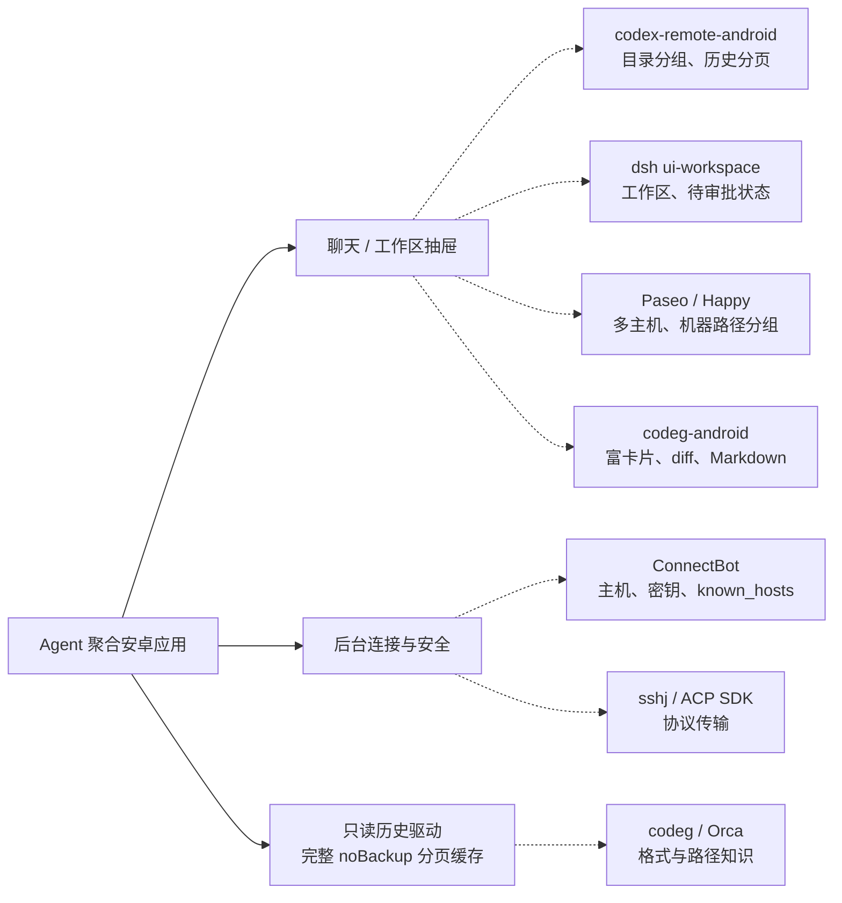

# 04 参考项目复用清单

复用重点是聊天首页、工作区抽屉、多主机聚合、历史分页和结构化交互。ConnectBot 提供连接与安全基础设施，其 SSH 主机列表和终端导航不作为本产品的默认交互。

本文面向开发与选型。标识：**上游源码核实**＝引用文件已核对；**既有采样记录**＝原工程或环境记录；**新增设计**＝本项目需要实现；**待验证**＝适配与运行尚未确认。源码存在不代表移植完成，参考项目的运行结果也不能替代本项目真机验收。

## 1. 复用方式与边界

| 方式 | 用途 | 验证要求 |
| --- | --- | --- |
| 基础工程复用 | 保留现有 ConnectBot 工程中的连接、配置、安全与调试能力 | 导航与前台服务不能继续围绕终端会话等同 Agent 会话 |
| 直接依赖 | SSH 库、ACP Kotlin SDK；termlib 用于独立调试终端 | 锁定工程使用版本，验证安卓兼容，不以“上游最新版”替代项目依赖 |
| 合规复制与适配 | Kotlin UI、纯函数解析、密钥存储等 | 保留版权／许可／NOTICE，核对资源、协议模型及依赖；未移植不标已有 |
| 设计参考 | React／TypeScript 工作区、主机选择、状态投影 | 重建 Kotlin 行为，不把外部 daemon、后端或协议整体带入 |
| 存储知识参考 | 原生路径、世代、排序、继续 argv | 对照实际安装样本；读取器只读，不复制对原生数据的写操作 |

## 2. 连接基础：ConnectBot

**上游源码核实**：[connectbot/connectbot](https://github.com/connectbot/connectbot) 提交 `925565a3a06db233d3f4c6f8da7f075b93a02575`，Apache-2.0。

以下路径相对 `app/src/main/java/org/connectbot/`；引用范围是连接能力，不含本项目的 Agent 聚合逻辑。

| 资产 | 具体源码 | 本项目用途 |
| --- | --- | --- |
| 稳定主机模型 | [data/entity/Host.kt](https://github.com/connectbot/connectbot/blob/925565a3a06db233d3f4c6f8da7f075b93a02575/app/src/main/java/org/connectbot/data/entity/Host.kt) | `id` 与可编辑 `hostname` 分离，含 username、port、jumpHostId、pubkeyId；映射稳定 hostId |
| 密钥与信任记录 | `data/entity/Pubkey.kt`、`data/entity/KnownHost.kt` | 保留密钥管理和 known_hosts 关联；地址修改不能自动放行变更密钥 |
| 端口转发 | `data/entity/PortForward.kt` | loopback Web 补充路线的隧道配置 |
| 连接生命周期 | `service/TerminalManager.kt`、`TerminalBridge.kt`、`Relay.kt` | 连接与后台服务参考；需要单独定义 Agent 会话的所有权与 busy 状态 |
| 通知与提示 | `service/ConnectionNotifier.kt`、`SessionAttention.kt` | 后台运行／审批提醒的基础，不将终端输出状态直接当 Agent 状态 |
| 用户交互组件 | `ui/components/InlinePrompt.kt`、`PromptDialogs.kt`、`AuthBannerDialog.kt` | 认证与安全提示参考；Agent 权限请求仍需协议级身份绑定 |

**新增设计**：默认首页为聊天，主机管理进入设置或选择器；SSH 终端保留独立调试入口。连接、终端、Agent 会话分别管理，关闭抽屉或切换筛选不得触发底层 busy 会话释放。

**待验证**：SSH 库替换范围与前台服务类型以本工程和目标 Android 行为为准；不根据旧 POM 或外部代码就认定本项目传输已完成。主机、密钥、安全与备份逻辑须保持原功能；历史缓存单独使用 noBackup。

## 3. 聊天与工作区的具体参考

### 3.1 codex-remote-android：自动历史、cwd 项目、抽屉与分页

**上游源码核实**：[liuhao-labs/codex-remote-android](https://github.com/liuhao-labs/codex-remote-android)，Apache-2.0，提交 `372581ad5cc66677d5322a9a447a03277d36ce15`。

| 资产 | 源码 | 可借鉴行为 |
| --- | --- | --- |
| 聊天与目录侧栏 | [WorkspaceScreen.kt](https://github.com/liuhao-labs/codex-remote-android/blob/372581ad5cc66677d5322a9a447a03277d36ce15/app/src/main/java/com/codex/remote/ui/screens/WorkspaceScreen.kt) | `ModalNavigationDrawer`；按 project 展示 thread；组内先 `onSelectProject` 再 `onNewThread`；主区为聊天 |
| 自动历史导入／项目生成 | [AppViewModel.kt](https://github.com/liuhao-labs/codex-remote-android/blob/372581ad5cc66677d5322a9a447a03277d36ce15/app/src/main/java/com/codex/remote/AppViewModel.kt)、[README](https://github.com/liuhao-labs/codex-remote-android/blob/372581ad5cc66677d5322a9a447a03277d36ce15/README.md) | 连接 bootstrap 后由远端 thread 历史生成项目，无需在安卓预填项目路径 |
| 历史分页 | 同上 `loadOlderHistory`、`onLoadOlderHistory`；`app/src/test/java/com/codex/remote/data/rpc/ThreadHistoryPaginationTest.kt` | 新近历史先显示、向上滚动再取旧页；分页游标与错误状态独立处理 |
| SSH stdio | [SshAppServerTransport.kt](https://github.com/liuhao-labs/codex-remote-android/blob/372581ad5cc66677d5322a9a447a03277d36ce15/app/src/main/java/com/codex/remote/data/ssh/SshAppServerTransport.kt) | sshj `Session.exec` 启动远端 app-server；长驻连接 `ssh.timeout = 0`；首次主机指纹确认和变更阻断 |
| 主机配置 | `app/src/main/java/com/codex/remote/data/store/ConnectionStore.kt` | 保存具体连接的参考 |

**新增设计**：把单一 Codex 的 project／thread 扩为 `(hostId, cwd)` 工作区与 `(hostId, agent, sessionId)` 会话。当前 host 与 Agent 是浏览筛选，不改变 busy 会话身份。其分页 UI 值得参考，但本项目必须额外提供完整 noBackup 历史页、load 前消费就绪与完成屏障；不能声称参考项目已证明这些契约。

该项目使用 Codex app-server，既不是 ACP，也不是 ZCode app-server。传输形态相近不表示方法、事件或审批可以直接复制。其 SSH 配置对 curve25519 的处理也不是通用安卓密码学修复；本项目仍需核实 provider、算法和目标密钥组合。

### 3.2 Paseo：host-picker 与 sidebar-projection

**上游源码核实**：[getpaseo/paseo](https://github.com/getpaseo/paseo)，提交 `a1da1b8f234afe7a75785022292cdf8a50ee11a5`，一方代码 Apache-2.0，第三方组件按各自许可。

| 资产 | 源码 | 借鉴内容 |
| --- | --- | --- |
| 主机选择器 | [host-picker.tsx](https://github.com/getpaseo/paseo/blob/a1da1b8f234afe7a75785022292cdf8a50ee11a5/packages/app/src/components/hosts/host-picker.tsx)、`host-picker-constants.ts` | 具体 host、All hosts、添加主机、连接状态和设置；聚合范围使用独立 UI ID |
| 侧栏投影 | [sidebar-projection.ts](https://github.com/getpaseo/paseo/blob/a1da1b8f234afe7a75785022292cdf8a50ee11a5/packages/app/src/components/sidebar/sidebar-projection.ts) | 统一生成固定项、项目／状态分组及键盘快捷键的遍历范围，显示与操作不各自维护一套列表 |
| 多主机运行时 | `packages/app/src/runtime/host-runtime.ts` | 作为连接状态管理的研究入口；具体重连与切换策略移植待验证 |

**新增设计**：顶栏选择 host 后自动 probe／刷新，选择 Agent 过滤抽屉；All hosts／All agents 保留聚合搜索。Paseo 的具体投影不等于本项目自动 probe 已实现，也不能据其插件入口推断 dsh 或 zcode provider 已可运行。WSL 专用关键字零命中不构成“不支持 WSL”的证据。

### 3.3 Happy：机器＋path 分组

**上游源码核实**：[slopus/happy](https://github.com/slopus/happy)，MIT，提交 `63579c5234641768318b9c240103b068dc1a3aaf` 的 [projectGroups.ts](https://github.com/slopus/happy/blob/63579c5234641768318b9c240103b068dc1a3aaf/packages/happy-app/sources/sync/projectGroups.ts)。

`buildPathProjectGroups` 使用 `[machineId, projectPath]` 作为键；同名路径在不同机器上保持不同组；worktree 可归在其 repo 组下。**新增设计**：本项目只采用主机＋目录隔离原则，工作区严格以 `(hostId, cwd)` 自动分组，未经目录身份确认不自动把 worktree 或符号链接合并。

### 3.4 deepseek-harness：workspace 界面与审批状态

**上游源码核实**：[deepseek-ai/deepseek-harness](https://github.com/deepseek-ai/deepseek-harness) 默认分支 `master`，MIT，提交 `d743267388641bc76f17c45ce8b4c231aed1d32c`。

| 资产 | 具体源码 | 借鉴内容 |
| --- | --- | --- |
| 工作区抽屉 | [WorkspaceBrowser.tsx](https://github.com/deepseek-ai/deepseek-harness/blob/d743267388641bc76f17c45ce8b4c231aed1d32c/packages/client/ui-workspace/src/client/rows/WorkspaceBrowser.tsx) | 分组／平铺、搜索、目录选择与会话行操作 |
| 工作区／会话行 | [Rows.tsx](https://github.com/deepseek-ai/deepseek-harness/blob/d743267388641bc76f17c45ce8b4c231aed1d32c/packages/client/ui-workspace/src/client/rows/Rows.tsx) | 工作区创建入口；`pendingInteraction` 分为 approval、plan review、answer，并显示状态 |
| 行为说明 | [ui-workspace README](https://github.com/deepseek-ai/deepseek-harness/blob/d743267388641bc76f17c45ce8b4c231aed1d32c/packages/client/ui-workspace/README.md) | workspace 下会话展示、分批展开、搜索、归档运行中工作的确认边界 |
| ACP 接口 | [packages/acp/acp/src/index.ts](https://github.com/deepseek-ai/deepseek-harness/blob/d743267388641bc76f17c45ce8b4c231aed1d32c/packages/acp/acp/src/index.ts) | list／resume／close／new／prompt／cancel；无 load 历史重放，见 03 |

本项目参考交互与状态，不复制整个 React／Cordis 运行时。Web 层的 DSH 专用卡片、计划和目录管理不能据此当作 ACP 事件能力。运行中归档需确认的原则可以借鉴，但不能以 close 作为无提示视图切换。

### 3.5 codeg-android：富卡片、diff、Markdown 与密钥存储

**上游源码核实**：[xintaofei/codeg-android](https://github.com/xintaofei/codeg-android)，Apache-2.0，提交 `33dba91b1522330fe519c27c4833066e35c9495e`。下列路径相对 `app/src/main/java/app/codeg/android/`。

| 资产 | 具体路径 | 适配重点 |
| --- | --- | --- |
| 工具卡片 | `feature/sessiondetail/rendering/ToolCallCard.kt`、`ToolDerive.kt` | 工具名、参数、状态与结果；转换本项目归一化事件，不直接绑定原后端模型 |
| 交互卡片 | `feature/sessiondetail/interactive/PermissionRequestCard.kt`、`AskQuestionCard.kt`、`PlanApprovalCard.kt` | 保留提交中／不可用状态；回调必须绑定原主机、Agent、会话与请求 |
| 思考块 | `feature/sessiondetail/rendering/ReasoningBlock.kt` | 折叠展示，不丢历史正文 |
| 差异视图 | `core/designsystem/diff/DiffView.kt`、`UnifiedDiff.kt` | 核实文件路径、换行与大 diff 的显示边界 |
| Markdown 流式解析 | `core/designsystem/markdown/MarkdownContent.kt`、`LiveBlockParser.kt`、`MarkdownCache.kt` | 消息渲染缓存与完整历史缓存是不同职责 |
| 密钥存储 | [KeystoreSecretStore.kt](https://github.com/xintaofei/codeg-android/blob/33dba91b1522330fe519c27c4833066e35c9495e/app/src/main/java/app/codeg/android/core/security/KeystoreSecretStore.kt) | AndroidKeyStore＋AES-GCM；复制前核对密钥别名、错误处理与备份排除 |
| 事件模型 | `core/model/AcpEvent.kt` | 作为映射参考，不能把 codeg 后端 snake_case 视为标准 ACP wire |
| 连接与存储 | `core/network/CodegClientFactory.kt`、`EventStream.kt`、`core/datastore/ServerStore.kt` | 原后端鉴权、重连与配置的参考，不原样应用到 SSH stdio |
| 设计系统 | `core/designsystem/component/`、`theme/` | 字符串资源、R 包名、主题与依赖需一同适配 |

工具与交互卡片的固定源码链接见 02 第 2 节。该仓库已有 `UnifiedDiffTest.kt`、`LiveBlockParserTest.kt`、`ToolDeriveTest.kt`；本项目如移植对应逻辑，应当移植或等价覆盖其测试，而不是只复制界面。不得凭图标资源认定支持某个 Agent，也不得把历史卡片恢复为有效审批按钮。

## 4. Agent 一方源码与只读解析参考

| 来源 | 核实路径与用途 | 复用边界 |
| --- | --- | --- |
| [Orca](https://github.com/stablyai/orca)，MIT | [src/shared/agent-resume-argv.ts](https://github.com/stablyai/orca/blob/main/src/shared/agent-resume-argv.ts)：含 `zcode --resume <id>`、`dsh-tui --resume <id>` 等 argv | 命令表是知识资产；本机采样的 dsh 命令是 `dsh tui --resume <id>`，必须以目标安装为准。WSL 扫描与移动端限制仍需逐源码／部署核实 |
| [codeg](https://github.com/spacering-net/codeg)，Apache-2.0 | [deepseek.rs](https://github.com/spacering-net/codeg/blob/main/src-tauri/src/parsers/deepseek.rs)：日志世代、多帧、v4 测试；[kimi_code.rs](https://github.com/spacering-net/codeg/blob/main/src-tauri/src/parsers/kimi_code.rs)：索引补 `cwd` | 第三方解析不能代表所有上游版本；筛消息文本不能代替完整事件；不得带入原生数据写操作 |
| [ZCode](https://github.com/zai-org/ZCode)，Apache-2.0 | [apps/zcode-cli/packages/cli/src/run.ts](https://github.com/zai-org/ZCode/blob/29628c9acdb81b703bbd4080c207a0e7ce5e276e/apps/zcode-cli/packages/cli/src/run.ts)：专用 app-server；README：统一 `zcode --web` | 本机真入口 `/home/colle/.zcode/server/agents/glm/zcode-agent` 为 0.16.9，no-PTY 能力／真实列表探测已成功；严格 JSONL 非 JSON-RPC，initialize 不存在；resume／prompt／审批与安卓驱动仍待端到端验证，见 03 第 3.3 节 |
| [kimi-cli](https://github.com/MoonshotAI/kimi-cli)，Apache-2.0 | 归档的旧 Python CLI 与旧 Web 源码 | 仅作历史参考，不作为当前维护依赖 |
| [kimi-code](https://github.com/MoonshotAI/kimi-code)，MIT | [kap-server/routes](https://github.com/MoonshotAI/kimi-code/tree/419aced0e97fa04b75f8f71b089e1667f6de6d0a/packages/kap-server/src/routes)、[web/run.ts](https://github.com/MoonshotAI/kimi-code/blob/419aced0e97fa04b75f8f71b089e1667f6de6d0a/apps/kimi-code/src/cli/sub/web/run.ts) | server API 公开；公开主仓中当前 Web UI 为打包资源，开发源码在另一 code-app 仓库，不能说当前 Web UI 源码已公开可直接移植 |
| [agentctxsync](https://github.com/westsource/agentctxsync) | 存储布局、写入约束调研入口 | 第三方资料需与真实样本交叉确认；不将其服务端依赖或写入逻辑引入只读扫描器 |

ZCode 的 UI 工作区与原生 `workspaceIdentity` 必须分开保存；SQLite 保留 `directory/path/workspace_id`，不能把 cwd-only 分组代码直接搬入 protocol list／resume。`/home/colle/dsh/cpa-jethub-plugins/zcode` 是空 main 的 CPA 插件产物，不是官方 CLI；能力／列表探测与该文件无关。采样启动只注入 provider 配置路径，未读取内容；活动 endpoint 的解析不能按已采样 bundled 路径硬编码，详细依据见 03 第 3.3 节。

动态 `main` 引用用于定位已核实的知识资产；复制时必须固定所用提交与许可文件，重新核对目标安装版本，不能只更新链接而沿用旧结论。

## 5. 直接依赖的验证边界

### 5.1 SSH 与终端

**既有采样记录**：选型资料包含 sshj、termlib 与 ACP Kotlin SDK。本文不宣称最新版、生产验证或安卓兼容已经完成。依赖坐标与版本以工程锁定结果为准；不能在文档中手写新的“最新版”替代实际依赖。

| 候选 | 用途 | 本项目要求 |
| --- | --- | --- |
| sshj | 远端 exec、双向 stdio、stderr 与隧道 | 验证 Android provider、算法、密钥、跳板、指纹与长驻流；关闭读超时仅用于已建立的长期连接，连接／探测仍需超时 |
| cbssh／mwiede jsch | SSH 替代候选 | 只有主路线确证受阻时评估；不能绕过密钥校验或减小目标范围 |
| termlib | 独立 SSH 调试终端的显示 | 终端模拟／渲染不等于 ACP 传输或 Agent 聊天 |
| Apache SSHD／旧 jsch | 其他库研究入口 | 安卓与维护兼容性未在本项目验证，不据此进入依赖 |

### 5.2 ACP Kotlin SDK

**上游源码核实**：[agentclientprotocol/kotlin-sdk](https://github.com/agentclientprotocol/kotlin-sdk)，默认分支 `master`，Apache-2.0（`LICENSE.txt`），核实提交 `31de4eee7587a41cec5054750da159ac1727d4df`。

- [Transport.kt](https://github.com/agentclientprotocol/kotlin-sdk/blob/31de4eee7587a41cec5054750da159ac1727d4df/acp/src/commonMain/kotlin/com/agentclientprotocol/transport/Transport.kt) 提供状态、发送与 frame／error／close 监听。
- [StdioTransport.kt](https://github.com/agentclientprotocol/kotlin-sdk/blob/31de4eee7587a41cec5054750da159ac1727d4df/acp/src/commonMain/kotlin/com/agentclientprotocol/transport/StdioTransport.kt) 接收 `Flow<String>` 与 suspend writer，writer 自行负责换行与 flush，可封装 SSH exec 流。
- [Client.kt](https://github.com/agentclientprotocol/kotlin-sdk/blob/31de4eee7587a41cec5054750da159ac1727d4df/acp/src/commonMain/kotlin/com/agentclientprotocol/client/Client.kt) 含 initialize、new／load／resume／list 等及初始化中的通知排队。必须核实工程使用版本是否具有同样行为；SDK 的排队不替代本项目持续消费者、noBackup 落盘与历史完成屏障。

**待验证**：工程使用的 artifact、字节码、Android 兼容与资源限制；上游当前提交不等于工程旧依赖。SDK 出现 list／resume 方法不表示远端 Agent 一定支持。

## 6. 其他设计入口

[herdr](https://github.com/herdrdev/herdr)、[Collie](https://github.com/AltanS/collie) 可以继续研究运行时状态、agent 主动上报与联邦协议；不以终端 pane 检测替代结构化消息。它们当前 API 的调用生命周期、订阅格式、许可与维护状态在正式复制前需按固定提交核实。

Paseo provider 插件是另一实现路线的研究项，不是当前目标已经支持 dsh／zcode 的证据。采用其他产品替代自研、增加 daemon 或缩小支持范围均需另行决策，不能作为自动降级。

## 7. 许可与排除策略

本项目优先采用 MIT／Apache-2.0 等已核实的许可。复制前必须核对具体文件、第三方依赖、资源与所用提交，仓库许可不能覆盖所有 vendored 文件或商标。

| 许可／项目 | 本项目策略 | 合规边界 |
| --- | --- | --- |
| MIT：dsh、当前 kimi-code、Happy、Orca | 可以按许可复制与改编 | 保留版权声明与许可全文；第三方内容另核实 |
| Apache-2.0：ConnectBot、ZCode、codeg、codeg-android、codex-remote-android、ACP Kotlin SDK、Paseo 一方代码、旧 kimi-cli | 可以按许可复制与改编 | 保留版权／许可与适用 NOTICE；修改文件按许可标注；保留第三方声明 |
| [whip](https://github.com/kosumic/whip)、[Haven](https://github.com/GlassHaven/Haven)，AGPL-3.0 已核实 | 本项目选择不直接复制其代码 | AGPL 并非法律上禁止复制；复制、修改、分发或网络交互时须遵守适用的源代码开放等义务，与本项目当前复用策略不符 |
| [Conch](https://github.com/nikitaeight24family/Conch)，PolyForm Noncommercial 1.0.0 | 本项目未确认用途符合许可前不直接复制 | [LICENSE](https://github.com/nikitaeight24family/Conch/blob/main/LICENSE) 允许规定的非商业等用途；不能表述为法律上一概禁止复制 |
| [AgentsMesh](https://github.com/AgentsMesh/AgentsMesh)，Business Source License 1.1 | 本项目未确认生产授权前不直接复制 | [LICENSE](https://github.com/AgentsMesh/AgentsMesh/blob/main/LICENSE) 允许复制、修改、分发与非生产使用，Additional Use Grant 为 None；生产使用须核对有效条款、转许可条件或商业授权 |

Apache-2.0 不授予用项目名称或 logo 作背书的商标权。许可合规判断不能由功能调研替代；发行前应当核对完整许可文本及 NOTICE，不把上述摘要当作法律意见。

本文不列未经当前验证的 star、排名、最近提交日期或“唯一项目”断言。源文件的存在、许可与研究方向是证据；复用代码能否在本项目运行、busy 切换是否隔离、缓存是否完整仍须按 06 验收。
