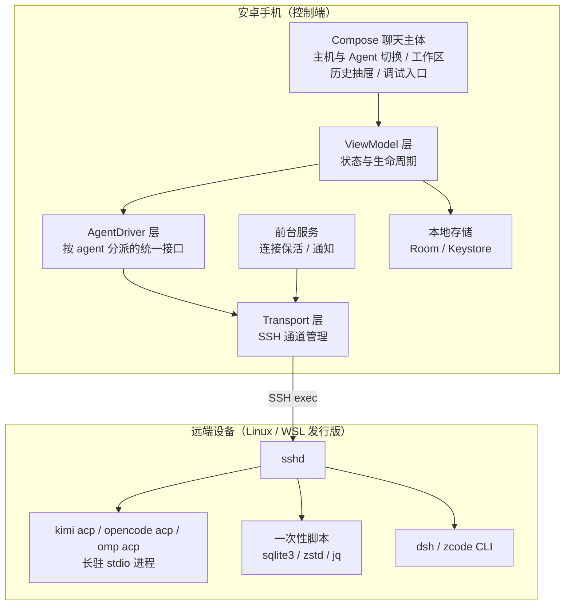
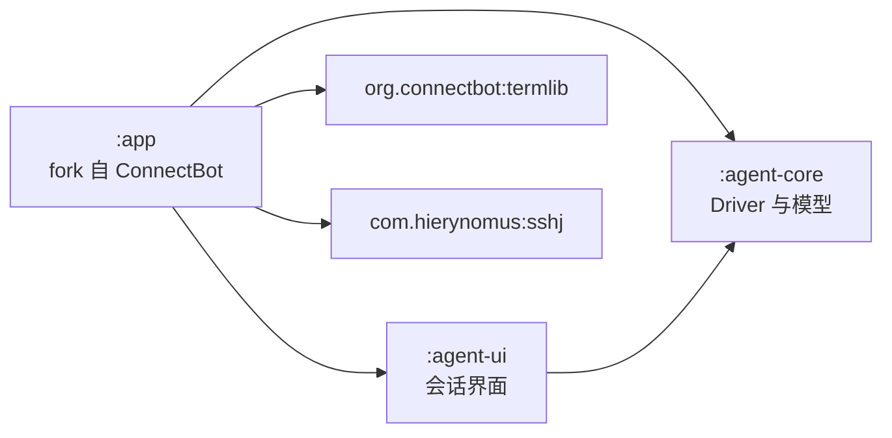
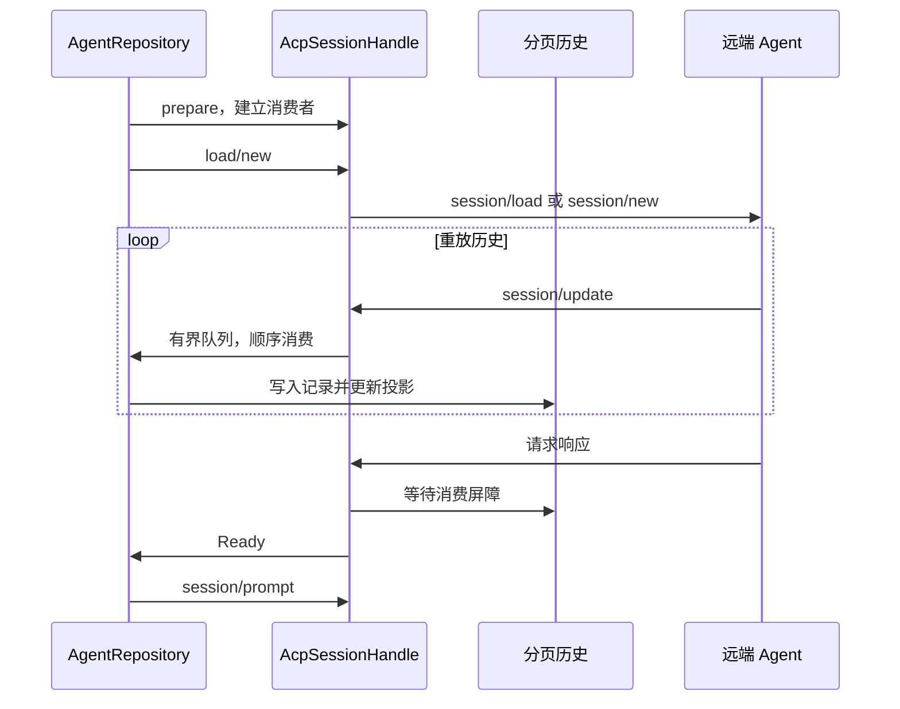
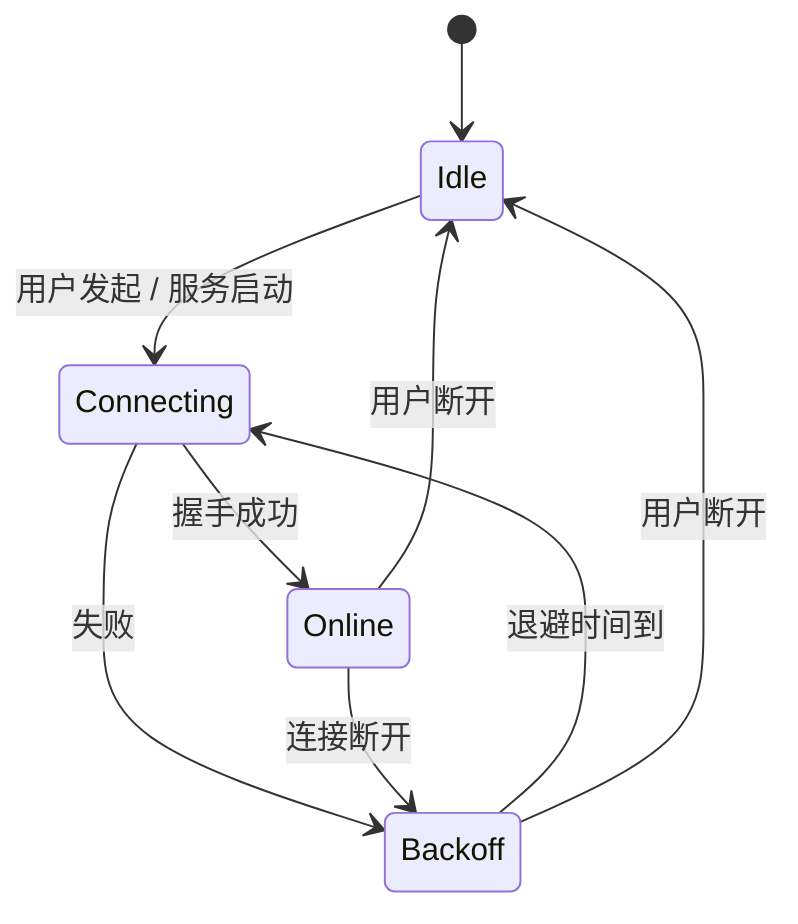
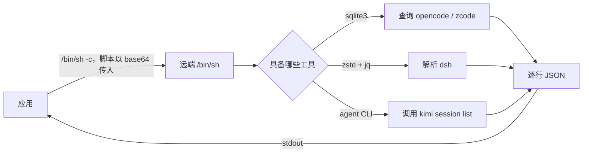
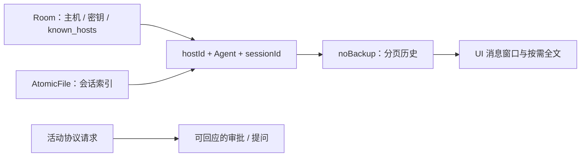

# 05 技术方案

安卓应用以 Agent 对话为默认入口。SSH 承担传输、主机认证与调试，不要求用户进入终端手工启动 Agent。读者为开发者与测试人员；正文中的异常处理属于实现契约。**已有**表示源码或实测确认，**新增设计**表示目标实现，**待验证**表示尚未通过目标版本的端到端验收。

## 0. 界面与操作契约

**新增设计**：手机采用聊天主体与左侧历史抽屉；宽屏可呈现同一历史侧栏。信息架构参考 [codex-remote-android 的 WorkspaceScreen](https://github.com/liuhao-labs/codex-remote-android/blob/main/app/src/main/java/com/codex/remote/ui/screens/WorkspaceScreen.kt) 与 [Kimi 旧 Web 会话组件](https://github.com/MoonshotAI/kimi-cli/blob/main/web/src/features/sessions/sessions.tsx)，协议不随 UI 借鉴而更换。

| 区域 | 内容与行为 |
| --- | --- |
| 顶部 | 历史抽屉入口、当前主机、当前 Agent、新建会话；主机切换触发探测和索引刷新 |
| 上下文栏 | 工作目录、连接与历史加载状态；目录来自当前会话，不用手机端默认目录替代 |
| 聊天主体 | 用户消息、回复、折叠思考与工具卡、差异、审批、提问；连接失败保留已收到的内容并提供重试 |
| 底部 | 输入框、发送与停止；历史加载未完成或通道失效时禁止发送 |
| 历史抽屉 | 当前主机和 Agent 的历史，按 `(hostId, cwd)` 分组；组内新建、会话选择、搜索；可切到跨主机和 Agent 聚合视图 |
| 辅助入口 | 主机配置、密钥、设置、SSH 调试终端；不以终端作为 Continue 的默认动作 |

1. 启动后呈现聊天框架和本地索引；未配置主机时显示添加主机入口。
2. 选中主机后自动探测各 Agent 并刷新历史。CLI 不可用与网络失败分别显示；保留已有缓存，不能用失败结果清空列表。
3. 切换 Agent 改变可见历史与新建目标，不能把当前会话 ID 传给另一 Agent。相同路径在不同主机上分别分组。
4. 选择历史会话后，在聊天区域加载历史并恢复原工作目录。只有历史消费完成并建立交互通道后才能发送。
5. 有任务执行或待审批时，切换操作必须明确处理当前会话；不能把普通导航点击解释为停止任务。
6. 不支持结构化交互的实际版本必须说明原因，提供主动选择的调试终端，不自动跳转 SSH。

## 1. 架构总览



**分层职责**：

| 层 | 职责 | 不做什么 |
| --- | --- | --- |
| UI 层 | 呈现与交互 | 不含业务逻辑与协议解析 |
| ViewModel 层 | 状态管理、调用 Driver | 不直接操作 SSH |
| AgentDriver 层 | 统一 5 个 agent 的差异，输出归一化模型 | 不管理连接生命周期 |
| Transport 层 | SSH 连接、通道复用、重连 | 不理解 agent 语义 |
| 本地存储 | Room 配置与加密凭据、AtomicFile 索引、私有分页历史 | 不修改远端 Agent 原生存储；历史缓存不进入系统备份 |

## 2. 模块划分



| 模块 | 来源 | 内容 |
| --- | --- | --- |
| `:app` | fork ConnectBot | 主机管理、密钥、known_hosts、前台服务、导航框架 |
| `:agent-core` | **新增设计** | `AgentDriver` 接口与 5 个实现、会话模型、远端脚本 |
| `:agent-ui` | **新增设计** | 会话列表、对话界面、权限审批；组件自 codeg-android 移植 |

不 fork `termlib`，直接依赖 `org.connectbot:termlib:0.3.11`。

## 3. AgentDriver 抽象

### 3.1 接口定义

**已有**的公共列表接口定义于 `android/agent-core/src/main/kotlin/org/rmagentma/core/AgentModels.kt`。探测、连接准备与恢复由各协议实现提供，不能将尚未存在的统一方法当成公共 API。

```kotlin
interface AgentDriver {
    val agent: AgentKind
    suspend fun listSessions(host: HostSession, limit: Int = 200): List<AgentSession>
}
```

**新增设计**的连接契约：先准备 handle，启动事件消费，再执行 new/load/resume；实例关闭和取消必须唤醒正在等待的请求。具体方法名以对应 driver 源码为准。

`AgentSessionHandle` 是交互通道的抽象，对外暴露：

| 成员 | 说明 |
| --- | --- |
| `events: Flow<AgentEvent>` | 归一化事件流，见 3.3 |
| `send(text: String)` | 发送用户消息 |
| `cancel()` | 取消当前轮次 |
| `respondPermission(requestId, optionId)` | 回应权限请求 |
| `close()` | 关闭通道 |

### 3.2 交互与历史通道

| Agent | 交互通道 | 历史恢复 | 状态 |
| --- | --- | --- | --- |
| kimi、opencode、omp | `<agent> acp`，SSH no-PTY exec | 按实际 `loadSession` 能力请求 `session/load`，消费重放通知 | **已有**协议实现；移动端大历史恢复须独立验收 |
| dsh | `dsh --profile acp` | 独立只读历史读取后，按 `sessionCapabilities.resume` 请求 `session/resume` | **已有**本机 initialize 确认 resume/list/close，无 loadSession；**新增设计**接入原生聊天 |
| zcode | `app-server`，严格 JSONL 信封，不是 ACP | 只读 SQLite，用户继续时 resume 后订阅 | **已有**本机真正 CLI 0.16.9 的 runtime/capabilities 与 session/list；**新增设计**独立 driver；正文恢复、发送与审批**待验证** |

当前 ACP 实现使用手写 JSON-RPC，不链接官方 Kotlin SDK。SDK 的 Transport 形状仅作接口参考，不应把设计依赖标成现有实现。

`ShellDriver` 负责读取历史元数据和生成主动使用的调试命令，不决定主页面跳转。只有用户明确选择终端才打开 PTY。dsh ACP 不支持 `session/load`；用 `resume` 替换 load 而不读取历史会得到空聊天页面，不能视为恢复成功。

**已有**：`ZcodeDriver` 使用独立请求信封、订阅与反向审批，不发送 `jsonrpc` 或 `initialize`，等待 session 存储 ready 后调用 `runtime/capabilities`。默认探测 PATH；ZCode 的已验证桌面 runtime 布局入口为 `$HOME/.zcode/server/agents/glm/zcode-agent`，只注入 provider 文件路径，不读取凭据内容。`ZcodeLaunchConfig` 可以显式指定活动配置路径，不能猜测 endpoint 目录。

ZCode 继续会话时没有权威 `workspaceIdentity` 就省略 workspace，让服务端按原 sessionId 恢复；不能把 cwd 当持久化 identity。历史列表的 UI 分组键仍为主机与 cwd，两者职责不同。协议依据见 [ZCode shared schema](https://github.com/zai-org/ZCode/blob/main/packages/shared/src/zcode-protocol/index.ts)；支持范围必须与目标主机的实际版本一致。

### 3.3 归一化事件模型

`AgentEvent` 是 5 个 agent 输出去异后的统一模型，参照 codeg-android 的 `AcpEvent.kt` 设计。

| 事件 | 字段 | 来源 |
| --- | --- | --- |
| `ContentDelta` | `text` | ACP `agent_message_chunk` |
| `Thinking` | `text` | ACP `agent_thought_chunk` |
| `ToolCall` | `id`、`title`、`kind`、`status`、`input`、`output` | ACP `tool_call` |
| `ToolCallUpdate` | `id`、`status`、`content` | ACP `tool_call_update` |
| `Plan` | `entries` | ACP `plan` |
| `PermissionRequest` | `requestId`、`toolCall`、`options` | ACP `session/request_permission` |
| `QuestionRequest` | `requestId`、`question`、`options` | ACP `elicitation/create` |
| `UsageUpdate` | `used`、`size` | ACP `usage_update` |
| `SessionInfo` | `title`、`updatedAt` | ACP `session_info_update` |
| `TurnComplete` | `stopReason` | `session/prompt` 的返回值 |
| `Error` | `message`、`code` | 传输层或协议层错误 |
| `Unknown` | `type` | 未知事件，**不中断流** |

**未知事件必须降级为 `Unknown` 而不是抛异常**——agent 版本升级会引入新事件类型，协议的前向兼容依赖这一点。

**流式分片的聚合规则**：同一条消息的多个 `agent_message_chunk` 会连续到达，且可能夹杂空字符串分片。渲染时按「连续同类型分片」合并；若 agent 提供了不透明 `messageId`，则优先按 `messageId` 合并。

## 4. Transport 层

### 4.1 SSH 通道的三种用法

| 用法 | 生命周期 | SSH 方法 | 用途 |
| --- | --- | --- | --- |
| 长驻 exec 通道 | 与交互会话同寿 | `Session.exec(command)` | 跑 `kimi acp` 等长驻进程 |
| 一次性 exec 通道 | 单次调用 | `Session.exec(command)` | 跑会话列表脚本 |
| 本地端口转发 | 与转发需求同寿 | `Session.startLocalPortForwarding` | 访问远端 Web 界面 |

**必须禁 PTY**：长驻通道用于 ACP 时不得分配伪终端，否则远端会回显请求、行尾变 CRLF，协议失效。sshj 的 `Channel` 默认不分配 PTY，但需在代码中显式保证。

**stderr 必须单独消费**：SSH 会向 stderr 输出 `Warning: Permanently added ... to the list of known hosts` 之类的信息，agent 的日志也走 stderr。把 stderr 与 stdout 合并会污染 NDJSON 流。做法是取 `getErrorStream()` 后异步读取并转发到应用日志。

**连接参数**：

| 参数 | 值 | 理由 |
| --- | --- | --- |
| 读超时 | 0（不限） | 长驻进程与长时间思考 |
| 密钥交换算法 | 让 sshj 使用平台默认 provider，不指定 "BC" | 安卓的系统 "BC" 是精简实现，无 EC 与 X25519；指定它会让握手在认证前就报 `no such algorithm`。平台默认 provider（AndroidOpenSSL）实现了 ECDH、X25519 与 DH |
| 日志实现 | `slf4j-nop` | 避免与安卓日志冲突 |
| 保活 | 应用层心跳 | 网络切换（Wi-Fi ↔ 移动网络）会静默断开 |

### 4.2 ACP Transport 适配

**已有**：`AcpConnection` 在 SSH channel 的独立 stdout/stdin 上进行 NDJSON 分帧与 JSON-RPC 收发。**新增设计**：准备 handle 后先启动唯一事件消费者，再发起 load/new；响应前的历史通知顺序进入分页存储，消费屏障完成后才把会话标记为 Ready。



队列背压必须可取消；消费者在请求前启动，不能让 reader 等待一个只能在 load 返回后建立的消费者。审批、问答和终止状态不能被历史窗口淘汰。单个事件或磁盘配额超过限制必须显式失败并保留可读部分，不能自动批准工具或静默丢弃事件。

**分帧要点**：

| 要点 | 处理 |
| --- | --- |
| 行切分 | 按 `\n` 切分；未完整的一行必须缓冲，不能丢弃 |
| 行尾 `\r` | 去掉尾部 `\r` 以兼容意外产生的 CRLF |
| 非法 JSON 行 | **跳过并记录警告**，不中断连接（远端可能混入非协议输出） |
| 消息上限 | 单条 32 MiB，超限报错（与官方 SDK 一致） |

### 4.3 重连与保活



| 机制 | 参数 | 说明 |
| --- | --- | --- |
| 退避重试 | 起始 1 秒，上限 60 秒，指数增长 | 避免网络不可达时高频重试 |
| 应用层心跳 | 30 秒无数据则发送探测 | 网络切换后 SSH 可能已静默断开 |
| 连接复用 | 同一主机的多条通道共用一个 SSH 会话 | 减少握手开销 |
| 单通道隔离 | 一条通道失败不影响其他通道 | 一台设备的某个 agent 出错不阻塞整体 |

## 5. 会话列表的实现

### 5.1 远端脚本

会话列表用一个自包含的脚本在远端执行，结果以 JSON 行输出。

**不能依赖远端默认 shell**：用户的登录 shell 可能是 fish、zsh 或 csh，heredoc 在这类 shell 下是语法错误。实测（fish）会把整条命令判为语法错误，脚本一行都不执行。脚本因此以 base64 作为参数传给显式调用的 `/bin/sh -c`，并对默认 shell 不假设任何语法。



**脚本的三个原则**：

1. **逐个 agent 独立降级**：某个 agent 的工具缺失或解析失败，不影响其他 agent
2. **输出统一格式**：每个会话一行 JSON，字段见 03 文档第 4 节
3. **错误也输出 JSON**：以 `{"level":"error","agent":"dsh","message":"..."}` 的形式混在流中，由应用分离呈现

### 5.2 远端工具依赖与降级

| 命令 | 缺失时的处理 |
| --- | --- |
| `python3` | 脚本以 `{"level":"error","category":"python_missing"}` 结束并返回 127；应用保留缓存并提示 |
| `base64` | 同上，category 为 `base64_missing` |
| `sqlite3` | 回退到 `python3 -c` 加标准库 `sqlite3` |
| `zstd` | 回退到 Python 3.14+ 的 `compression.zstd`；两者都无则跳过 dsh 并报错 |
| `jq` | 回退到 Python 标准库 `json` |
| agent CLI | kimi 的兜底路径直接读 `state.json`，不依赖可执行文件 |

脚本非零退出时也输出 `{"level":"error","category":"scanner_exit_failed"}`，因此**失败不会被误判为空结果**：应用保留既有缓存，而不是把会话列表清空。

**不把解析逻辑放进应用**的理由：

| 理由 | 说明 |
| --- | --- |
| 数据量 | opencode 数据库实机 4.6 GB，不可能传输 |
| 依赖 | 安卓端引入 zstd 需要原生库（按 ABI 分包）或纯 Java 实现（aircompressor） |
| 版本漂移 | agent 存储格式变化时只需改远端脚本，无需发版 |
| 写锁 | 远端 agent 可能正在写库，用远端的 `sqlite3` 读取更容易正确处理 WAL |

## 6. 数据模型

### 6.1 配置、索引与历史分别存储

**已有**：主机与认证配置复用 Room 数据库的 `Host`、`Pubkey`、`KnownHost`、`PortForward`、`Profile` 表；会话索引由 `AgentIndexStore` 以 AtomicFile 快照写入 `noBackupFilesDir`，不是 Room FTS。索引关联键是稳定的 `Host.id`，修改 `hostname` 不改变关联。

**新增设计**：完整历史使用应用私有、排除系统备份的分页存储，UI 仅加载显示窗口。原始记录与显示预览分离，不能把单条截尾或删除旧事件当成完整历史。审批请求保留在活动交互状态中，读取旧页不能重新激活历史审批。



| 数据 | 生命周期与边界 |
| --- | --- |
| 主机配置 | 持久保存；地址可编辑，主键不变 |
| 会话索引 | 远端扫描成功后按来源替换；失败保留缓存；删除主机同步清理其索引 |
| 分页历史 | 打开会话时建立回放代次；完成后标记就绪；失败保留可读部分并标记未完成；重复 load 不盲追加上一代历史 |
| 显示窗口 | 按页读取，流式消息聚合；超长正文和 diff 默认有限预览，完整内容按需打开 |
| 待交互请求 | 绑定原活动会话与请求实例；切换、取消或通道关闭后禁止回应陈旧请求 |

**已有**：`AgentEventHistory` 将记录与索引写入 `noBackupFilesDir/agent-history`，记录带 CRC 校验；总磁盘预算为 256 MiB。显示窗口最多 500 项且受约 8 MiB 预算约束，更早历史读取替换当前页，未处理审批仍保留。新会话清理旧临时日志，不提供跨进程离线历史恢复；会话元数据索引仍持久保存。`fullText` 按原事件实例读取完整合并文本，UI 分页显示全文。

磁盘满、损坏或超过配额时显示明确错误，不能静默丢失内容后进入 Ready。这些文件是本地临时缓存，不是上游会话的权威存储；清理不能修改远端 Agent 数据。

### 6.2 凭据存储

复用 codeg-android 的 `KeystoreSecretStore` 实现：AndroidKeyStore 生成 AES-256 密钥，密文以 `iv || ciphertext` 的 base64 形式存入私有 SharedPreferences，密钥不出 Keystore。

不使用已废弃的 `androidx.security:security-crypto`。

## 7. 平台适配

### 7.1 Android 本地网络权限

| 版本 | 行为 | 处理 |
| --- | --- | --- |
| Android 16 | 选择性启用，受影响应用用 `NEARBY_WIFI_DEVICES` 授权 | 在清单中声明该权限，并在首次访问局域网时请求 |
| Android 17（targetSdk ≥ 37） | 默认屏蔽，需运行时请求 `ACCESS_LOCAL_NETWORK` | 适配时声明并请求；被拒绝时给出明确提示 |

该权限在系统网络栈深处实现，对所有网络库生效，**包括 WebView**。被拦截时 TCP 表现为超时而非即时失败。

对「用户已知 IP」的场景，直接请求权限即可，不需要走 `NsdManager` 的系统选择器。

### 7.2 WSL 设备

WSL 内的 agent 数据位于发行版的 Linux 文件系统中。两种访问方式：

| 方式 | 做法 | 评价 |
| --- | --- | --- |
| SSH 直连发行版 | WSL 内启 sshd，应用直接 SSH 进去 | **推荐**：与 Linux 设备一致，无需特殊处理 |
| 经 Windows 宿主访问 UNC 路径 | 应用连 Windows，用 `wsl.exe -d <发行版> --exec` 或 `\\wsl.localhost\...` 路径 | 需要 Windows 侧额外逻辑，且 `wsl.exe` 的参数展开有陷阱 |

**采用第一种**。WSL 发行版默认不带 sshd，需要在发行版内安装并配置。这是环境准备步骤，写进部署说明。

**`wsl.exe` 的两个陷阱（仅在使用第二种方式时相关，记录备查）**：

1. 必须用 `--exec` 而不是 `--`：后者会让 `wsl.exe` 在 Windows 侧先展开参数中的 `$变量`，导致脚本语义变化
2. 交互式登录 shell 会在 stdout 打印 banner（如 `sudo` 提示），解析 stdout 时必须用非交互方式或加围栏

来源：Orca 的 `docs/reference/wsl-command-execution.md`。

### 7.3 手机自身作为被管设备

手机的 agent 装在 droidspace 容器内。该容器默认使用 NAT 网络，**容器内的服务默认无法被局域网直接访问**。

| 方案 | 做法 | 状态 |
| --- | --- | --- |
| 宿主机网络模式 | droidspace 切到 Host 模式，容器直接使用手机 IP | **待验证** |
| NAT + 端口转发 | 配置转发规则 | **待验证** |
| 手机不自管 | 手机只作控制端，不作为被管节点 | 保底方案 |

**本期按保底方案设计**：手机作为控制端，不纳入被管设备列表。是否支持手机自管列为**待验证**。

## 8. 可选能力

以下能力不在主路径上，按需启用。

### 8.1 终端界面

复用 `termlib` 在应用内提供终端，用于：

- 用户主动选择的 CLI 调试与版本兼容性排查
- 任意设备的 SSH 排障

终端不取代结构化对话主流程，不自动作为 Continue 的落点。

### 8.2 覆盖网络集成

不实现设备自动发现（见 02 文档第 4 节）。建议用户在每台设备安装 Tailscale，用 MagicDNS 主机名作为连接地址——地址永久稳定，不需要在应用内做任何发现逻辑。

应用侧只要求一件事：`Host.hostname` 字段允许填写任意主机名，不做 IP 格式校验。

### 8.3 Web 界面嵌入

WebView 嵌入属于**待验证**的补充路线，不代替已支持的原生聊天。远端 Web 服务和手机 listener 都仅绑定 loopback，经受控 SSH 转发连接；切换主机必须关闭旧页面与转发，不能复用旧主机的鉴权状态。

| Agent | 接入约束 |
| --- | --- |
| kimi-code | 当前版本启动 URL 使用 fragment token；与归档 kimi-cli 的端口和接口分开核验 |
| opencode | 依据目标版本验证 Basic 鉴权，不能开放未认证的远程代码执行服务 |
| dsh | `dsh web --no-open --host 127.0.0.1 --port <port>`；启动 token 在根 URL 交换 cookie，不是 API Bearer header；转发端口变化后重新鉴权 |
| zcode | 官方统一发行有 `--web`，不代表本机旧独立 CLI 有该选项；先验证 executable 与发行形态 |
| omp | 未确认可复用 Web 接口，不据此提供 WebView 操作 |

dsh 连接与鉴权依据见 [connection README](https://github.com/deepseek-ai/deepseek-harness/blob/master/packages/client/connection/README.md)。启动 token 不写入普通日志，不允许网页导航跳出已授权的 loopback origin。

**WebView 的配置要求**：

| 项 | 配置 |
| --- | --- |
| 明文 HTTP | `networkSecurityConfig` 中允许私有网段的 cleartext |
| DOM 存储 | `WebSettings.setDomStorageEnabled(true)`（三家界面都依赖 localStorage） |
| 生命周期 | **单实例 WebView 复用**，切换 agent 时加载新 URL 并释放旧页面，不做多实例常驻 |

**安全提示**：opencode 的服务端不校验 Host 头，必须设置 `OPENCODE_SERVER_PASSWORD` 后才可对局域网开放。

## 9. 风险与对策

| 风险 | 影响 | 对策 |
| --- | --- | --- |
| cbssh/sshj 在真机上的流式表现未验证 | 阻塞整条 ACP 路线 | **阶段 0 先做 spike 验证**（见 06 文档） |
| omp 会话格式无真实样本 | 无法实现该 agent 的会话解析 | 用 `--session-dir` 在临时目录生成本地样本后再实现 |
| agent 版本升级导致存储格式变化 | 解析失败，会话列表为空 | 解析逻辑全程容错；字段缺失时降级；世代号当变量处理 |
| dsh 世代号已到 v4，公开实现记录的是 v3 | 解析到错误世代 | 取数值最高世代，忽略 `.tmp` 与 `.lock` |
| 远端缺少 `sqlite3`/`zstd`/`jq` | 部分 agent 无法列出 | 三级降级：CLI → Python 标准库 → 明确报错 |
| 网络切换导致 SSH 静默断开 | 交互中断 | 应用层心跳 + 退避重连 + 前台服务保活 |
| Android 17 的本地网络权限 | 局域网访问被拒 | 提前声明权限并处理拒绝；必要时引导用户授权 |
| WSL 发行版未配置 sshd | 无法连接 | 写入部署说明；应用在探测失败时给出提示 |
