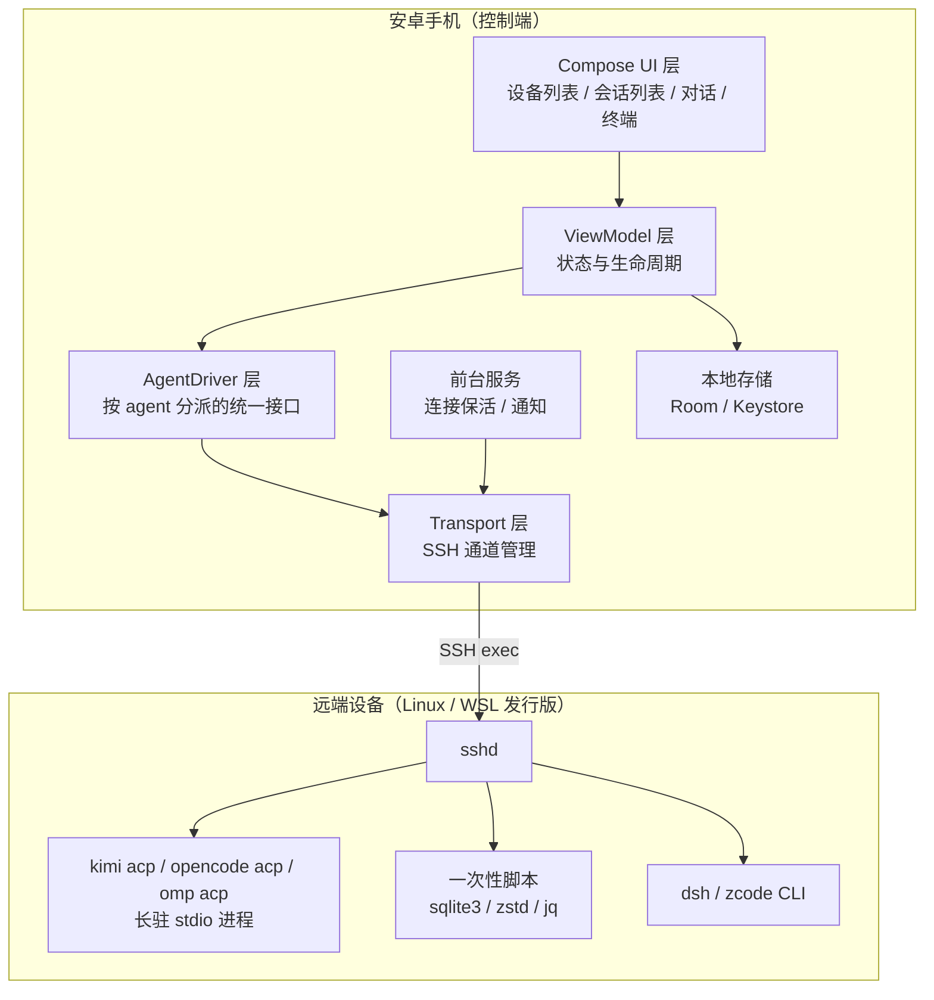
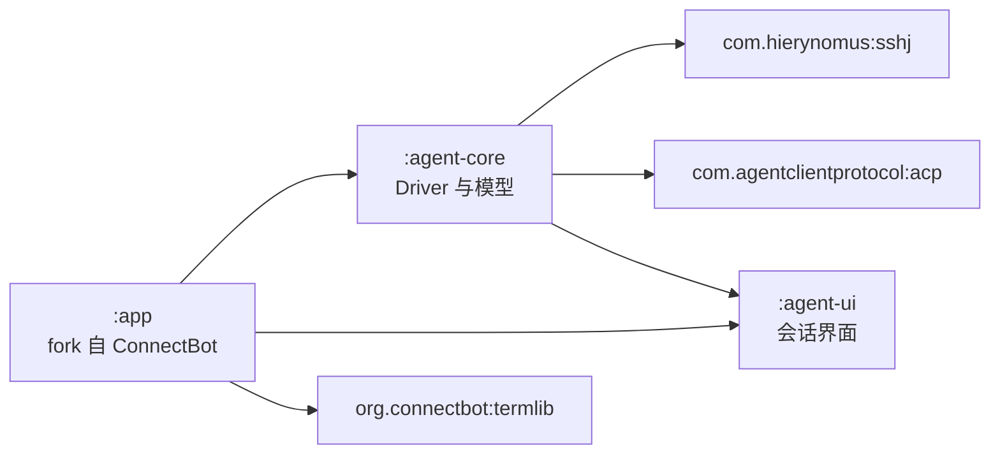
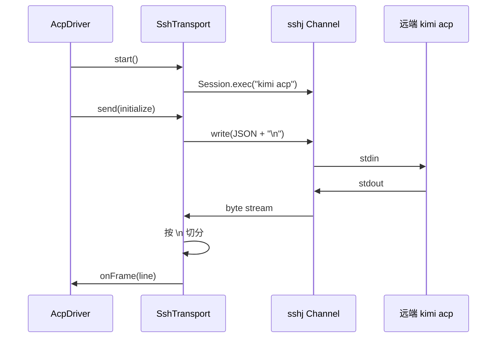
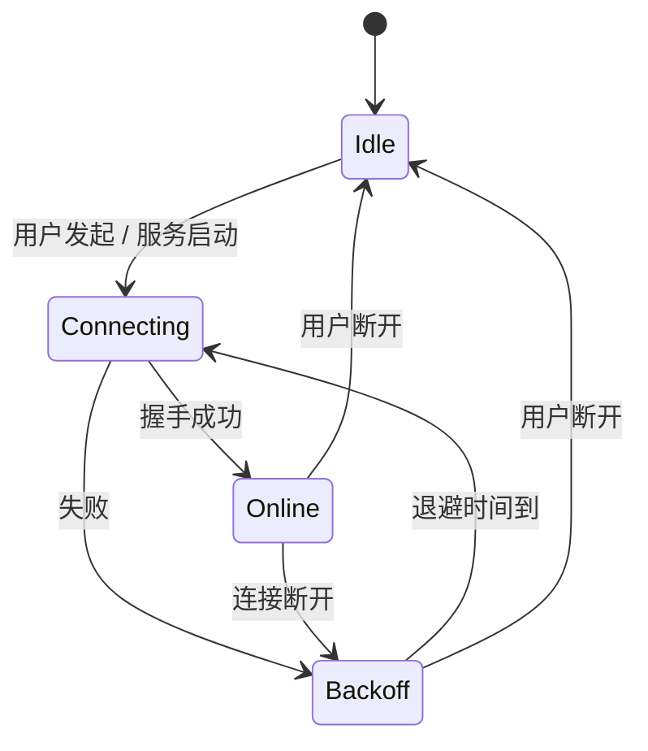
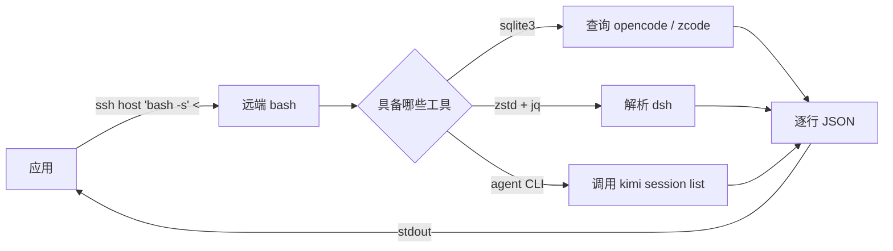
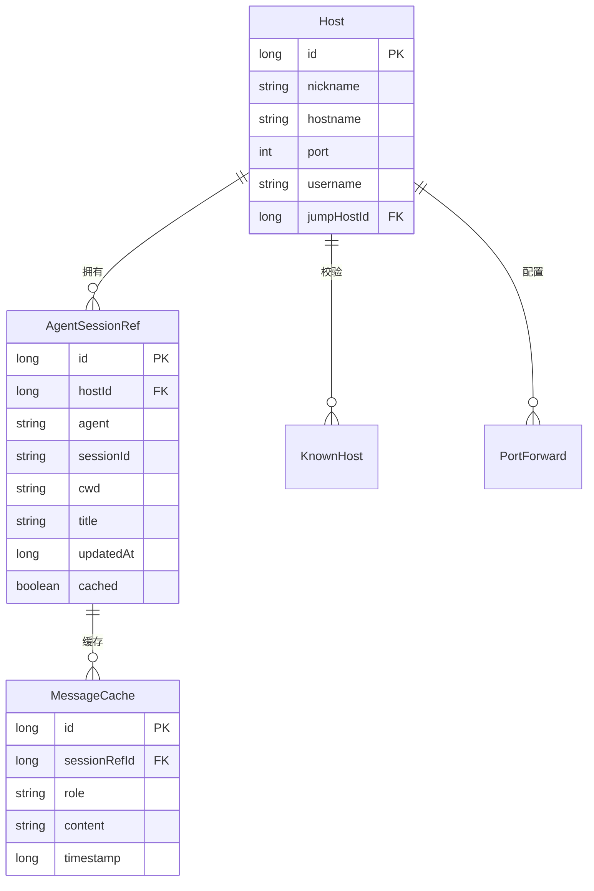

# 05 技术方案

自研安卓应用的架构设计、模块划分与关键实现。

## 1. 架构总览



**分层职责**：

| 层 | 职责 | 不做什么 |
| --- | --- | --- |
| UI 层 | 呈现与交互 | 不含业务逻辑与协议解析 |
| ViewModel 层 | 状态管理、调用 Driver | 不直接操作 SSH |
| AgentDriver 层 | 统一 5 个 agent 的差异，输出归一化模型 | 不管理连接生命周期 |
| Transport 层 | SSH 连接、通道复用、重连 | 不理解 agent 语义 |
| 本地存储 | 设备配置、凭据、会话缓存 | 不存储会话正文（保存在远端） |

## 2. 模块划分



| 模块 | 来源 | 内容 |
| --- | --- | --- |
| `:app` | fork ConnectBot | 主机管理、密钥、known_hosts、前台服务、导航框架 |
| `:agent-core` | **新增设计** | `AgentDriver` 接口与 5 个实现、会话模型、远端脚本 |
| `:agent-ui` | **新增设计** | 会话列表、对话界面、权限审批；组件自 codeg-android 移植 |

不 fork `termlib`，直接依赖 `org.connectbot:termlib:0.3.11`。

## 3. AgentDriver 抽象

### 3.1 接口定义

```kotlin
interface AgentDriver {
    /** agent 标识，取值为 opencode / omp / kimi / dsh / zcode */
    val agent: AgentKind

    /** 探测该 agent 在目标主机上是否可用 */
    suspend fun probe(host: HostSession): AgentAvailability

    /** 列出历史会话 */
    suspend fun listSessions(host: HostSession, limit: Int = 200): List<AgentSession>

    /** 建立交互会话，用于收发消息 */
    suspend fun open(host: HostSession, sessionId: String?, cwd: String): AgentSessionHandle
}
```

`AgentSessionHandle` 是交互通道的抽象，对外暴露：

| 成员 | 说明 |
| --- | --- |
| `events: Flow<AgentEvent>` | 归一化事件流，见 3.3 |
| `send(text: String)` | 发送用户消息 |
| `cancel()` | 取消当前轮次 |
| `respondPermission(requestId, optionId)` | 回应权限请求 |
| `close()` | 关闭通道 |

### 3.2 两种实现

| 实现 | 覆盖 agent | 底层 |
| --- | --- | --- |
| `AcpDriver` | kimi、opencode、omp | ACP Kotlin SDK + 自定义 `SshTransport` |
| `ShellDriver` | dsh、zcode | SSH 一次性命令 + 终端降级 |

**`AcpDriver` 一套代码覆盖三个 agent**，差异只在启动命令：

| agent | 启动命令 |
| --- | --- |
| kimi | `kimi acp` |
| opencode | `opencode acp` |
| omp | `omp acp` |

**`ShellDriver` 的职责**：会话历史用一次性脚本获取；交互则降级为终端（`termlib`），由用户手动操作。dsh 与 zcode 的交互界面路线列为**待验证**——若验证可行，可用各自的 Web 界面经 SSH 端口转发嵌入（见 8.3 节）。

### 3.3 归一化事件模型

`AgentEvent` 是 5 个 agent 输出去异后的统一模型，参照 codeg-android 的 `AcpEvent.kt` 设计。

| 事件 | 字段 | 来源 |
| --- | --- | --- |
| `ContentDelta` | `text` | ACP `agent_message_chunk` |
| `Thinking` | `text` | ACP `agent_thought_chunk` |
| `ToolCall` | `id`、`title`、`kind`、`status`、`input`、`output` | ACP `tool_call` |
| `ToolCallUpdate` | `id`、`status`、`content` | ACP `tool_call_update` |
| `Plan` | `entries` | ACP `plan` |
| `PermissionRequest` | `requestId`、`toolCall`、`options` | ACP `session/request_permission` |
| `QuestionRequest` | `requestId`、`question`、`options` | ACP `elicitation/create` |
| `UsageUpdate` | `used`、`size` | ACP `usage_update` |
| `SessionInfo` | `title`、`updatedAt` | ACP `session_info_update` |
| `TurnComplete` | `stopReason` | `session/prompt` 的返回值 |
| `Error` | `message`、`code` | 传输层或协议层错误 |
| `Unknown` | `type` | 未知事件，**不中断流** |

**未知事件必须降级为 `Unknown` 而不是抛异常**——agent 版本升级会引入新事件类型，协议的前向兼容依赖这一点。

**流式分片的聚合规则**：同一条消息的多个 `agent_message_chunk` 会连续到达，且可能夹杂空字符串分片。渲染时按「连续同类型分片」合并；若 agent 提供了不透明 `messageId`，则优先按 `messageId` 合并。

## 4. Transport 层

### 4.1 SSH 通道的三种用法

| 用法 | 生命周期 | SSH 方法 | 用途 |
| --- | --- | --- | --- |
| 长驻 exec 通道 | 与交互会话同寿 | `Session.exec(command)` | 跑 `kimi acp` 等长驻进程 |
| 一次性 exec 通道 | 单次调用 | `Session.exec(command)` | 跑会话列表脚本 |
| 本地端口转发 | 与转发需求同寿 | `Session.startLocalPortForwarding` | 访问远端 Web 界面 |

**必须禁 PTY**：长驻通道用于 ACP 时不得分配伪终端，否则远端会回显请求、行尾变 CRLF，协议失效。sshj 的 `Channel` 默认不分配 PTY，但需在代码中显式保证。

**stderr 必须单独消费**：SSH 会向 stderr 输出 `Warning: Permanently added ... to the list of known hosts` 之类的信息，agent 的日志也走 stderr。把 stderr 与 stdout 合并会污染 NDJSON 流。做法是取 `getErrorStream()` 后异步读取并转发到应用日志。

**连接参数**：

| 参数 | 值 | 理由 |
| --- | --- | --- |
| 读超时 | 0（不限） | 长驻进程与长时间思考 |
| 密钥交换算法 | 剔除 curve25519 | 安卓 Conscrypt 不提供 X25519 |
| 日志实现 | `slf4j-nop` | 避免与安卓日志冲突 |
| 保活 | 应用层心跳 | 网络切换（Wi-Fi ↔ 移动网络）会静默断开 |

### 4.2 ACP Transport 适配

ACP Kotlin SDK 的 `StdioTransport` 接受 `Flow<String>` 与 `suspend (String) -> Unit`，因此只需实现一个适配器把 sshj 的字节流转成行流：



**分帧要点**：

| 要点 | 处理 |
| --- | --- |
| 行切分 | 按 `\n` 切分；未完整的一行必须缓冲，不能丢弃 |
| 行尾 `\r` | 去掉尾部 `\r` 以兼容意外产生的 CRLF |
| 非法 JSON 行 | **跳过并记录警告**，不中断连接（远端可能混入非协议输出） |
| 消息上限 | 单条 32 MiB，超限报错（与官方 SDK 一致） |

### 4.3 重连与保活



| 机制 | 参数 | 说明 |
| --- | --- | --- |
| 退避重试 | 起始 1 秒，上限 60 秒，指数增长 | 避免网络不可达时高频重试 |
| 应用层心跳 | 30 秒无数据则发送探测 | 网络切换后 SSH 可能已静默断开 |
| 连接复用 | 同一主机的多条通道共用一个 SSH 会话 | 减少握手开销 |
| 单通道隔离 | 一条通道失败不影响其他通道 | 一台设备的某个 agent 出错不阻塞整体 |

## 5. 会话列表的实现

### 5.1 远端脚本

会话列表用一个自包含的 shell 脚本在远端执行，通过 heredoc 传入，结果以 JSON 行输出。



**脚本的三个原则**：

1. **逐个 agent 独立降级**：某个 agent 的工具缺失或解析失败，不影响其他 agent
2. **输出统一格式**：每个会话一行 JSON，字段见 03 文档第 4 节
3. **错误也输出 JSON**：以 `{"level":"error","agent":"dsh","message":"..."}` 的形式混在流中，由应用分离呈现

### 5.2 远端工具依赖与降级

| 命令 | 缺失时的处理 |
| --- | --- |
| `sqlite3` | 回退到 `python3 -c` 加标准库 `sqlite3` |
| `zstd` | 回退到 Python 3.14+ 的 `compression.zstd`；两者都无则跳过 dsh 并报错 |
| `jq` | 回退到 Python 标准库 `json` |
| agent CLI | kimi 的兜底路径直接读 `state.json`，不依赖可执行文件 |

**不把解析逻辑放进应用**的理由：

| 理由 | 说明 |
| --- | --- |
| 数据量 | opencode 数据库实机 4.6 GB，不可能传输 |
| 依赖 | 安卓端引入 zstd 需要原生库（按 ABI 分包）或纯 Java 实现（aircompressor） |
| 版本漂移 | agent 存储格式变化时只需改远端脚本，无需发版 |
| 写锁 | 远端 agent 可能正在写库，用远端的 `sqlite3` 读取更容易正确处理 WAL |

## 6. 数据模型

### 6.1 本地存储（Room）

复用 ConnectBot 已有的 `Host`、`Pubkey`、`KnownHost`、`PortForward`、`Profile` 表，新增两张表。



| 表 | 用途 | 说明 |
| --- | --- | --- |
| `AgentSessionRef` | 会话索引缓存 | 来自远端扫描，用于离线浏览与快速搜索 |
| `MessageCache` | 消息正文缓存 | **可选**，仅缓存用户最近打开过的会话，容量有上限 |

`Host` 与 `AgentSessionRef` 的关系键是 `Host.id`（稳定主键），而不是 `hostname`。这样修改地址不影响会话索引——满足 FR-1 的验收口径。

### 6.2 凭据存储

复用 codeg-android 的 `KeystoreSecretStore` 实现：AndroidKeyStore 生成 AES-256 密钥，密文以 `iv || ciphertext` 的 base64 形式存入私有 SharedPreferences，密钥不出 Keystore。

不使用已废弃的 `androidx.security:security-crypto`。

## 7. 平台适配

### 7.1 Android 本地网络权限

| 版本 | 行为 | 处理 |
| --- | --- | --- |
| Android 16 | 选择性启用，受影响应用用 `NEARBY_WIFI_DEVICES` 授权 | 在清单中声明该权限，并在首次访问局域网时请求 |
| Android 17（targetSdk ≥ 37） | 默认屏蔽，需运行时请求 `ACCESS_LOCAL_NETWORK` | 适配时声明并请求；被拒绝时给出明确提示 |

该权限在系统网络栈深处实现，对所有网络库生效，**包括 WebView**。被拦截时 TCP 表现为超时而非即时失败。

对「用户已知 IP」的场景，直接请求权限即可，不需要走 `NsdManager` 的系统选择器。

### 7.2 WSL 设备

WSL 内的 agent 数据位于发行版的 Linux 文件系统中。两种访问方式：

| 方式 | 做法 | 评价 |
| --- | --- | --- |
| SSH 直连发行版 | WSL 内启 sshd，应用直接 SSH 进去 | **推荐**：与 Linux 设备一致，无需特殊处理 |
| 经 Windows 宿主访问 UNC 路径 | 应用连 Windows，用 `wsl.exe -d <发行版> --exec` 或 `\\wsl.localhost\...` 路径 | 需要 Windows 侧额外逻辑，且 `wsl.exe` 的参数展开有陷阱 |

**采用第一种**。WSL 发行版默认不带 sshd，需要在发行版内安装并配置。这是环境准备步骤，写进部署说明。

**`wsl.exe` 的两个陷阱（仅在使用第二种方式时相关，记录备查）**：

1. 必须用 `--exec` 而不是 `--`：后者会让 `wsl.exe` 在 Windows 侧先展开参数中的 `$变量`，导致脚本语义变化
2. 交互式登录 shell 会在 stdout 打印 banner（如 `sudo` 提示），解析 stdout 时必须用非交互方式或加围栏

来源：Orca 的 `docs/reference/wsl-command-execution.md`。

### 7.3 手机自身作为被管设备

手机的 agent 装在 droidspace 容器内。该容器默认使用 NAT 网络，**容器内的服务默认无法被局域网直接访问**。

| 方案 | 做法 | 状态 |
| --- | --- | --- |
| 宿主机网络模式 | droidspace 切到 Host 模式，容器直接使用手机 IP | **待验证** |
| NAT + 端口转发 | 配置转发规则 | **待验证** |
| 手机不自管 | 手机只作控制端，不作为被管节点 | 保底方案 |

**本期按保底方案设计**：手机作为控制端，不纳入被管设备列表。是否支持手机自管列为**待验证**。

## 8. 可选能力

以下能力不在主路径上，按需启用。

### 8.1 终端界面

复用 `termlib` 在应用内提供终端，用于：

- `ShellDriver` 覆盖的 agent（dsh、zcode）的交互
- 任意设备的排障

### 8.2 覆盖网络集成

不实现设备自动发现（见 02 文档第 4 节）。建议用户在每台设备安装 Tailscale，用 MagicDNS 主机名作为连接地址——地址永久稳定，不需要在应用内做任何发现逻辑。

应用侧只要求一件事：`Host.hostname` 字段允许填写任意主机名，不做 IP 格式校验。

### 8.3 Web 界面嵌入

| 条件 | 做法 |
| --- | --- |
| agent 提供 Web 界面且允许局域网访问 | 直接加载；kimi 用 URL fragment 传 token；opencode 用 `onReceivedHttpAuthRequest` 提供 basic 凭据 |
| agent 的 Web 界面拒绝绑非回环地址（dsh） | 应用建立 SSH 本地端口转发，加载 `http://127.0.0.1:<端口>` |
| agent 无 Web 界面（omp、zcode） | 不适用 |

**WebView 的配置要求**：

| 项 | 配置 |
| --- | --- |
| 明文 HTTP | `networkSecurityConfig` 中允许私有网段的 cleartext |
| DOM 存储 | `WebSettings.setDomStorageEnabled(true)`（三家界面都依赖 localStorage） |
| 生命周期 | **单实例 WebView 复用**，切换 agent 时加载新 URL 并释放旧页面，不做多实例常驻 |

**安全提示**：opencode 的服务端不校验 Host 头，必须设置 `OPENCODE_SERVER_PASSWORD` 后才可对局域网开放。

## 9. 风险与对策

| 风险 | 影响 | 对策 |
| --- | --- | --- |
| cbssh/sshj 在真机上的流式表现未验证 | 阻塞整条 ACP 路线 | **阶段 0 先做 spike 验证**（见 06 文档） |
| omp 会话格式无真实样本 | 无法实现该 agent 的会话解析 | 用 `--session-dir` 在临时目录生成本地样本后再实现 |
| agent 版本升级导致存储格式变化 | 解析失败，会话列表为空 | 解析逻辑全程容错；字段缺失时降级；世代号当变量处理 |
| dsh 世代号已到 v4，公开实现记录的是 v3 | 解析到错误世代 | 取数值最高世代，忽略 `.tmp` 与 `.lock` |
| 远端缺少 `sqlite3`/`zstd`/`jq` | 部分 agent 无法列出 | 三级降级：CLI → Python 标准库 → 明确报错 |
| 网络切换导致 SSH 静默断开 | 交互中断 | 应用层心跳 + 退避重连 + 前台服务保活 |
| Android 17 的本地网络权限 | 局域网访问被拒 | 提前声明权限并处理拒绝；必要时引导用户授权 |
| WSL 发行版未配置 sshd | 无法连接 | 写入部署说明；应用在探测失败时给出提示 |
