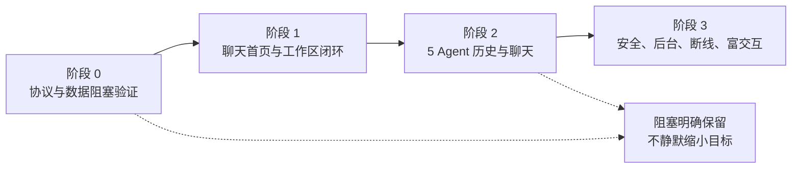

# 06 实施路线

实施以 Agent 聚合聊天的可验证闭环为里程碑：首页 chat、host 自动 probe、Agent 筛选、工作区抽屉、原会话历史与继续。SSH 连接与终端是基础设施和调试工具；“能通过终端继续”不能作为聊天目标通过。

本文面向开发与测试。**新增设计**表示实施与验收要求，均不代表已交付；**上游源码核实**与**既有采样记录**只能作为路线依据；**待验证**表示发布前必须取得证据。阶段完成须对应可复现结果，不能按源码存在、编译成功或外部项目已有功能计完成。

## 1. 阶段与门槛（新增设计）

安全校验、只读、busy 隔离和历史不丢失贯穿所有阶段，不是最后补做。缓存与历史屏障属于第一条聊天链路的必需条件，不延迟到“体验完善”。

## 2. 阶段 0：协议、历史与环境证据

优先确认缺少样本的历史格式与未完成的真实协议链路；已成功的版本、能力与列表探测作为有限证据保留。允许最小验证代码，但不能修改 Agent 安装或原生文件，也不能以危险监听、关闭信任校验或下载整库解决阻塞。

| 编号 | 验证项 | 方法 | 通过条件 | 未通过时 |
| --- | --- | --- | --- | --- |
| V-1 | 安卓 SSH exec 长驻通道 | 真机连接目标 host；分离 stdout／stderr、禁 PTY，运行受控双向命令及真实 Agent | 握手、指纹、认证、往返无回显／CRLF 污染；后台与断线行为可诊断 | 保留安全与流式要求，调查 provider／算法／库，不直接退回终端验收 |
| V-2 | kimi 的聊天与历史重放 | initialize → 分页 list → 先启动消费者 → load → 历史屏障 → prompt → 审批 | 响应前历史不丢；原 ID／cwd 保持；完成屏障后才能发送；一次真实回复与审批成功 | 精确记录失败方法；CLI 可做只读读取，不把终端交互计为聊天通过 |
| V-3 | dsh ACP 与历史接续 | 在实际 host 执行 `dsh --profile acp`，探测能力；读取原生多帧日志分页，再 resume 原 ID、prompt／cancel | list 到结束；无 load 路线显式使用只读历史；首尾与工具事件完整；实时接续无重复／缺口 | 保留历史不完整与接入阻塞，不因 resume 成功认定 UI 历史完成 |
| V-4 | omp 真实样本 | 用户通过 `omp --session-dir <dir>` 在临时目录完成真实会话，检查只读样本及 ACP | 核实首行、cwd、分支 parentId、排序、继续入口与历史正文 | 不猜 256 字节格式，不把 omp 从范围删去或自动降为仅新建 |
| V-5 | zcode 专用驱动与真实工作区 | 使用 `/home/colle/.zcode/server/agents/glm/zcode-agent`，仅注入正确 provider 配置路径；no-PTY app-server 按 startup/storageState 与 runtime/capabilities 就绪，list 保留原生 workspaceIdentity；再由用户明确选择原会话验证 resume／subscribe／prompt／审批 | 在已有 0.16.9、能力与真实列表证据上，完成原 ID 历史／继续／prompt／审批与安卓驱动端到端 | 单列失败方法与驱动状态，不把 CPA 插件产物当 CLI；不添加 jsonrpc 或调用不存在的 initialize，不自动替换安装 |
| V-6 | Linux／WSL／droidspace 可达性 | 在各自已有环境验证 SSH、目录语义、工具和远端登录状态 | WSL 目标为发行版；自管容器地址与 NAT 行为明确；网络拒绝可见 | 部署方案单列待验证，宿主转接需另确认；不把连通别的目标视为通过 |
| V-7 | 完整分页缓存 | 大历史、早到更新、超内存窗口、写入失败、进程重启与离线读取 | noBackup 中已取得首尾页可重读；消费者屏障有效；部分历史可续读且标不完整 | 保留成功页与游标；禁止静默 drop-oldest 或空覆盖 |

**既有采样记录**：dsh `0.2.1-alpha.1` 经 SSH 2222 的 initialize 已确认 list／resume／close、无 loadSession。ZCode 真入口 `/home/colle/.zcode/server/agents/glm/zcode-agent` 返回版本 0.16.9，no-PTY app-server 的 runtime/capabilities 与真实 workspaceIdentity 列表已成功；initialize 返回 -32601，协议没有 jsonrpc 字段。CPA 插件产物的空 main 不是 CLI 故障。以上不替代 V-3／V-5 的原 ID 继续、prompt、审批与安卓端到端，出处与启动条件见 03 第 3.3 节。

V-1、历史完整性、busy 隔离与各 Agent 的可运行性都可能阻塞对应目标，不能称某个单项为“唯一阻塞”。验证顺序应当先并行调查 V-4／V-5，建立 V-1／V-2／V-7 闭环，再扩展 V-3 与多环境场景。

## 3. 阶段 1：聊天首页与工作区闭环

以 kimi 为第一条垂直链路；其他 Agent 即使未完成，也应当在探测和状态中明确显示，而不是隐藏。

| 任务 | 交付行为 | 验收 |
| --- | --- | --- |
| 首页与导航 | 冷启动为聊天；顶栏 host＋Agent；独立主机设置和 SSH 调试入口 | 无需进入终端即可找会话、打开与发送 |
| host 自动 probe／刷新 | 选具体 host 即连接、探测与刷新；快速切换隔离迟到响应 | 失败保留旧结果，显示原因与重试；不把刷新失败当空历史 |
| Agent 与聚合筛选 | 具体 Agent 过滤；All hosts／All agents 为浏览范围 | 聚合搜索可组合；执行前要求具体 host／Agent |
| 自动工作区抽屉 | 历史 `cwd` 生成 `(hostId, cwd)` 组；组内新建 | 同路径跨主机分离；新建使用组目录；目录缺失记录保留但不可继续 |
| 会话身份与运行所有权 | 会话键 `(hostId, agent, sessionId)`；视图筛选独立于执行 | busy 切换不静默 cancel／close／迁移 ID；不能保留时明确阻止或确认停止 |
| 历史打开与缓存 | load 前消费者就绪、响应后屏障、完整 noBackup 分页页库 | 超显示窗口旧页仍可读；部分失败可续读；不把存在缓存文件当完整 |
| 第一条真实聊天 | kimi 新建／继续、输出、权限交互 | 使用原上下文及 cwd 完成一轮；旧历史与新输出接续正确 |

**里程碑 M-1（待验收）**：手机默认打开聊天；选择 host 自动刷新；抽屉按主机＋目录展示 kimi 历史并在组内新建；继续同一 ID 完成聊天和审批；运行中切换筛选不静默停止，首尾历史在重启及离线时可读取。仅列表可见或终端可继续不计 M-1 完成。

## 4. 阶段 2：5 个 Agent 的历史与聊天

逐 Agent 完成历史、上下文恢复和交互，不按“有一条 resume 命令”计算已接入。

| Agent | 主要实现要求 | 完成证据 |
| --- | --- | --- |
| kimi-code | ACP 与索引／wire 历史的版本映射；缓存完整时才按条件 resume | 当前目标版本的新建、完整历史、原 ID 继续、审批与断线证据 |
| opencode | WAL 只读 SQLite 分页；message／part 顺序；ACP 映射 | 不改原生数据库、不传整库；历史工具事件与新输出关联正确 |
| oh-my-pi | 真实样本决定 JSONL、标题与分支处理；ACP 实际能力 | 样本与协议双向比对；原 ID／路径恢复正确，不能只验新建 |
| deepseek-harness | `dsh --profile acp`；list／resume／new／prompt／cancel；无 load 的只读历史路线 | 多帧与最高有效世代读取；历史＋resume 同一 ID；能力缺失不伪装为支持 |
| zcode | 独立 ZCode Protocol 驱动使用真 CLI 与原生 workspaceIdentity；startup/storageState／runtime/capabilities 探测，不使用 JSON-RPC initialize | 在能力／列表已采样基础上验证完整历史、原 ID resume、订阅接续、prompt、审批与安卓端到端；驱动代码存在不计通过 |

交互统一模型必须覆盖文本、思考、工具、diff、权限、提问、计划和用量。按能力呈现，历史请求与实时请求分开；缺失能力显示不支持，未知事件保留，不伪造工具或审批。

**里程碑 M-2（待验收）**：5 个 Agent 的历史都能逐页到结束；每个 Agent 在应用内完成新建和原 ID 继续的真实聊天验收；All hosts／All agents 搜索范围准确。未取得完整历史或聊天仍受阻的 Agent 必须标“部分可用／阻塞”并说明原因，M-2 保持未完成，不能用终端通过或从矩阵删掉该 Agent。

## 5. 阶段 3：交互、安全与后台验收

| 工作 | 参考与约束 | 验收证据 |
| --- | --- | --- |
| 富卡片与差异视图 | codeg-android 的工具／审批／提问／计划、diff 与 Markdown，见 04 | 对真实事件正确显示；旧审批不能操作；资源与协议映射测试通过 |
| 抽屉与状态聚合 | codex-remote-android、dsh ui-workspace、Paseo、Happy，见 04 | 工作区、主机、Agent 过滤、组内新建与 busy／待审批状态一致 |
| 搜索与分页 | 远端检索＋缓存检索，各自注明覆盖 | 离线、未加载、某主机失败时显示范围；不丢既有结果 |
| 断线与后台 | 前台服务、通知、退避重连、原轮次状态查询 | 不重复 prompt；恢复后原 ID 和审批路由不变；未知状态可见 |
| 凭据与信任 | Android Keystore、主机密钥确认、跳板支持 | 首次确认早于发送凭据；变更阻断；敏感信息不出现在日志／历史缓存 |
| 网络与 Web 补充 | loopback＋SSH 隧道；目标 Android 局域网权限 | 不开放 wildcard 执行服务；权限拒绝可恢复；WSL／NAT 场景分别验证 |
| 缓存生命周期 | noBackup、完整分页、显式清理、损坏恢复 | 旧消息不自动淘汰；写入失败保留旧页；清理不影响原生数据 |
| 独立调试终端 | ConnectBot／termlib 基础能力 | 调试能打开，不自动替换聊天入口，也不改变正在运行的 Agent 会话 |

**里程碑 M-3（待验收）**：01 的 AC-1 至 AC-10 全部有可复现证据。必须覆盖真机、Linux 与 WSL；droidspace 自管若可达性仍未确认，明确保留阻塞，不能对外宣称完整场景已交付。

## 6. 验证证据与完成口径

每个验收记录必须保存 host 环境、Agent 版本／路径、能力握手、cwd、原会话键、输入动作、预期与实际结果，并脱敏。公开源码引用只证明参考实现存在；本项目源码检查只证明对应路径存在；两者都不替代端到端测试。

| 回归类别 | 必须覆盖的分支 |
| --- | --- |
| 导航与身份 | 同 cwd 跨 host；同组多 Agent；All hosts／All agents；快速切换迟到结果；busy／待审批切换 |
| 历史时序 | load 响应前更新；屏障前积压；未知事件；重复重放；无 load 的 resume；外部持续写入 |
| 数据完整性 | 多页到末尾；超内存窗口；大帧报错；缓存磁盘失败／损坏；重启／离线；断线续读；旧缓存不空覆盖 |
| 协议能力 | ACP 能力缺失／initialize 失败；ZCode 不存在 initialize、严格 schema 不含 jsonrpc、cwd-only 列表误空与真实 workspaceIdentity；dsh 无 load 与 close 语义 |
| 安全与网络 | 指纹首次确认／变更；密码／密钥／跳板；只读数据库；loopback 隧道；权限拒绝；后台被系统终止 |

实施代码时必须运行工程标准检查、已有单元测试与相关真机测试；依赖或构建环境受阻必须先修复标准路径，不能只验证 import／compile 就宣告完成。未取得实际测试证据的阶段必须保持待验收状态。

工作量与排期必须在 V-1 至 V-7 的阻塞和适配范围明确后评估。没有可复现依据时不手写天数、周数或移植占比；阶段顺序和完成条件不依赖未经验证的工期数字。

## 7. 待验证项与禁止推断

| 编号 | 未验证边界 | 确认方式 | 确认前禁止 |
| --- | --- | --- | --- |
| U-1 | 本项目真机上的 SSH／ACP 长驻流 | V-1／V-2，含后台、stderr、主机密钥与算法 | 宣称参考项目已用 sshj 即本项目可用 |
| U-2 | omp 首行格式、分支与恢复入口 | V-4 真实样本＋原会话继续 | 按第三方定宽描述截断文件或认定普通 JSON 一定失败 |
| U-3 | dsh 只读历史与 ACP 接续、审批展示 | V-3／V-7；本机握手只是能力依据 | resume 当作历史 load；Web 卡片当 ACP 扩展 |
| U-4 | zcode 活动 provider 配置路径、真实 workspaceIdentity、resume／prompt／审批与安卓驱动端到端 | V-5，在已确认 0.16.9、能力／列表基础上验证；只注入正确配置路径，不读配置内容 | 把 CPA 插件当 CLI、硬编码 endpoint／identity、添加 jsonrpc／initialize 或宣称全链路通过 |
| U-5 | 历史页 schema、去重与游标失效恢复 | 按 03 的字段契约和真实源制定后验证 | 按文本去重、丢旧页、伪造时间、自动创建新 ID 冒充继续 |
| U-6 | droidspace NAT、自管可达性与 WSL 部署 | V-6 实机与目标发行版验证 | 用 Windows 宿主结果代替 WSL；未连通就宣称手机自管可用 |
| U-7 | 目标 Android 的局域网权限与后台行为 | 当前官方规则＋targetSdk＋目标版本实机 | 沿用旧版本阈值直接放行，或权限失败清空数据 |
| U-8 | 各 Agent 格式与能力漂移 | 每个 host 记录版本、数据根与握手；升级后回归 | 名称硬编码能力、未知格式返回空成功 |
| U-9 | 替代产品／provider 插件路线 | 实际部署与逐能力端到端验证 | 仅凭入口存在宣称覆盖 dsh／zcode 或“不支持 WSL” |

未定义项不得用于自动停止、迁移会话身份、删除记录、缩小支持范围或宣称发布通过。

## 8. 环境准备与替代方案边界

| 项 | Linux | WSL | droidspace |
| --- | --- | --- | --- |
| SSH 与信任 | 用户准备可达 sshd、认证与指纹确认 | 发行版内 sshd 与可达地址；宿主转接需另确认 | 容器服务与 NAT 可达性待验证 |
| 只读工具 | sqlite3／zstd／jq，或已核实的 Python 兜底 | 同左，运行在发行版内 | 同左，工具缺失明确提示 |
| Agent 登录 | 用户已安装并登录，不由应用保存 API 凭据 | 同左，复用 WSL 内登录状态 | 同左 |
| 网络 | 可编辑地址；可以部署覆盖网络 | 覆盖网络与发行版路由单独验证 | VPN／容器路由单独验证 |
| Web | 如使用补充路线，仅 loopback 隧道 | 同左 | 同左 |

应用不得自动安装工具、升级 Agent、修改原生库或写登录凭据。官方一方发行版存在不表示当前 PATH 或旧文件已替换。

Paseo／Orca 等替代产品可作为成本比较；增加 daemon、改用其他客户端或减少 Agent 都是产品范围决策，需另行确认。主路线阻塞时先完成未阻塞部分并保留阻塞清单，不自动改成“只支持 kimi＋opencode”，也不以终端降级宣布目标完成。
