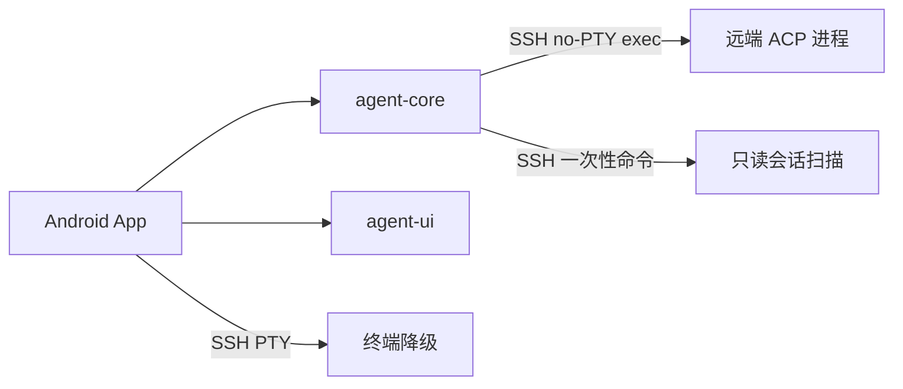

# rmAgentMa — 多设备 AI Agent 会话统一管理

在安卓手机上聚合多台电脑的 AI 编码 Agent。默认进入聊天界面，顶部切换主机与 Agent，历史抽屉按工作目录分组并支持聚合搜索；新建、恢复与审批在应用内完成，SSH 终端作为独立调试入口。连接地址可以修改，设备主键保持不变；跨网络可达性由 SSH 和用户配置的覆盖网络提供，不自动发现设备。具体协议与验收边界见下文。

## 工程与构建

Android 工程位于 [`android/`](android/)，以 ConnectBot 为基座。`:agent-core` 负责协议、会话模型和远端扫描，`:agent-ui` 提供 Compose 渲染组件，`:app` 负责设备、安全存储、界面与服务。上游来源及许可见 [`android/NOTICE`](android/NOTICE) 和 [`android/LICENSE`](android/LICENSE)。



构建前必须安装 JDK 17 或可用的 JDK 17 toolchain、Android SDK Platform 37 及对应 Build Tools。Gradle wrapper 和构建插件需要访问官方分发站、Google Maven、Maven Central；终端的原生构建及 Mosh 发布资产还需要 Android 原生工具链和 GitHub 访问。SDK 路径通过 `ANDROID_HOME` 或 `android/local.properties` 的 `sdk.dir` 配置。

### GitHub Actions

根目录 [Android workflow](.github/workflows/android.yml) 在 main 推送、Pull Request 和手动触发时分别运行 OSS debug APK 构建与标准校验。构建使用完整 Git 历史与 tag；artifact 包含 APK、源 commit、构建链接及 SHA-256，不能把其他 commit 的旧 APK 当作当前交付。

```bash
gh run list --workflow android.yml -R collegeming/rmAgentMa
gh workflow run android.yml --ref main -R collegeming/rmAgentMa
gh run view <run-id> -R collegeming/rmAgentMa
gh run download <run-id> -n rmAgentMa-oss-debug-<run-id>-<attempt> -D ci-artifacts/apk
(cd ci-artifacts/apk && sha256sum -c SHA256SUMS)
```

远端构建不保证比本地缓存构建更快；它把编译负担移到 runner，并留下可重复检查的构建记录。首次运行仍需下载依赖与原生工具链。构建与校验结果必须分别检查，APK 可下载不表示测试已全部通过。

CI debug 使用 `-PciDebug=true`，包名为 `org.rmagentma.android.debug.ci`，与本地 `.debug` 包并存，不覆盖现有用户数据。runner 默认 debug 签名不用于正式发布，后续覆盖安装仍须比较证书；不能为绕过签名错误卸载应用或清数据。发布签名需单独配置，不上传本机私钥或用户数据库。

### 本地构建

在项目根目录执行：

```bash
cd android
./gradlew :app:assembleOssDebug
./gradlew :agent-core:test :agent-ui:testDebugUnitTest
./gradlew spotlessCheck lint check test
PYTHONDONTWRITEBYTECODE=1 python3 -m unittest discover -s agent-core/src/test/python -v
```

构建失败时先查看首个失败任务，不要安装未完成构建的产物。调试 APK 位于 `android/app/build/outputs/apk/oss/debug/app-oss-debug.apk`，包名为 `org.rmagentma.android.debug`，可与 ConnectBot 并存。调试包用于本地验证，不是签名发布版。

安装前必须连接并授权安卓设备，`adb devices` 应显示目标设备且状态为 `device`。在项目根目录执行：

```bash
adb install -r android/app/build/outputs/apk/oss/debug/app-oss-debug.apk
```

安装后打开 rmAgentMa，按下方步骤添加 SSH 设备。连接安卓设备后才能在 `android/` 中执行 `./gradlew connectedOssDebugAndroidTest`；纯 JVM 或扫描脚本测试不代表真机验收通过。

## 远端准备与使用

前置条件：被管设备已经配置 SSH 登录；各 agent 已由用户完成登录，应用不保存 agent API 凭据。Windows 设备的 SSH 服务必须位于 WSL 发行版内，地址与端口须从手机可达，不连接 Windows 宿主后猜测发行版路径。

1. 在被管设备验证当前账号的 SSH 登录与工作目录访问权限。必须核对服务器主机密钥指纹，不能为了连通而关闭主机校验。
2. 在被管设备准备 `python3`（3.9+）。dsh 扫描另需 `zstd` 命令或 Python 3.14+ 的 `compression.zstd`。扫描器不需要常驻安装，也不修改 agent 存储。
3. 在应用中添加 SSH 主机，填写显示名、主机名或地址、端口、用户名和认证配置。使用覆盖网络时可直接填写 MagicDNS 主机名。
4. 在聊天首页选择主机与 Agent，应用自动加载该来源的历史。首次连接核对指纹后确认；指纹变更会拒绝连接，应先在设备侧查明原因，不要直接删除信任记录。
5. 通过历史抽屉选择按工作目录分组的会话，或在当前工作区新建。恢复使用原会话的 Agent、会话 ID 与目录；加载完成前不能发送。跨主机、跨 Agent 搜索由聚合视图提供，不把同路径的不同主机合并。
6. 主机配置、密钥与 SSH 调试终端从辅助菜单进入。终端不作为普通继续操作的默认入口；主动发送调试命令前确认终端位于 shell 提示符，避免把命令输入其他交互程序。

地址变化时编辑已有设备，不要删除再添加；删除设备会改变设备主键及其关联记录。连接断开时先核对网络、SSH 地址和端口，再刷新列表；不要重复发送结果未知的上一轮消息。

## 实现边界与验收

- 远端扫描覆盖 kimi、opencode、zcode、dsh；omp 使用 ACP 能力协商后的 `session/list`，不依赖未经验证的文件格式。
- dsh 使用只读历史与 ACP resume；zcode 使用独立 app-server 协议，不是 ACP。远端探测成功不等于手机端发送、停止与审批已经验收。终端保留作主动选择的调试入口。
- Agent exec 使用 sshj；上游终端与密钥工具仍保留原 SSH 库，完整替换尚未完成。
- ACP 使用手写 JSON-RPC 实现，未链接方案中的官方 Kotlin SDK；协议形状已对照 SDK 源码核对，实际 agent 版本兼容性仍需联调。
- 索引使用 noBackup 目录中的 AtomicFile 快照，不使用 Room FTS。界面搜索当前缓存的每设备、每 Agent 最新 200 条，含标题、摘要和工作目录，不是所有远端历史正文的全文搜索。打开会话的完整历史进入 256 MiB 预算的私有临时日志；UI 按页读取与打开全文，新会话会清理旧临时日志，不提供跨进程离线正文恢复。
- 私钥原编码（含用户原有口令加密）在数据库边界由 Android Keystore AES-GCM 再加密，口令使用上游 Keystore 存储。私钥不进入系统备份，卸载、清数据或换设备前必须显式导出并安全保管；生物识别私钥不能导出，必须另行安排登录方式。历史迁移数据库、旧 WAL/free pages 或既有云端旧备份不由此实现安全擦除。
- 扫描器需要 Python；缺少 Python 时明确报错，不是文档中完整的 CLI-only 降级实现。
- 安卓真机长驻通道、网络切换、后台保活、WSL 跨设备连接、真实 agent 上下文恢复与文件审批仍需按 [AC-1～AC-7](01-需求说明.md#6-验收口径) 验收。本地合成会话测试不能替代这些验收。
- 手机 droidspace 自管、WebView 嵌入和自动设备发现不属于当前主路径。

## 文档索引

| 文档 | 内容 | 读者 |
| --- | --- | --- |
| [01-需求说明.md](01-需求说明.md) | 使用场景、功能需求、非功能需求、约束、验收口径 | 全体 |
| [02-竞品调研.md](02-竞品调研.md) | 现成软件盘点与结论：没有任何一个满足完整需求 | 决策、方案 |
| [03-Agent对接矩阵.md](03-Agent对接矩阵.md) | 5 个 agent 的存储位置、读取方式、继续命令、接入路线 | 开发 |
| [04-参考项目复用清单.md](04-参考项目复用清单.md) | 9 个可复用项目的资产盘点与许可 | 开发 |
| [05-技术方案.md](05-技术方案.md) | 架构、模块划分、关键实现、风险 | 开发 |
| [06-实施路线.md](06-实施路线.md) | 分阶段计划、验证顺序、工作量 | 决策、开发 |

## 结论标识

全组文档正文逐条使用以下标识，正文陈述的是当前生效状态，不含修订记录。

| 标识 | 含义 |
| --- | --- |
| **已有** | 已由源码或实机验证确认 |
| **新增设计** | 本期需要实现的形态 |
| **待验证** | 发布前需要实机验证或业务决策，不得据此实现 |

## 目标 agent

本文档组的对接范围为以下 5 个 agent CLI，它们安装在用户的多台设备上。

| agent | 命令 | 会话存储 |
| --- | --- | --- |
| opencode | `opencode` | SQLite |
| oh-my-pi | `omp` | 待验证（见 03 文档） |
| kimi-code | `kimi` | 目录 + JSONL |
| deepseek-harness | `dsh` | zstd 压缩 JSONL |
| zcode | `zcode` | SQLite |

## 目标设备

| 设备类型 | 系统 | 本组文档中的处理 |
| --- | --- | --- |
| Linux 笔记本 | 直装 | 与手机通过 SSH 连接 |
| Windows 笔记本 | WSL | SSH 进入发行版 |
| 安卓手机 | droidspace + Arch | 作为控制端；能否同时作为被管节点，列入待验证 |

## 事实来源

- 5 个 agent 的存储格式与 CLI 能力：本机实机验证（opencode 1.18.34 / kimi 2.1.1 / omp 18.4.9 / dsh 0.2.1-alpha.1 / zcode CLI 0.16.9）
- 参考项目的源码结构与能力边界：GitHub 源码逐文件核对，路径与结论见 04 文档
- star 数：GitHub API 实时取值，取数日期见各表脚注

未经验证的内容一律标注为**待验证**，不得据此实现。
